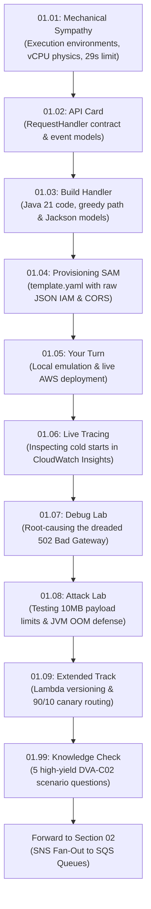

# Section 01 · API Gateway & Java 21 Lambda Deep Dive
## The Synchronous Ingestion Foundation of CloudOrder

> **Theme**: Building the public REST entry point of our distributed order platform, understanding the physical compute boundaries of AWS Lambda, and mastering API Gateway's proxy integration contract.

---

## 1. The Narrative Arc of This Section

Every distributed system starts with an ingress boundary. For **CloudOrder**, that ingress is Amazon API Gateway routing traffic into an ephemeral, high-throughput AWS Lambda function written in Java 21.

Here is the exact journey you will take in this section:

---

## 2. Lecture Roadmap & Reading Order

| # | Lecture | Type | What Happens in the Story |
|---|---|:---:|---|
| **[01.01](./01.01-mechanical-sympathy-api-gateway-lambda.md)** | **Mechanical Sympathy** | 📖 | You learn what actually happens inside AWS Firecracker when an HTTP request hits API Gateway, why Java cold starts exist, and the 1,769 MB vCPU rule. |
| **[01.02](./01.02-api-card-requesthandler.md)** | **📇 API Card: RequestHandler** | 📇 | You study the strict Java SDK contract (`APIGatewayProxyRequestEvent` $\to$ `APIGatewayProxyResponseEvent`) that prevents integration crashes. |
| **[01.03](./01.03-build-order-api-handler.md)** | **Build: Core Order Ingestion** | 🛠 | You write the Java 21 handler, Jackson models, and extract greedy path variables (`/orders/{proxy+}`) and query parameters. |
| **[01.04](./01.04-provisioning-sam-template.md)** | **Provisioning: SAM Template** | 🛠 | You write the declarative SAM template with an explicit raw JSON IAM execution role (no shortcuts) and CORS configurations. |
| **[01.05](./01.05-your-turn-local-test-deploy.md)** | **Your Turn: Test & Deploy** | 🎯 | You test the endpoint locally in Docker (`sam local start-api`), deploy to your real AWS account, and invoke it via `curl`. |
| **[01.06](./01.06-live-verification-cloudwatch-insights.md)** | **Live Verification** | 🧩 | You query CloudWatch Logs Insights to measure actual `Init Duration` (cold starts) vs. `Duration` on your live Lambda function. |
| **[01.07](./01.07-debug-malformed-proxy-response.md)** | **Debug: 502 Bad Gateway** | 🐞 | You intentionally break the proxy response contract, observe how API Gateway fails with zero Lambda exceptions, and learn how to diagnose it. |
| **[01.08](./01.08-attack-lab-unbounded-payload-oom.md)** | **Attack Lab: Payload Exhaustion** | 🔓 | You flood the greedy route with a 12 MB payload, observe API Gateway's 10 MB edge defense, and harden the Java handler against JVM heap exhaustion. |
| **[01.09](./01.09-extended-lambda-versioning-aliases.md)** | **Extended: Versioning & Canary** | ＋ | You learn how to publish immutable Lambda versions and split production traffic (90% to v1, 10% to v2). |
| **[01.99](./01.99-knowledge-check.md)** | **DVA-C02 Knowledge Check** | ✅ | You test your mastery against 5 scenario-based exam questions covering all mechanics taught in this section. |

---

## 3. Checkpoint & Next Section Preview

* **Section Checkpoint**: `s01-end` (Frozen source code available in `reference/snapshots/s01-end/`).
* **The Bridge to Section 02**: In Section 1, our order ingestion endpoint is synchronous. If payment processing takes 15 seconds, the customer waits, and at peak load, our database connections choke. In **Section 02**, we decouple this synchronous endpoint into an **asynchronous fan-out pipeline using Amazon SNS and Amazon SQS**!
