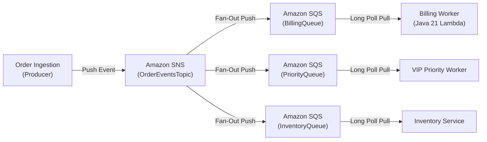
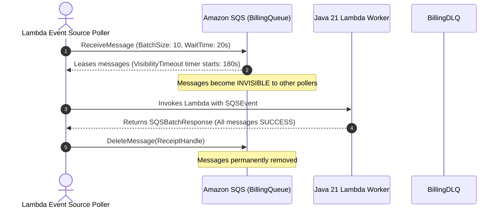

# Lecture 02.01 · 📖 Mechanical Sympathy: Fan-Out Topology, Polling Models & SQS Visibility Timeouts

> **Section:** S02 · **Type:** 📖 Theory · **Track:** ★ Core · **Time:** ~25 minutes  
> **Navigation:** ← [Section 01 Overview](../S01-api-gateway/README.md) | [Section 02 Overview](./README.md) | [02.02 · 📇 API Card: SnsClient & SQSBatchResponse](./02.02-api-card-sns-sqs-batch-response.md) →  
> **DVA-C02 Domain Focus:** Domain 1 (Development with AWS Services) & Domain 4 (Troubleshooting & Optimization).

---

## Narrative Bridge: The Limits of Synchronous Ingestion

In [Section 01](../S01-api-gateway/README.md), we built a synchronous order ingestion REST API using API Gateway and Java 21 Lambda (`OrderApiHandler`). A client submits an order via HTTP POST, and the Lambda function processes it immediately, returning an HTTP 201 response.

In a real enterprise platform like **CloudOrder**, order submission requires downstream side-effects:
1. Billing and credit card payment settlement.
2. Warehouse inventory reservation.
3. Notification dispatch (email/SMS receipts).
4. Real-time analytics tracking.

If our `OrderApiHandler` invokes all these downstream systems synchronously, our architecture suffers from three fatal distributed systems anti-patterns:
* **Latency Amplification**: The customer waits for the sum of all downstream latencies ($t_{\text{total}} = t_{\text{billing}} + t_{\text{inventory}} + t_{\text{email}}$).
* **Cascading Failure**: If the billing service experiences a 30-second degradation, our API Gateway times out at 29 seconds, dropping orders even though the customer's credit card may have been charged.
* **Loss of Backpressure**: A flash sale that spikes ingress traffic from 100 req/sec to 10,000 req/sec directly hammers downstream relational databases, causing connection pool exhaustion and database outages.

To scale reliably, we must **decouple** ingestion from processing using the **SNS Fan-Out to SQS** architectural pattern.

---

## 1. Push vs. Pull: SNS and SQS Compared

The AWS messaging ecosystem divides cleanly into **push** (publish/subscribe) and **pull** (message queues).



### Amazon SNS (Simple Notification Service) · The Push Broker
* **Delivery Model**: Push. When a producer calls `sns:Publish`, SNS immediately pushes the message to all active subscribers (HTTP endpoints, SQS queues, Lambda functions, email, SMS).
* **Persistence**: Transient. SNS does not store messages. If a subscriber is offline and has no dead-letter queue, the message is lost forever after retry exhaustion.
* **Throughput**: Virtually unlimited. Standard topics support tens of thousands of messages per second with zero provisioning.
* **Scale Factor**: A single SNS topic can fan out to up to **12,500,000 subscriptions**.

### Amazon SQS (Simple Queue Service) · The Pull Buffer
* **Delivery Model**: Pull. Messages are stored across a distributed fleet of storage servers. Consumers must actively poll the queue (`sqs:ReceiveMessage`) to lease and process messages.
* **Persistence**: Durable. SQS stores messages across multiple Availability Zones for up to **14 days** (default: 4 days).
* **Backpressure Smoothing**: SQS acts as a shock absorber. When 50,000 orders arrive during Black Friday, SQS buffers them safely. Downstream workers process them at a steady, sustainable rate without crashing databases.

### The Fan-Out Topology: The Best of Both Worlds
Combining SNS and SQS gives us:
1. **Zero Producer Coupling**: The order ingestion service only knows the SNS Topic ARN. It knows nothing about billing, inventory, or analytics.
2. **Independent Consumer Scaling**: Each downstream subsystem receives its own dedicated SQS queue. If the billing worker crashes or falls behind, the inventory queue continues processing at full speed without obstruction.

---

## 2. SQS Polling Mechanics: Short Polling vs. Long Polling

When a consumer requests messages from an SQS queue via `ReceiveMessage`, SQS behaves according to its polling configuration:

| Dimension | Short Polling (`WaitTimeSeconds = 0`) | Long Polling (`WaitTimeSeconds = 1 to 20`) |
|---|---|---|
| **Server Query Scope** | Queries a random subset of SQS storage nodes. | Queries all SQS storage nodes across the fleet. |
| **Response Behavior** | Returns immediately, even if zero messages are found. | Holds the connection open until messages arrive or timeout expires. |
| **Empty Responses** | High frequency. Produces false-empty reads when messages exist on other nodes. | Near-zero. Only returns empty if the queue is genuinely empty for 20 seconds. |
| **Cost & Latency** | Expensive. Burns millions of empty API requests ($0.40/million). | Highly cost-effective. Cuts empty receive requests by up to 90%. |
| **DVA-C02 Rule** | Anti-pattern. Never use short polling in production. | **Standard Best Practice**. Always set `ReceiveMessageWaitTimeSeconds = 20`. |

```text
Short Polling (WaitTimeSeconds = 0):
Client ──[ReceiveMessage]──> Node A (0 messages found) ──> Returns [] immediately (Billable API Call!)
                             Node B (Has 5 messages, but was not queried in this sample)

Long Polling (WaitTimeSeconds = 20):
Client ──[ReceiveMessage]──> Holds connection open...
                             At 1.4s: Message arrives at Node C ──> Instantly delivered to Client!
```

---

## 3. The Visibility Timeout & The $V \ge 6 \times L$ Formula

When a worker retrieves a message from SQS, SQS **does not delete** the message. Instead, it places the message into an invisible state called the **Visibility Timeout**:



### The Message Lease Cycle:
1. **Receipt Handle**: SQS issues an ephemeral `ReceiptHandle` unique to this specific lease.
2. **Receive Count**: SQS increments `ApproximateReceiveCount`.
3. **Timer Expiry**: If the worker fails to delete the message or acknowledge it before `VisibilityTimeout` expires, the message becomes **visible again** to all pollers.

### The Invariant: Why $\text{VisibilityTimeout} \ge 6 \times \text{Function Timeout}$?

On AWS Lambda with an SQS Event Source Mapping, AWS strictly requires:
$$\text{Queue VisibilityTimeout} \ge 6 \times \text{Lambda Function Timeout}$$

**Why the factor of 6?**
1. **Network Retries & Backoff**: The Lambda poller internally executes retries with exponential backoff if the function encounters invocation throttles (`Lambda.TooManyRequestsException`).
2. **Race Condition Prevention**: If `VisibilityTimeout` is shorter than or equal to function execution time (e.g. $V = 30\text{s}$, $L = 30\text{s}$), a slow database query taking 29.5 seconds allows the visibility timer to expire *before* the first worker can delete the message. A second Lambda worker immediately receives and executes the same message, causing **duplicate side-effects (double charging the customer)**.

> [!IMPORTANT]
> **DVA-C02 Exam Rule**: If your Lambda function timeout is **30 seconds**, your SQS queue visibility timeout must be at least **180 seconds** ($6 \times 30$). CloudFormation and SAM will generate a deployment warning or error if this relationship is violated.

---

## 4. Poison Pills, DLQ Redrive Policies, and Partial Batch Failure

### What is a Poison Pill?
A poison pill is a malformed message (e.g. invalid JSON, missing mandatory fields, payload referencing deleted entities) that causes consumer code to throw an unhandled exception every time it is parsed.

Without a **Dead Letter Queue (DLQ)** and redrive policy:
1. Message arrives $\to$ Worker crashes.
2. Visibility timeout expires $\to$ Message reappears.
3. Worker receives it again $\to$ Crashes again.
4. This loops indefinitely, consuming 100% of your Lambda concurrency and generating massive AWS bills!

### The Redrive Policy Solution:
```json
{
  "deadLetterTargetArn": "arn:aws:sqs:us-east-1:123456789012:CloudOrderBillingDLQ",
  "maxReceiveCount": 3
}
```
When `ApproximateReceiveCount > maxReceiveCount`, SQS automatically moves the message into `CloudOrderBillingDLQ` without invoking Lambda again.

### The Partial Batch Failure Revolution: `ReportBatchItemFailures`
Historically, if an SQS batch contained 10 messages and message #7 threw an exception:
* The entire batch was marked as failed.
* Messages #1 through #6 (which already succeeded) and messages #8 through #10 were **all rolled back and re-delivered**.
* Downstream systems were forced to build complex deduplication tables or risk processing orders multiple times.

With `ReportBatchItemFailures`, our Lambda handler returns an explicit list of only the failed `itemIdentifier` values:
```json
{
  "batchItemFailures": [
    { "itemIdentifier": "msg-poison-pill-uuid" }
  ]
}
```
The AWS Lambda service deletes the 9 successful messages from SQS and only resets the visibility timeout for the 1 failed message!

---

## Summary of Mechanical Rules

| Concept | The Mechanical Invariant |
|---|---|
| **SNS Routing** | Push delivery; zero persistence; filter policies evaluate message attributes at the edge with zero compute cost. |
| **SQS Polling** | Always configure long polling (`ReceiveMessageWaitTimeSeconds = 20`) to eliminate empty receive bills. |
| **Visibility Timeout** | Must be $\ge 6 \times \text{Lambda Function Timeout}$ to prevent duplicate concurrent executions. |
| **DLQ Redrive** | Set `maxReceiveCount: 3` to quarantine unparseable poison pills. |
| **Batch Resilience** | Use `ReportBatchItemFailures` and return `SQSBatchResponse` to isolate item failures without whole-batch rollbacks. |

---

## What's Next?

Now that we understand the physical constraints of queues, visibility leases, and partial batch failures, let's examine the exact Java SDK classes and method contracts that implement this in code.

Proceed to **[Lecture 02.02 · 📇 API Card: SnsClient & SQSBatchResponse (AWS SDK Java v2)](./02.02-api-card-sns-sqs-batch-response.md)**.

---

**Navigation**:  
← [Section 01 Overview](../S01-api-gateway/README.md) | [Section 02 Overview](./README.md) | [02.02 · 📇 API Card: SnsClient & SQSBatchResponse](./02.02-api-card-sns-sqs-batch-response.md) →
