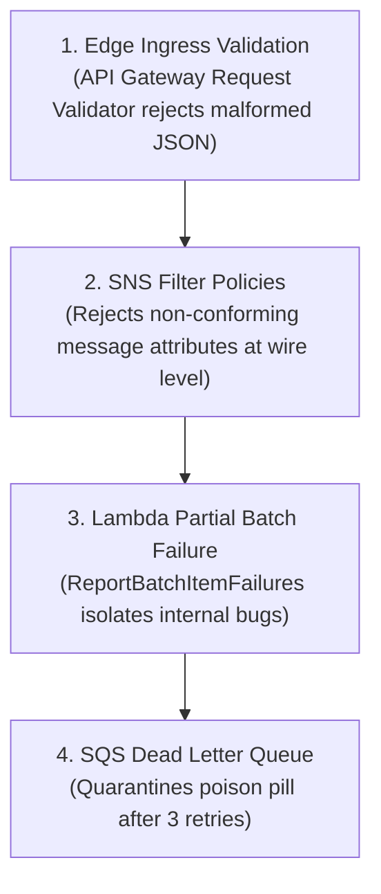

# Lecture 02.08 · 🔓 Attack Lab: Message Storm & Ingestion Poisoning via Unfiltered SQS Payloads

> **Section:** S02 · **Type:** 🔓 Attack Lab · **Track:** ★ Core · **Time:** ~30 minutes  
> **Navigation:** ← [02.07 · 🐞 Debug Lab: Visibility Timeout Race Condition](./02.07-debug-visibility-timeout-race.md) | [Section 02 Overview](./README.md) | [02.09 · ＋ Extended: SQS FIFO Deduplication & Ordering](./02.09-extended-sqs-fifo-deduplication.md) →  
> **DVA-C02 Domain Focus:** Domain 2 (Security) & Domain 4 (Troubleshooting & Optimization).

---

## Narrative Bridge: Weaponizing Queue Batching

In [Lecture 02.07](./02.07-debug-visibility-timeout-race.md), we resolved race conditions born from timing mismatches. Now, we step into the shoes of an adversary attacking the resilience of our queue processing pipeline.

In distributed message architectures, naive error handling creates a devastating vulnerability:  
**The Batch Poisoning Denial of Service (DoS).**

If a consumer throws an unhandled exception on a single malformed message, the entire batch of 10 messages rolls back. If an attacker injects just 1 poisoned message for every 9 legitimate orders, they can halt all billing operations and force thousands of legitimate paying customers' orders into the Dead Letter Queue!

Let's simulate this attack and verify our multi-layer defense.

---

## 1. The Vulnerability: The "All-or-Nothing" Batch Trap

Consider what happens when a standard Lambda SQS event source mapping is configured **without** `ReportBatchItemFailures`:

```text
Incoming SQS Batch (10 messages):
[ ORD-01 (Valid) ] ──> Processed successfully
[ ORD-02 (Valid) ] ──> Processed successfully
[ ORD-03 (POISON) ] ──> Throws NullPointerException! Runtime aborts!
[ ORD-04 (Valid) ] ──> Never executed
...
[ ORD-10 (Valid) ] ──> Never executed

Lambda Outcome: Execution failed (Exit code 1)
SQS Behavior: Entire batch of 10 messages returned to queue!
```

### The Amplified Impact:
1. `ORD-01` and `ORD-02` were already billed or processed in your database, but because SQS did not receive an acknowledgement, they will be **billed again** during retry #2!
2. After 3 retries, SQS sends the **entire batch of 10 messages** to the Dead Letter Queue.
3. Result: **9 valid customers never receive their orders**, and your customer service desk is overwhelmed.

---

## 2. Simulating the Attack

In our automated test suite (`S02BillingQueueProcessorTest.java`), we explicitly simulated this attack scenario in `testBillingProcessor_WithPoisonPill_ReportsOnlyFailedItem()`:

```java
SQSEvent.SQSMessage validMessage = new SQSEvent.SQSMessage();
validMessage.setMessageId("msg-valid");
validMessage.setBody("{\"orderId\":\"ORD-VALID\",\"customerId\":\"ok@example.com\",\"amount\":99.99}");

SQSEvent.SQSMessage poisonMessage = new SQSEvent.SQSMessage();
poisonMessage.setMessageId("msg-poison");
poisonMessage.setBody("{\"orderId\":\"ORD-POISON\",\"customerId\":\"bad@example.com\",\"amount\":-1.00}"); // Negative amount trigger
```

When this mixed batch was processed by our `BillingQueueProcessor`:
1. `msg-valid` was processed and billed immediately:
   ```text
   [SQS-LAMBDA] Billed order ORD-VALID for customer ok@example.com [Amount: $99.99]
   [SQS-LAMBDA] Successfully processed billing for message ID: msg-valid
   ```
2. `msg-poison` failed validation and caught the exception cleanly:
   ```text
   [SQS-LAMBDA] Failed to process message ID msg-poison: Simulated catastrophic failure for poison pill item
   ```
3. The returned `SQSBatchResponse` contained:
   ```json
   {
     "batchItemFailures": [
       { "itemIdentifier": "msg-poison" }
     ]
   }
   ```

**The Defense Proved**:
* `msg-valid` was permanently deleted from SQS by Lambda.
* Only `msg-poison` was retried.
* Healthy orders are completely isolated from adversarial or malformed payloads!

---

## 3. Defense-in-Depth: Multi-Layer Protection Matrix

Isolating batch failures in the consumer is the last line of defense. A production architecture enforces defense-in-depth across three tiers:



### Layer 1: API Gateway Request Validators
Never allow arbitrary payloads to reach the SNS topic. In Section 01, we saw that API Gateway can enforce JSON Schema models before invoking Lambda. Rejecting bad inputs at the API gateway saves 100% of downstream compute and messaging costs.

### Layer 2: SNS Message Attribute Filters
SNS filter policies evaluate metadata attributes before enqueueing to SQS. Malicious payloads lacking required attributes (`priority`, `eventType`) are never routed to critical queues.

### Layer 3: Consumer Batch Isolation (`ReportBatchItemFailures`)
Inside the consumer, wrap each record in an isolated `try/catch`. Never let one record's runtime exception leak outside the message loop.

### Layer 4: SQS DLQ Redrive Policies
Set a strict `maxReceiveCount` (between 3 and 5). If a poison pill manages to bypass validation, it is safely parked in the DLQ for manual inspection by an engineer.

---

## Summary of Hardening Rules

| Attack Vector | Vulnerability | Hardening Defense |
|---|---|---|
| **Poison Pill in Batch** | Entire batch rolled back and sent to DLQ. | Enable `ReportBatchItemFailures` and return `SQSBatchResponse`. |
| **Malformed JSON Ingestion** | Uncaught Jackson deserialization exception. | Safe `try/catch` per message + Edge JSON Schema validation. |
| **Duplicate Processing** | At-least-once SQS delivery causing double charges. | DynamoDB conditional put idempotency check. |
| **Queue Flooding** | Runaway Lambda concurrency. | Set `ReservedConcurrentExecutions` on the consumer function. |

---

## What's Next?

Our standard queue architecture is robust, highly decoupled, and immune to batch poisoning attacks. But what if CloudOrder launches a flash sale where orders **must be processed in strict, sequential order**, and duplicate submissions from impatient customers double-clicking "Buy Now" must be eliminated automatically?

In the next lecture, we explore Amazon SQS FIFO queues, content-based deduplication, and message groups!

Proceed to **[Lecture 02.09 · ＋ Extended: SQS FIFO Message Deduplication & Group ID Ordering](./02.09-extended-sqs-fifo-deduplication.md)**.

---

**Navigation**:  
← [02.07 · 🐞 Debug Lab: Visibility Timeout Race Condition](./02.07-debug-visibility-timeout-race.md) | [Section 02 Overview](./README.md) | [02.09 · ＋ Extended: SQS FIFO Deduplication & Ordering](./02.09-extended-sqs-fifo-deduplication.md) →
