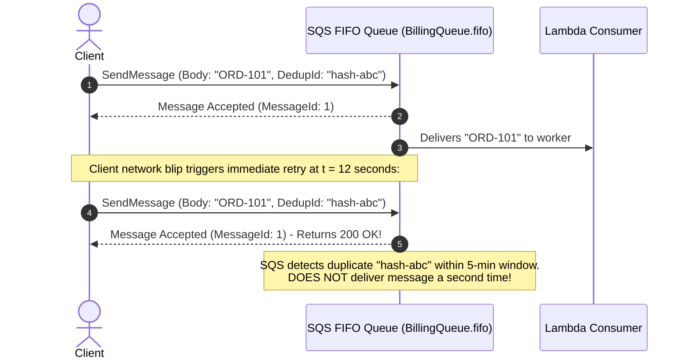

# Lecture 02.09 · ＋ Extended: SQS FIFO Message Deduplication & Group ID Ordering

> **Section:** S02 · **Type:** ＋ Extended · **Track:** ＋ Extended · **Time:** ~30 minutes  
> **Navigation:** ← [02.08 · 🔓 Attack Lab: Message Storm & Ingestion Poisoning](./02.08-attack-lab-poison-pill-batch-isolation.md) | [Section 02 Overview](./README.md) | [02.99 · ✅ DVA-C02 Knowledge Check](./02.99-knowledge-check.md) →  
> **DVA-C02 Focus:** FIFO Queues, SNS FIFO Topics, Deduplication Windows, and Partition Keys.

---

## Narrative Bridge: When Order and Uniqueness Are Non-Negotiable

In the core track of Section 02, we implemented Standard SQS queues. Standard queues provide virtually unlimited throughput and near-zero latency, but they only guarantee **best-effort ordering** and **at-least-once delivery**.

For many workloads (such as inventory updates, financial ledgering, or flash sale seat reservations), out-of-order processing can corrupt business state. Furthermore, if a customer double-clicks "Confirm Order" within 2 seconds, network retries could enqueue two identical orders.

To solve this without building custom locking infrastructure, AWS provides **Amazon SQS FIFO (First-In, First-Out) queues** and **Amazon SNS FIFO topics**.

---

## 1. Standard vs. FIFO Queues: The Architectural Trade-offs

| Characteristic | SQS Standard Queue | SQS FIFO Queue |
|---|---|---|
| **Ordering Guarantee** | Best-effort (messages may occasionally arrive out of order). | **Strict First-In-First-Out** delivery order. |
| **Delivery Guarantee** | At-least-once (occasional duplicate deliveries possible). | **Exactly-once processing** (within a 5-minute deduplication window). |
| **Throughput Baseline** | Nearly unlimited API requests per second. | 300 msgs/sec (without batching) or 3,000 msgs/sec (with batching of 10). |
| **High-Throughput Mode** | N/A | Up to **70,000 msgs/sec** with partition-level scaling! |
| **Naming Requirement** | Any alphanumeric name. | **Must end with the `.fifo` suffix** (e.g. `BillingQueue.fifo`). |

---

## 2. Message Deduplication: `MessageDeduplicationId` & The 5-Minute Window

SQS FIFO prevents duplicates using a **5-minute sliding deduplication interval**.



### The Two Deduplication Strategies:
1. **Explicit `MessageDeduplicationId`**:
   The producer computes a unique token (such as a UUID or client idempotency key) and passes it in `SendMessageRequest`:
   ```java
   SendMessageRequest request = SendMessageRequest.builder()
       .queueUrl(fifoQueueUrl)
       .messageBody(orderJson)
       .messageGroupId("cust-4821")
       .messageDeduplicationId("order-create-" + orderId)
       .build();
   ```
2. **Content-Based Deduplication**:
   If enabled on the queue (`ContentBasedDeduplication: true`), SQS generates a SHA-256 hash of the `MessageBody`. If two identical message bodies are submitted within 5 minutes, SQS automatically suppresses the second message.

> [!IMPORTANT]
> **DVA-C02 Exam Trap**: The deduplication window is **exactly 5 minutes** and cannot be configured or changed. If the identical `MessageDeduplicationId` is sent at 5 minutes and 1 second, SQS treats it as a brand-new message and delivers it!

---

## 3. Parallelism without Ordering Chaos: `MessageGroupId`

The most common mistake when adopting FIFO queues is creating a throughput bottleneck by setting a single, static `MessageGroupId`.

### The Problem:
SQS FIFO preserves order **per message group**. If every message uses `MessageGroupId: "default"`, only **one Lambda execution environment** can poll the queue at a time! All 3,000 messages will be processed sequentially by a single thread, throttling your platform to a crawl.

### The Solution: Group ID as a Partition Key
Think of `MessageGroupId` exactly like a partition key in Kafka or DynamoDB:
* Set `MessageGroupId = customerId` (or `orderId`).
* Orders for Customer A are processed in strict sequential order ($A_1 \to A_2 \to A_3$).
* Orders for Customer B are processed in strict sequential order ($B_1 \to B_2$).
* Orders for Customer A and Customer B can be processed **in parallel** by separate concurrent Lambda workers!

```text
Message Stream:  [A1]  [B1]  [A2]  [C1]  [B2]  [A3]
                   │     │           │
Lambda Worker 1 ──<A1>───┼───────────┼────<A2>─────────<A3>  (Strict order for A)
Lambda Worker 2 ────────<B1>─────────┼──────────<B2>         (Strict order for B)
Lambda Worker 3 ────────────────────<C1>                     (Strict order for C)
```

---

## 4. SAM Declarative FIFO Specification

To declare a complete FIFO fan-out architecture in AWS SAM:

```yaml
Resources:
  # 1. SNS FIFO Topic
  OrderEventsFifoTopic:
    Type: AWS::SNS::Topic
    Properties:
      TopicName: CloudOrderEvents.fifo
      FifoTopic: true
      ContentBasedDeduplication: true

  # 2. SQS FIFO Queue with High-Throughput Enabled
  BillingFifoQueue:
    Type: AWS::SQS::Queue
    Properties:
      QueueName: CloudOrderBilling.fifo
      FifoQueue: true
      ContentBasedDeduplication: true
      DeduplicationScope: messageGroup # Enables High-Throughput mode
      FifoThroughputLimit: perMessageGroupId # Scales throughput per group
      VisibilityTimeout: 180
      ReceiveMessageWaitTimeSeconds: 20

  # 3. SNS to SQS Subscription
  BillingFifoSubscription:
    Type: AWS::SNS::Subscription
    Properties:
      TopicArn: !Ref OrderEventsFifoTopic
      Protocol: sqs
      Endpoint: !GetAtt BillingFifoQueue.Arn
```

* **`DeduplicationScope: messageGroup`** & **`FifoThroughputLimit: perMessageGroupId`**: Activates **High-Throughput FIFO**. Instead of the 300/3,000 msgs/sec queue-wide cap, SQS scales throughput dynamically up to 70,000 msgs/sec based on the number of distinct `MessageGroupId` partitions!

---

## What's Next?

You have mastered the core theory, implemented the code, deployed the infrastructure, observed live telemetry, debugged race conditions, hardened against batch poisoning, and explored advanced FIFO ordering.

Now it is time to prove your knowledge against real DVA-C02 exam scenarios.

Proceed to **[Lecture 02.99 · ✅ DVA-C02 Knowledge Check: SQS Batching, DLQ Redrive Policies & SNS Attribute Filtering](./02.99-knowledge-check.md)**.

---

**Navigation**:  
← [02.08 · 🔓 Attack Lab: Message Storm & Ingestion Poisoning](./02.08-attack-lab-poison-pill-batch-isolation.md) | [Section 02 Overview](./README.md) | [02.99 · ✅ DVA-C02 Knowledge Check](./02.99-knowledge-check.md) →
