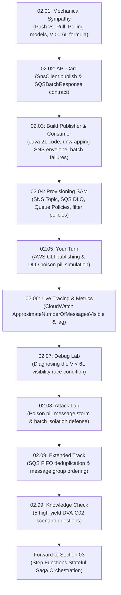

# Section 02 · SNS Fan-Out to SQS & Partial Batch Failure Resilience
## Asynchronous Decoupling & Queue Engineering in CloudOrder

> **Theme**: Decoupling synchronous REST ingestion into an asynchronous pub/sub fan-out topology, mastering the SQS polling loop, avoiding the visibility timeout race condition, and engineering resilient partial batch failure processing.

---

## 1. The Narrative Arc of This Section

In [Section 01](../S01-api-gateway/README.md), we built a synchronous order ingestion REST API using API Gateway and Java 21 Lambda. But if downstream billing, fraud detection, or fulfillment services experience latency or downtime, a synchronous HTTP API cascades failures back to clients and exhausts database connection pools.

In **Section 02**, we transform CloudOrder into an event-driven architecture. The ingestion endpoint publishes events to an Amazon SNS topic (`OrderEventsTopic`), which immediately fans out messages to multiple Amazon SQS queues (`BillingQueue` and `PriorityQueue`). 

Here is the engineering journey you will take across this section:

---

## 2. Lecture Roadmap & Reading Order

| # | Lecture | Type | What Happens in the Story |
|---|---|:---:|---|
| **[02.01](./02.01-mechanical-sympathy-fanout-queues-visibility.md)** | **Mechanical Sympathy** | 📖 | You learn the physical differences between push and pull architectures, why SQS short-polling burns API budgets, and the mathematical proof behind the $V \ge 6 \times L$ visibility timeout rule. |
| **[02.02](./02.02-api-card-sns-sqs-batch-response.md)** | **📇 API Card: SNS & SQS** | 📇 | You study the AWS SDK for Java v2 contract for `SnsClient.publish()`, message attributes, and the `SQSBatchResponse` item-level failure structure. |
| **[02.03](./02.03-build-event-publisher-batch-consumer.md)** | **Build: Publisher & Consumer** | 🛠 | You implement the Java 21 `OrderEventPublisher` and `BillingQueueProcessor`, safely parse the SNS-over-SQS JSON envelope, and isolate failed items. |
| **[02.04](./02.04-provisioning-sns-sqs-sam-template.md)** | **Provisioning: SAM Template** | 🛠 | You write the SAM template with SNS subscription attribute filtering (`FilterPolicy: { priority: ["HIGH"] }`), SQS queue policies, dead letter queues, and raw IAM policies. |
| **[02.05](./02.05-your-turn-cli-fanout-dlq.md)** | **Your Turn: CLI Fan-Out & DLQ** | 🎯 | You emit real order events with the AWS CLI, observe SNS fan-out routing across queues, and force a poisoned payload into the Dead Letter Queue after 3 attempts. |
| **[02.06](./02.06-live-verification-cloudwatch-sqs.md)** | **Live Verification & Metrics** | 🧩 | You inspect CloudWatch queue metrics (`ApproximateNumberOfMessagesVisible`, `ApproximateAgeOfOldestMessage`) and monitor queue backlog health. |
| **[02.07](./02.07-debug-visibility-timeout-race.md)** | **Debug: Visibility Timeout Race** | 🐞 | You intentionally violate the $V \ge 6 \times L$ rule ($V=10\text{s}, L=30\text{s}$), observe duplicate processing and double billing, and fix the root cause. |
| **[02.08](./02.08-attack-lab-poison-pill-batch-isolation.md)** | **Attack Lab: Batch Poisoning** | 🔓 | You inject malformed payloads into a 10-message batch to verify that healthy orders are billed immediately while poisoned items are safely quarantined to DLQ. |
| **[02.09](./02.09-extended-sqs-fifo-deduplication.md)** | **Extended: SQS FIFO Ordering** | ＋ | You master SQS FIFO queues, content-based deduplication (`MessageDeduplicationId`), and parallel processing via partition keys (`MessageGroupId`). |
| **[02.99](./02.99-knowledge-check.md)** | **DVA-C02 Knowledge Check** | ✅ | You prove your exam readiness with 5 deep scenario questions covering SQS, SNS filter policies, dead letter redrive, and Lambda batch handling. |

---

## 3. Checkpoint & Next Section Preview

* **Section Checkpoint**: `s02-end` (Frozen source code and SAM template in `reference/snapshots/s02-end/`).
* **The Bridge to Section 03**: Now that order events are safely published and buffered in resilient queues, how do we coordinate the complex, multi-step checkout process across separate microservices (inventory reservation, payment settlement, invoice generation) while guaranteeing automated rollbacks if a step fails? In **Section 03**, we dive into **AWS Step Functions**, the **Saga Pattern**, and Amazon States Language (ASL)!
