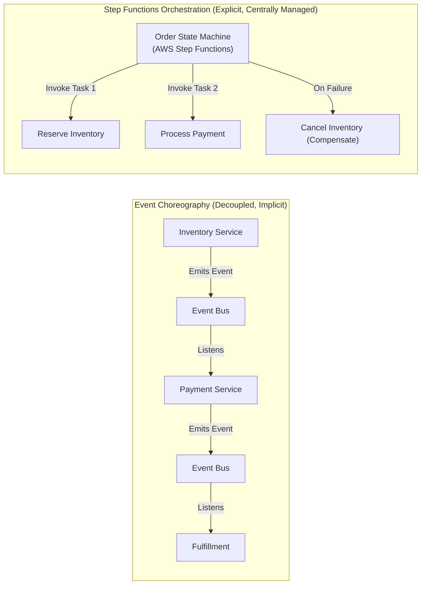

# Lecture 03.01 · 📖 Mechanical Sympathy: Orchestration vs. Choreography, Standard vs. Express Workflows & The Saga Pattern

> **Section:** S03 · **Type:** 📖 Theory · **Track:** ★ Core · **Time:** ~25 minutes  
> **Navigation:** ← [Section 02 Overview](../S02-fanout-sqs/README.md) | [Section 03 Overview](./README.md) | [03.02 · 📇 API Card: SfnClient & ASL JSONPath](./03.02-api-card-sfn-client-asl-jsonpath.md) →  
> **DVA-C02 Domain Focus:** Domain 1 (Development with AWS Services) & Domain 4 (Troubleshooting & Optimization).

---

## Narrative Bridge: Moving Beyond Point-to-Point Messaging

In [Section 02](../S02-fanout-sqs/README.md), we built a resilient asynchronous message pipeline using SNS fan-out and SQS batch processing.

However, once an order is pulled from `BillingQueue`, the checkout process involves multiple distinct microservices:
1. **Warehouse Service**: Holds physical inventory.
2. **Payment Gateway**: Charges customer credit cards.
3. **Fulfillment Service**: Generates tracking numbers and packing slips.

In traditional monolithic architectures, you would wrap these three operations in a single database transaction (`BEGIN TRANSACTION ... COMMIT`). If payment failed, the database automatically rolled back the inventory update.

In a distributed cloud architecture where services own independent databases and APIs, **distributed ACID transactions (Two-Phase Commit / 2PC) do not work**. They require synchronous locks across network boundaries, causing extreme latency, deadlocks, and availability collapse.

To coordinate multi-step workflows safely, distributed architectures choose between **Choreography** and **Orchestration**.

---

## 1. Orchestration vs. Choreography: Distributed Architecture Patterns



### Event Choreography (Pub/Sub)
* **How it works**: Services publish events to SNS or EventBridge without knowing who listens. Subscribed services react and publish follow-up events.
* **When to use**: High fan-out, independent notifications, simple event broadcasting (like our S02 SNS fan-out).
* **The Failure Mode**: For multi-step business transactions, choreography becomes "pinball architecture." If Step 3 fails, coordinating compensating rollbacks across 5 different decoupled services requires cascading failure events that are nearly impossible to trace, audit, or debug.

### Stateful Orchestration (Step Functions)
* **How it works**: A centralized state machine explicitly controls the workflow: *"Call Service A; if successful, call Service B; if Service B fails, call Service A's rollback endpoint and notify customer."*
* **When to use**: High-value business transactions, order fulfillment, credit card settlement, ETL workflows, and human approval steps.
* **Benefits**: Single pane of glass for execution history, explicit timeout and retry management, deterministic state tracking, and zero "lost in flight" orders.

---

## 2. The Saga Pattern: Distributed Rollback Without Locks

The **Saga Pattern** is the standard architectural solution for distributed transactions:
* A Saga is a sequence of local transactions $T_1, T_2, \dots, T_n$.
* For each forward transaction $T_i$, there exists a corresponding **Compensating Transaction** $C_i$ that undoes the side effects of $T_i$.
* If transaction $T_k$ fails, the saga orchestrator aborts forward execution and invokes compensating transactions in reverse order: $C_{k-1}, C_{k-2}, \dots, C_1$.

```text
Happy Path Flow:
[ Start ] ──> [ T1: Reserve Inventory ] ──> [ T2: Process Payment ] ──> [ Success ]

Compensating Rollback Flow (Payment Declined):
[ Start ] ──> [ T1: Reserve Inventory ] ──> [ T2: Process Payment (FAIL!) ]
                                                        │
              [ Abort / Fail ] <── [ C1: Cancel Reservation ] <───┘
```

In CloudOrder, Step Functions acts as the Saga orchestrator. When `ProcessPayment` throws `PaymentDeclinedException`, Step Functions catches the error and executes `CancelInventoryCompensateHandler`.

---

## 3. Standard Workflows vs. Express Workflows: The Mechanical Invariants

AWS Step Functions provides two distinct workflow engines. Choosing the wrong engine can result in either massive bill shocks or failed executions.

| Architectural Dimension | Standard Workflows | Express Workflows |
|---|---|---|
| **Maximum Execution Duration** | **Up to 1 year** | **Up to 5 minutes** |
| **Execution Execution Guarantee** | **Exactly-once** execution model | **At-least-once** execution model |
| **Execution Rate (Scale)** | Up to 2,000 execution starts/sec (burst 4,000) | **100,000+ execution starts/sec** |
| **Execution History & Auditing** | **Full Visual Graph & Audit History** in Console (retained 90 days) | **Zero console history**. Logs emitted to CloudWatch Logs only! |
| **Pricing Model** | **$0.025 per 1,000 state transitions** | Priced by **Duration & Memory (GB-seconds)** + request count (similar to Lambda) |
| **Invocation Types** | Asynchronous only (`StartExecution`) | **Asynchronous AND Synchronous** (`StartSyncExecution`) |
| **Primary Use Cases** | Long-running sagas, human approvals, order fulfillment, payment processing | High-throughput IoT ingestion, streaming ETL, sub-second API Gateway backends |

---

## 4. The 25,000 Event History Limit & Mechanical Traps

On the DVA-C02 exam, AWS tests your knowledge of the internal limits of Standard Workflows:

> [!WARNING]
> **The 25,000 Event History Hard Limit**:
> A Standard Workflow execution can record a maximum of **25,000 events** in its execution history. If an execution exceeds this limit (e.g. an infinite loop or a `Map` state iterating through 50,000 items), the state machine fails immediately with an `ExecutionHistoryExceeded` error!
> 
> **How to architect around it**:
> 1. Use **Nested State Machines**: A parent state machine starts child executions via `arn:aws:states:::states:startExecution.sync:2`.
> 2. Use **Distributed Map State**: Automatically splits processing across child workflows.
> 3. Use **Express Workflows** for high-volume batch loops.

---

## Summary of Mechanical Rules

| Architecture Decision | Production Rule |
|---|---|
| **Transaction Integrity** | Use the **Saga Pattern** with compensating actions; never attempt distributed database locks in serverless. |
| **Workflow Engine Selection** | Use **Standard** for order sagas where exactly-once execution and visual audits are required; use **Express** for high-throughput streaming and synchronous sub-second APIs. |
| **Idempotency** | Always supply `name` in `SfnClient.startExecution()` to prevent duplicate workflow launches on network retries. |
| **History Protection** | Keep standard workflows under 25,000 events; nest workflows for high-iteration batch tasks. |

---

## What's Next?

Now that we understand the orchestration model, the Saga pattern, and the differences between Standard and Express engines, let's dissect the exact SDK contracts and the Amazon States Language (ASL) JSONPath syntax.

Proceed to **[Lecture 03.02 · 📇 API Card: SfnClient & Amazon States Language (ASL)](./03.02-api-card-sfn-client-asl-jsonpath.md)**.

---

**Navigation**:  
← [Section 02 Overview](../S02-fanout-sqs/README.md) | [Section 03 Overview](./README.md) | [03.02 · 📇 API Card: SfnClient & ASL JSONPath](./03.02-api-card-sfn-client-asl-jsonpath.md) →
