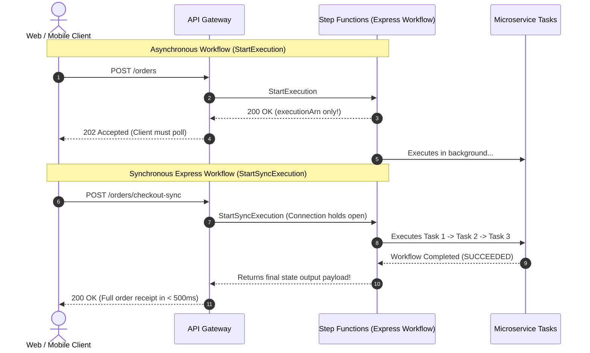

# Lecture 03.09 · ＋ Extended: Synchronous Express Workflows with Direct API Gateway HTTP Ingress

> **Section:** S03 · **Type:** ＋ Extended · **Track:** ＋ Extended · **Time:** ~30 minutes  
> **Navigation:** ← [03.08 · 🔓 Attack Lab: Workflow Concurrency Starvation](./03.08-attack-lab-standard-vs-express-pricing-collapse.md) | [Section 03 Overview](./README.md) | [03.99 · ✅ DVA-C02 Knowledge Check](./03.99-knowledge-check.md) →  
> **DVA-C02 Exam Focus:** `StartSyncExecution`, Synchronous Express Workflows, Direct API Gateway Service Integrations.

---

## Narrative Bridge: Real-Time Synchronous Orchestration

In the core track of Section 03, our state machine ran asynchronously. When an order event arrived, we launched a workflow in the background, requiring the consumer to either poll `DescribeExecution` or wait for an EventBridge event upon completion.

However, many enterprise applications require **synchronous request-response orchestration**:
* A checkout UI displays a spinner while the payment and inventory reservation execute, expecting a final confirmed receipt in under 1 second.
* If you use Standard Workflows, you cannot return the result in the HTTP response because Standard Workflows are strictly asynchronous.
* If you write a Lambda function that launches an asynchronous workflow and loops with `Thread.sleep()` polling for status, you burn expensive Lambda compute time and risk API Gateway's 29-second timeout limit!

To solve this, AWS introduced **Synchronous Express Workflows** powered by the **`StartSyncExecution` API**.

---

## 1. Asynchronous (`StartExecution`) vs. Synchronous (`StartSyncExecution`)



| Dimension | `StartExecution` (Standard / Express) | `StartSyncExecution` (Express Only) |
|---|---|---|
| **Response Payload** | Returns only `executionArn` and `startDate`. | Returns full `status`, `output` JSON, or `error`/`cause`. |
| **Connection Lifecycle** | Returns immediately (~30ms); execution runs in background. | **Holds connection open** until the workflow completes or times out. |
| **Max Timeout** | Standard: 1 year; Express: 5 minutes. | **Max 5 minutes** (or 29s if behind API Gateway). |
| **SDK API Method** | `sfnClient.startExecution(...)` | `sfnClient.startSyncExecution(...)` |
| **DVA-C02 Rule** | Standard Workflows **CANNOT** use `StartSyncExecution`! | Only supported on `Type: EXPRESS`. |

---

## 2. Java SDK v2 Implementation with `StartSyncExecution`

```java
package com.cloudarchitect.dvac02.workflow.service;

import software.amazon.awssdk.services.sfn.SfnClient;
import software.amazon.awssdk.services.sfn.model.StartSyncExecutionRequest;
import software.amazon.awssdk.services.sfn.model.StartSyncExecutionResponse;
import software.amazon.awssdk.services.sfn.model.SyncExecutionStatus;

public class SyncOrderCheckoutService {

    private final SfnClient sfnClient;
    private final String expressStateMachineArn;

    public SyncOrderCheckoutService(SfnClient sfnClient, String expressStateMachineArn) {
        this.sfnClient = sfnClient;
        this.expressStateMachineArn = expressStateMachineArn;
    }

    public String processOrderSynchronously(String orderJson) {
        StartSyncExecutionRequest request = StartSyncExecutionRequest.builder()
                .stateMachineArn(expressStateMachineArn)
                .input(orderJson)
                .build();

        // ⚡ Blocks synchronously until the state machine finishes!
        StartSyncExecutionResponse response = sfnClient.startSyncExecution(request);

        if (response.status() == SyncExecutionStatus.SUCCEEDED) {
            return response.output(); // Returns the final JSON payload directly!
        } else {
            throw new RuntimeException("Workflow failed: " + response.error() + " - " + response.cause());
        }
    }
}
```

---

## 3. Direct API Gateway to Step Functions Integration (Zero-Lambda Architecture)

Why introduce an intermediate Lambda function just to call `startSyncExecution`?  
API Gateway can connect **directly** to AWS Step Functions using a native AWS Service Integration!

### SAM / CloudFormation Specification:
```yaml
Resources:
  # 1. API Gateway REST API Ingress
  OrderApi:
    Type: AWS::Serverless::Api
    Properties:
      StageName: Prod

  # 2. IAM Role allowing API Gateway to invoke Step Functions
  ApiGatewayStepFunctionsRole:
    Type: AWS::IAM::Role
    Properties:
      AssumeRolePolicyDocument:
        Version: '2012-10-17'
        Statement:
          - Effect: Allow
            Principal:
              Service: apigateway.amazonaws.com
            Action: sts:AssumeRole
      Policies:
        - PolicyName: InvokeStepFunctionsSync
          PolicyDocument:
            Version: '2012-10-17'
            Statement:
              - Effect: Allow
                Action:
                  - states:StartSyncExecution
                Resource: !GetAtt ExpressCheckoutStateMachine.Arn

  # 3. Synchronous Express State Machine
  ExpressCheckoutStateMachine:
    Type: AWS::Serverless::StateMachine
    Properties:
      Name: CloudOrderSyncCheckout
      Type: EXPRESS
      Role: !GetAtt StateMachineRole.Arn
      Definition: ...
```

### In OpenAPI / Swagger Definition:
```yaml
/orders/sync-checkout:
  post:
    x-amazon-apigateway-integration:
      type: aws
      httpMethod: POST
      uri: !Sub "arn:aws:apigateway:${AWS::Region}:states:action/StartSyncExecution"
      credentials: !GetAtt ApiGatewayStepFunctionsRole.Arn
      requestTemplates:
        application/json: !Sub |
          {
            "input": "$util.escapeJavaScript($input.json('$'))",
            "stateMachineArn": "${ExpressCheckoutStateMachine.Arn}"
          }
      responses:
        default:
          statusCode: "200"
          responseTemplates:
            application/json: |
              #set($output = $util.parseJson($input.json('$.output')))
              $output
```

### Architectural Benefits:
1. **Zero Cold Starts**: Eliminates the 200–500ms JVM cold start of an ingress Lambda function.
2. **Reduced Latency**: Cuts HTTP hop overhead by 50%.
3. **Cost Savings**: Eliminates one Lambda compute bill completely!

---

## What's Next?

You have mastered the foundational theory of distributed orchestrations, written Java 21 saga participants, declared ASL state machines in SAM, observed live telemetry, debugged the `ResultPath` state wipe defect, analyzed Express vs. Standard economics, and implemented direct synchronous integrations.

Now it is time to prove your knowledge against high-yield DVA-C02 exam scenarios.

Proceed to **[Lecture 03.99 · ✅ DVA-C02 Knowledge Check: Step Functions Workflows, ASL Syntax, and Error Handling](./03.99-knowledge-check.md)**.

---

**Navigation**:  
← [03.08 · 🔓 Attack Lab: Workflow Concurrency Starvation](./03.08-attack-lab-standard-vs-express-pricing-collapse.md) | [Section 03 Overview](./README.md) | [03.99 · ✅ DVA-C02 Knowledge Check](./03.99-knowledge-check.md) →
