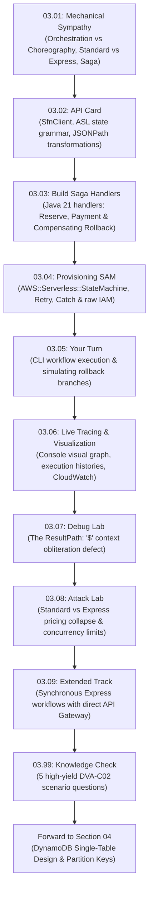

# Section 03 · Stateful Microservice Orchestration & Saga Pattern
## Coordinating Distributed Transactions in CloudOrder

> **Theme**: Transitioning from decoupled event queuing to stateful microservice orchestration using AWS Step Functions, mastering Amazon States Language (ASL) payload transformations, executing automated compensating rollbacks (the Saga Pattern), and comparing Standard vs. Express workflow economics.

---

## 1. The Narrative Arc of This Section

In [Section 02](../S02-fanout-sqs/README.md), we decoupled our ingress API by fanning out order events from Amazon SNS into Amazon SQS queues. But order processing is rarely a single atomic step. Completing a purchase requires:
1. Reserving physical inventory in the warehouse.
2. Authorizing and settling payment with a payment processor.
3. Generating invoices and dispatching delivery orders.

If payment fails *after* inventory is reserved, how do we guarantee the warehouse reservation is cancelled? If a service crashes halfway through, who tracks the state?

In **Section 03**, we implement **AWS Step Functions** to orchestrate the **CloudOrder Checkout Saga**. 

Here is the engineering journey across this section:

---

## 2. Lecture Roadmap & Reading Order

| # | Lecture | Type | What Happens in the Story |
|---|---|:---:|---|
| **[03.01](./03.01-mechanical-sympathy-orchestration-saga-standard-vs-express.md)** | **Mechanical Sympathy** | 📖 | You learn why distributed choreographies fail under complex failures, how the Saga Pattern coordinates two-phase rollbacks, and the mechanical differences between Standard and Express workflows. |
| **[03.02](./03.02-api-card-sfn-client-asl-jsonpath.md)** | **📇 API Card: SFN & ASL** | 📇 | You master the AWS SDK Java v2 `SfnClient`, Amazon States Language syntax (`Task`, `Choice`, `Fail`), and the 5 critical JSONPath filters (`InputPath`, `Parameters`, `ResultSelector`, `ResultPath`, `OutputPath`). |
| **[03.03](./03.03-build-saga-tasks-compensating-handlers.md)** | **Build: Saga Handlers** | 🛠 | You implement Java 21 Lambda handlers for inventory reservation, payment processing, compensating rollback, and client execution triggering via `SfnClient`. |
| **[03.04](./03.04-provisioning-step-functions-asl-sam.md)** | **Provisioning: SAM Template** | 🛠 | You write the SAM template declaring the `AWS::Serverless::StateMachine`, exponential backoff retry policies, targeted exception catch blocks, and raw JSON IAM execution roles. |
| **[03.05](./03.05-your-turn-cli-executions-compensating-rollback.md)** | **Your Turn: CLI Saga Execution** | 🎯 | You trigger live state machine runs with `aws stepfunctions start-execution`, verify the happy path, and pass `failPayment: true` to observe the compensating rollback in action. |
| **[03.06](./03.06-live-verification-cloudwatch-visual-workflow.md)** | **Live Verification & Graph** | 🧩 | You inspect the visual state transition diagram in the AWS Management Console and trace state inputs/outputs across CloudWatch Logs. |
| **[03.07](./03.07-debug-resultpath-state-obliteration.md)** | **Debug: Context Obliteration** | 🐞 | You diagnose the classic DVA-C02 exam bug where `"ResultPath": "$"` overwrites the root execution state and wipes out customer IDs needed downstream. |
| **[03.08](./03.08-attack-lab-standard-vs-express-pricing-collapse.md)** | **Attack Lab: Pricing Collapse** | 🔓 | You analyze what happens when high-throughput workloads (10,000 TPS) mistakenly use Standard Workflows ($0.025 per 1,000 transitions), and how Express Workflows protect your budget. |
| **[03.09](./03.09-extended-synchronous-express-workflows.md)** | **Extended: Synchronous Express** | ＋ | You build sub-second Synchronous Express Workflows directly integrated with API Gateway HTTP APIs (`StartSyncExecution`), returning instant execution responses without polling. |
| **[03.99](./03.99-knowledge-check.md)** | **DVA-C02 Knowledge Check** | ✅ | You prove your exam readiness with 5 deep scenario questions covering Standard vs. Express workflows, ASL JSONPath manipulation, and error handling. |

---

## 3. Checkpoint & Next Section Preview

* **Section Checkpoint**: `s03-end` (Frozen source code and SAM template in `reference/snapshots/s03-end/`).
* **The Bridge to Section 04**: Our multi-step checkout workflow can now orchestrate payments and rollbacks safely. But where do the state machine tasks persist order records, look up customer account history, and track real-time inventory balances with single-digit millisecond latency? In **Section 04**, we build the persistence backbone of CloudOrder: **Amazon DynamoDB Single-Table Design**, composite keys, and optimistic locking!
