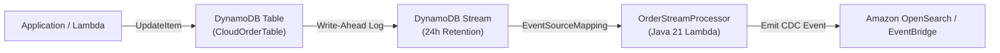

# Lecture 04.09 · ＋ Extended: DynamoDB Streams CDC, Batch Bisection & DAX In-Memory Acceleration

> **Section:** S04 · **Type:** ＋ Extended · **Track:** ＋ Extended · **Time:** ~30 minutes  
> **Navigation:** ← [04.08 · 🔓 Attack Lab: Unbounded Scan DoS & Capacity Depletion](./04.08-attack-lab-unbounded-scan-rcu-exhaustion.md) | [Section 04 Overview](./README.md) | [04.99 · ✅ DVA-C02 Knowledge Check](./04.99-knowledge-check.md) →  
> **DVA-C02 Focus:** DynamoDB Streams view types, shard bisection, Lambda integration, and DAX in-memory caching.

---

## Narrative Bridge: Real-Time Event Streaming & Microsecond Acceleration

In the core track of Section 04, we mastered Single-Table Design, GSI overloading, and optimistic locking.

However, two enterprise requirements remain:
1. **Change Data Capture (CDC)**: How do downstream analytics, search engines (OpenSearch), and audit logs react immediately whenever an order transitions to `COMPLETED`?
2. **Sub-Millisecond Read Latency**: While DynamoDB's 4–8ms response time is excellent, flash-sale product pages receiving 100,000 reads/sec demand **microsecond latency** without burning millions of RCUs.

To solve these, AWS provides **DynamoDB Streams** and **Amazon DynamoDB Accelerator (DAX)**.

---

## 1. DynamoDB Streams: Real-Time Change Data Capture (CDC)

DynamoDB Streams captures a time-ordered sequence of item-level modifications in any DynamoDB table and stores them in a durable log for **24 hours**.



### The 4 Stream View Types (High-Yield Exam Matrix):
When enabling DynamoDB Streams in CloudFormation (`StreamViewType`), you must select what data is captured:

| `StreamViewType` | What Is Included in the Stream Record | Common Use Case |
|---|---|---|
| `KEYS_ONLY` | Only the key attributes (`PK`, `SK`) of the modified item. | Simple invalidation signals; cache eviction notices. |
| `NEW_IMAGE` | The entire item as it appears **after** the modification. | Search index synchronization; downstream event publishing. |
| `OLD_IMAGE` | The entire item as it appeared **before** the modification. | Audit history; compliance logging; calculating changes. |
| `NEW_AND_OLD_IMAGES` | **Both the old and new images** of the item. | Financial transaction reconciliations; state delta analysis. |

---

## 2. Stream Ingestion Mechanics & The Poison Pill Shard Blocker

When an AWS Lambda function consumes a DynamoDB Stream:
* The Lambda event poller leases records from stream shards sequentially.
* Because records within a shard are **strictly ordered by partition key**, an unhandled exception in Lambda will **block the entire shard from advancing**!
* The poller will retry the failed batch until the 24-hour stream retention period expires, resulting in massive data lag.

### The Solution: Shard Bisection (`BisectBatchOnFunctionError`)

```yaml
OrderTableStreamEvent:
  Type: DynamoDB
  Properties:
    Stream: !GetAtt CloudOrderTable.StreamArn
    StartingPosition: TRIM_HORIZON
    BatchSize: 100
    BisectBatchOnFunctionError: true # ⚡ Automatically isolates poisoned records!
    MaximumRetryAttempts: 3
    DestinationConfig:
      OnFailure:
        Destination: !GetAtt StreamDLQ.Arn
```

```text
Incoming Batch (100 items) ──> Fails on item #73!
                                     │
         ┌───────────────────────────┴───────────────────────────┐
         ▼                                                       ▼
Batch A (Items 1-50): SUCCESS!                          Batch B (Items 51-100): FAILS!
                                                                 │
                                     ┌───────────────────────────┴───────────────────────────┐
                                     ▼                                                       ▼
                            Batch B1 (Items 51-75): FAILS!                  Batch B2 (Items 76-100): SUCCESS!
                                     │
                                     ▼ (Continues until item #73 is isolated and routed to DLQ!)
```

---

## 3. Amazon DynamoDB Accelerator (DAX): Microsecond In-Memory Caching

When even single-digit millisecond latency is too slow, **DAX** delivers **microsecond response times** (up to 10x performance boost) by placing an in-memory cache directly in front of DynamoDB.

```mermaid
flowchart LR
    Client["Java 21 Application"] -->|SDK Request| DAX["DAX Cluster<br/>(VPC Subnet Group)"]
    DAX -->|Cache Hit (Microseconds)| Client
    DAX -->|Cache Miss| DDB["Amazon DynamoDB<br/>(CloudOrderTable)"]
```

### Key DAX Architectural Properties:
1. **Drop-in Compatibility**: You do not change your table queries or data model. The AWS SDK provides a DAX client that implements the exact same API as `DynamoDbClient`.
2. **Write-Through Caching**: Writes to DAX are synchronously acknowledged only after they are persisted to both DAX and the underlying DynamoDB table.
3. **The Two Cache Stores**:
   * **Item Cache**: Caches results of `GetItem` and `BatchGetItem` (default TTL: 5 minutes).
   * **Query Cache**: Caches query parameters and result sets of `Query` and `Scan` (default TTL: 5 minutes).

### DAX vs. Amazon ElastiCache Redis:
| Dimension | DAX (DynamoDB Accelerator) | Amazon ElastiCache (Redis) |
|---|---|---|
| **Code Changes** | **Zero application logic change**; drop-in SDK replacement. | Requires custom cache-aside logic (`get`, `set`, cache invalidation). |
| **Data Scope** | Dedicated specifically to Amazon DynamoDB tables. | General-purpose cache for relational DBs, APIs, and sessions. |
| **Write Model** | Strictly **Write-Through**. | Flexible (Cache-Aside, Write-Through, Write-Behind). |
| **Network Location** | Must reside within an Amazon VPC private subnet. | Must reside within an Amazon VPC private subnet. |

---

## What's Next?

You have mastered DynamoDB SSD partition limits, RCU/WCU calculation formulas, Single-Table composite keys, optimistic locking conditional expressions, reserved keyword handling, full-table scan risks, DynamoDB Streams with shard bisection, and DAX in-memory caching.

Now it is time to prove your knowledge against high-yield DVA-C02 exam scenarios.

Proceed to **[Lecture 04.99 · ✅ DVA-C02 Knowledge Check: DynamoDB Capacity Math, Single-Table Modeling & Streams](./04.99-knowledge-check.md)**.

---

**Navigation**:  
← [04.08 · 🔓 Attack Lab: Unbounded Scan DoS & Capacity Depletion](./04.08-attack-lab-unbounded-scan-rcu-exhaustion.md) | [Section 04 Overview](./README.md) | [04.99 · ✅ DVA-C02 Knowledge Check](./04.99-knowledge-check.md) →
