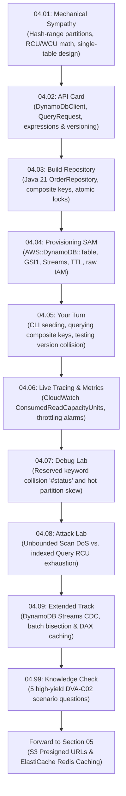

# Section 04 · DynamoDB Single-Table Design, GSI & Optimistic Locking
## The Single-Digit Millisecond Persistence Engine of CloudOrder

> **Theme**: Transitioning from relational paradigms to DynamoDB Single-Table Design, mastering partition key mathematics, calculating exact RCU/WCU consumption, enforcing atomic optimistic locking with version attributes, and capturing change data via DynamoDB Streams.

---

## 1. The Narrative Arc of This Section

In [Section 03](../S03-step-functions/README.md), we built a stateful checkout saga that orchestrated inventory reservation, payment processing, and compensating rollbacks. But state machine executions are ephemeral. Where do we store order history, customer account balances, and product catalogs with predictable single-digit millisecond latency at scale?

In **Section 04**, we construct the persistence foundation of CloudOrder using **Amazon DynamoDB**. Instead of deploying multiple normalized relational tables with slow SQL joins, we model all entities (Customers, Orders, OrderItems) into a **Single Table** using composite keys (`PK`/`SK`) and Global Secondary Index (`GSI1`) overloading.

Here is the engineering journey across this section:

---

## 2. Lecture Roadmap & Reading Order

| # | Lecture | Type | What Happens in the Story |
|---|---|:---:|---|
| **[04.01](./04.01-mechanical-sympathy-hash-partitions-rcu-wcu.md)** | **Mechanical Sympathy** | 📖 | You learn the physical architecture of DynamoDB SSD storage partitions (10 GB / 1,000 WCU / 3,000 RCU limits), calculate exact capacity consumption, and learn the single-table design philosophy. |
| **[04.02](./04.02-api-card-dynamodb-client-enhanced-client.md)** | **📇 API Card: DynamoDB & Expressions** | 📇 | You study the AWS SDK Java v2 `DynamoDbClient`, `QueryRequest`, `UpdateItemRequest`, `KeyConditionExpression`, and conditional expression syntax. |
| **[04.03](./04.03-build-single-table-repository-optimistic-locking.md)** | **Build: Single-Table Repository** | 🛠 | You implement Java 21 `OrderRepository` and `OrderEntity`, mapping composite keys, querying GSI1, and preventing lost updates with atomic version increments. |
| **[04.04](./04.04-provisioning-dynamodb-sam-template.md)** | **Provisioning: SAM Template** | 🛠 | You write the SAM template declaring `CloudOrderTable` with GSI overloading, TimeToLive (TTL), DynamoDB Streams (`NEW_AND_OLD_IMAGES`), and raw IAM roles. |
| **[04.05](./04.05-your-turn-cli-seeding-querying-optimistic-locking.md)** | **Your Turn: CLI Seeding & Queries** | 🎯 | You seed single-table data via AWS CLI, execute composite range queries (`begins_with`), and intentionally trigger `ConditionalCheckFailedException`. |
| **[04.06](./04.06-live-verification-cloudwatch-rcu-wcu-throttling.md)** | **Live Verification & Metrics** | 🧩 | You inspect CloudWatch metrics (`ConsumedReadCapacityUnits`, `ConsumedWriteCapacityUnits`, `ThrottledRequests`) and understand partition-level provisioning. |
| **[04.07](./04.07-debug-reserved-keyword-collision-and-hot-partition.md)** | **Debug: Reserved Keyword Collision** | 🐞 | You diagnose `ValidationException` caused by reserved keyword `status`, resolve it with `#status` attribute mapping, and detect hot partition skew. |
| **[04.08](./04.08-attack-lab-unbounded-scan-rcu-exhaustion.md)** | **Attack Lab: Unbounded Scan DoS** | 🔓 | You benchmark a full-table `Scan` vs an indexed `Query`, observing RCU depletion and latency collapse on large datasets. |
| **[04.09](./04.09-extended-dynamodb-streams-cdc-and-dax.md)** | **Extended: Streams & DAX Cache** | ＋ | You master DynamoDB Streams with shard bisection (`BisectBatchOnFunctionError`) and explore in-memory microsecond reads with DynamoDB Accelerator (DAX). |
| **[04.99](./04.99-knowledge-check.md)** | **DVA-C02 Knowledge Check** | ✅ | You prove your exam readiness with 5 deep scenario questions covering capacity unit math, single-table modeling, GSI projections, and streams. |

---

## 3. Checkpoint & Next Section Preview

* **Section Checkpoint**: `s04-end` (Frozen source code and SAM template in `reference/snapshots/s04-end/`).
* **The Bridge to Section 05**: DynamoDB provides single-digit millisecond reads for operational order data, but storing large binary assets (PDF invoices, product images) inside DynamoDB items is expensive and violates the 400 KB item limit. Furthermore, read traffic on static catalog data should never hit our database. In **Section 05**, we dive into **Amazon S3 Presigned URLs, S3 Event Notifications, and Amazon ElastiCache Redis**!
