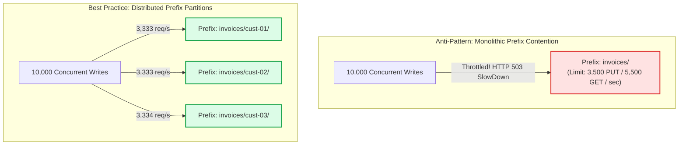
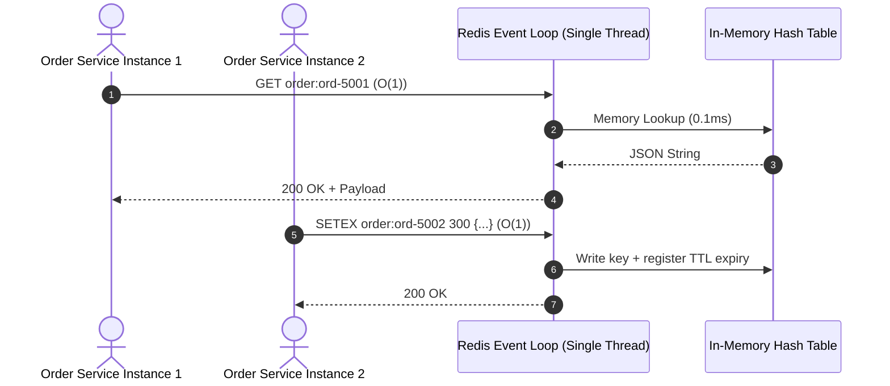

# Lecture 05.01 · 📖 Mechanical Sympathy: S3 Strong Read-After-Write Consistency, Redis Memory Architecture & Cache-Aside Semantics

> **Section:** S05 · **Type:** 📖 Theory · **Track:** ★ Core · **Time:** ~30 minutes  
> **Navigation:** ← [Section 04: 04.99 · Knowledge Check](../S04-dynamodb-persistence/04.99-knowledge-check.md) | [Section 05 Overview](./README.md) | [05.02 · 📇 API Card: S3Client, S3Presigner & Redis](./05.02-api-card-s3-presigner-elasticache-redis.md) →  
> **Project feature:** Architectural foundations for CloudOrder's object storage tier and in-memory cache. Explores the physical prefix partitioning model and strong read-after-write consistency of Amazon S3, along with the single-threaded reactor pattern and cache-aside semantics of ElastiCache Redis.  
> **Core Concepts:** S3 prefix partitioning (3,500 PUT / 5,500 GET per second per prefix), strong consistency model, multipart upload thresholds (5 MB - 5 TB), Redis event loop, Cache-Aside vs. Write-Through, TTL jitter.

---

## 1. Physical Anatomy of Amazon S3

Amazon S3 is not a hierarchical POSIX filesystem; it is a massively distributed, flat key-value object store. The "directories" you see in the AWS Console (e.g., `invoices/2026/09/invoice-101.pdf`) are simply characters in a single UTF-8 string called the **Object Key**.

### 1.1 Prefix Partitioning & Request Rate Limits
Behind the scenes, S3 automatically partitions bucket indices based on object key **prefixes**:

$$\text{Prefix} = \text{The substring of the key up to any slash delimiter or character boundary}$$

Each individual prefix partition supports:
* **3,500 PUT / COPY / POST / DELETE** requests per second.
* **5,500 GET / HEAD** requests per second.

If your application writes all invoices to a single path without partition distribution (e.g., `invoices/invoice-001.pdf` through `invoices/invoice-999.pdf`), all writes contend on a single partition key range, bottlenecking at 3,500 writes/sec.



> [!NOTE]
> In legacy S3 architectures (prior to 2018), engineers added MD5 hexadecimal hashes to the start of keys (e.g., `2a8f-invoices/2026/...`). Today, S3 automatically splits partitions dynamically as traffic scales. However, distributing high-rate writes across distinct prefixes (such as by customer ID or date prefixes) remains best practice for high-throughput applications.

### 1.2 Strong Read-After-Write Consistency
Prior to December 2020, Amazon S3 provided eventual consistency for overwrite PUTs and DELETEs. Today, S3 provides **strong read-after-write consistency** for `PUT` and `DELETE` requests of objects across all AWS Regions:
1. Immediately after a successful `PUT` of a new object or overwrite of an existing object, any subsequent `GET` or `HEAD` request immediately returns the latest version.
2. Changes to object metadata and bucket configurations are strongly consistent.
3. Bucket listing operations (`ListObjectsV2`) are strongly consistent immediately after writes.

### 1.3 Object Size Boundaries & Multipart Uploads
* **Single `PutObject` Operation**: Maximum payload size is **5 GB**.
* **Multipart Upload**:
  * Recommended for objects $> 100\text{ MB}$.
  * Mandatory for objects $> 5\text{ GB}$.
  * Maximum total object size: **5 TB**.
  * Individual part size: **5 MB to 5 GB** (the last part can be $< 5\text{ MB}$).
  * Total parts supported: 1 to 10,000 parts.
  * **Mechanical Advantage**: Parts upload in parallel, and transient network errors only require retransmitting the failed 5 MB part rather than the entire multi-gigabyte file.

---

## 2. ElastiCache Redis Memory Architecture

While Amazon S3 provides durable, low-cost persistence ($0.023/GB/month) with latencies around $10\text{--}50\text{ ms}$, relational and NoSQL databases like DynamoDB incur read capacity unit costs and single-digit millisecond latency ($2\text{--}10\text{ ms}$).

When customer traffic spikes (e.g., flash sales or dashboard order history lookups), querying DynamoDB on every request saturates provisioned capacity and introduces latency jitter. **Amazon ElastiCache for Redis** serves reads in **sub-millisecond (< 1 ms)** time directly from RAM.

### 2.1 The Single-Threaded Reactor Event Loop
Redis processes execution commands on a **single CPU thread** using an asynchronous I/O multiplexer (epoll/kqueue event loop):
* **Zero Lock Contention**: Because command execution is strictly sequential, Redis eliminates mutex overhead, race conditions, and deadlocks.
* **Deterministic Throughput**: A single `cache.t4g.micro` node can execute $50,000+$ operations per second provided operations are $O(1)$ (e.g., `GET`, `SET`, `DEL`).
* **The Hot Key Danger**: If a query executes an $O(N)$ command (such as `KEYS *` or huge `SMEMBERS`), the entire Redis thread blocks, queuing all subsequent client requests and triggering application-wide timeouts.



---

## 3. Caching Strategies: Cache-Aside vs. Write-Through

When integrating Redis into a microservice architecture, two primary design patterns emerge:

### 3.1 Cache-Aside (Lazy Loading) - CloudOrder Pattern
In the **Cache-Aside** pattern, the application code is responsible for coordinating the database and the cache:

```mermaid
flowchart TD
    Start(["Application Request:\ngetOrder(orderId)"]) --> CheckCache{"1. Query Redis:\nGET order:{orderId}"}
    
    CheckCache -->|Cache HIT\n(Sub-millisecond)| ReturnCached["Return Cached JSON\n(Zero Database Cost)"]
    ReturnCached --> Done(["Complete Request"])

    CheckCache -->|Cache MISS\n(null)| QueryDB["2. Query DynamoDB Table\n(Consume 1 RCU)"]
    QueryDB --> PopulateCache["3. Write to Redis with TTL:\nSETEX order:{orderId} 300 {...}"]
    PopulateCache --> ReturnDB["4. Return DB Entity"]
    ReturnDB --> Done

    classDef hit fill:#dcfce7,stroke:#16a34a,stroke-width:2px;
    classDef miss fill:#fef3c7,stroke:#d97706,stroke-width:2px;
    class ReturnCached hit;
    class QueryDB,PopulateCache miss;
```

#### Advantages:
1. **Resilience to Cache Node Outages**: If the Redis cluster crashes or restarts, the application seamlessly falls back to querying the database directly.
2. **Resource Efficiency**: Only frequently requested orders occupy RAM. Abandoned orders or stale historical records never enter the cache.

#### Disadvantages & Mitigation:
1. **Three-Trip Latency Penalty on Cache Miss**: Client $\rightarrow$ Cache $\rightarrow$ DB $\rightarrow$ Cache $\rightarrow$ Client.
2. **Stale Data Window**: If the order status changes in DynamoDB, the cache may serve outdated data until the TTL expires.
   * *Mitigation*: Trigger active cache eviction (`DEL order:{orderId}`) whenever updates occur (e.g., via the S3 invoice handler or payment callback).

### 3.2 Write-Through Pattern
In the **Write-Through** pattern, data is written to the cache and the primary database simultaneously:
1. Application updates DynamoDB and immediately writes to Redis.
2. Prevents stale data reads because the cache is always fresh.
3. *Penalty*: Increases write latency and wastes memory caching records that may never be read again.

---

## 4. Cache Expiration & The TTL Jitter Invariant

Setting an identical Time-To-Live (e.g., exactly 300 seconds) across all cached orders creates a catastrophic vulnerability known as a **Cache Stampede (Thundering Herd)**:

$$\text{Fixed TTL Vulnerability: If 5,000 orders are written at 09:00:00, all 5,000 keys expire at exactly 09:05:00.}$$

At 09:05:01, incoming traffic causes 5,000 simultaneous cache misses, unleashing thousands of concurrent queries onto DynamoDB and crashing database partitions.

To prevent this, production applications introduce **TTL Jitter**:

$$\text{Actual TTL} = \text{Base TTL} + \text{UniformRandom}(0, \text{JitterSeconds})$$

$$\text{TTL} = 300\text{ seconds} + \text{random}(0, 60)\text{ seconds} \implies \text{Keys expire smoothly between 300s and 360s.}$$

---

## Storytelling Bridge to API Contracts

Now that we understand the physical request limits of S3, its strong read-after-write consistency model, and the sub-millisecond Cache-Aside mechanics of Redis, we need the exact code abstractions to invoke them.

In [Lecture 05.02 · 📇 API Card: S3Client, S3Presigner & Redis](./05.02-api-card-s3-presigner-elasticache-redis.md), we will inspect the Java 21 AWS SDK v2 contracts for `S3Presigner`, SigV4 query strings, and Lettuce's atomic Redis commands.
