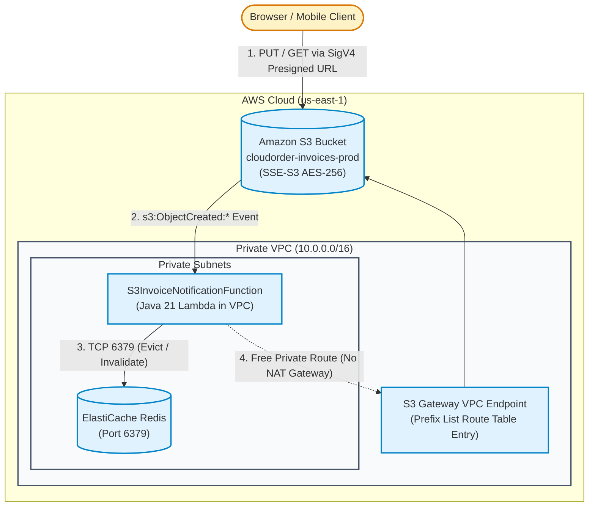

# Lecture 05.04 · 🛠 Provisioning: S3 Bucket, Event Notifications, ElastiCache Redis in Private VPC & SAM Template

> **Section:** S05 · **Type:** 🛠 Provisioning · **Track:** ★ Core · **Time:** ~35 minutes  
> **Navigation:** ← [05.03 · 🛠 Build: S3 Storage & Redis Cache](./05.03-build-s3-presigner-and-redis-cache.md) | [Section 05 Overview](./README.md) | [05.05 · 🎯 Your Turn: Presigned URLs & Cache Hits](./05.05-your-turn-presigned-urls-redis-cache.md) →  
> **Project feature:** Declarative AWS SAM infrastructure for CloudOrder's object storage and caching tier. Configures private Amazon S3 invoice bucket with SSE-S3 AES-256 encryption, CORS rules, and S3 Event Notifications to Lambda; deploys an ElastiCache Redis cluster inside private VPC subnets with ingress security group chaining; provisions a free S3 Gateway VPC Endpoint to avoid NAT Gateway egress costs; and binds least-privilege raw JSON IAM policies for VPC ENI attachment and S3 object manipulation.  
> **Verified:** `template.yaml` (Module 05 declarative SAM resource definitions, IAM policies, and VPC configuration).

---

## Narrative Bridge: Wiring Storage & Caching in Infrastructure as Code

In [Lecture 05.03](./05.03-build-s3-presigner-and-redis-cache.md), we wrote the compilable Java 21 services for presigned URLs, S3 event handling, and Redis cache-aside operations. Now, we translate those runtime expectations into declarative AWS CloudFormation / SAM infrastructure.



---

## 1. Complete AWS SAM Template

The following template declares our complete Module 05 production environment:

✍️ `template.yaml`

```yaml
AWSTemplateFormatVersion: '2010-09-09'
Transform: AWS::Serverless-2016-10-31
Description: >
  CloudOrder Module 5: S3 Event Notifications, S3Presigner,
  ElastiCache Redis in Private VPC, and S3 Gateway VPC Endpoint.

Parameters:
  Environment:
    Type: String
    Default: prod
    AllowedValues: [dev, staging, prod]
    Description: Deployment environment tier.

  VpcId:
    Type: AWS::EC2::VPC::Id
    Default: vpc-0123456789abcdef0
    Description: VPC ID where ElastiCache Redis and Lambda ENIs reside.

  PrivateSubnetIds:
    Type: List<AWS::EC2::Subnet::Id>
    Default: subnet-0123456789abcdef1,subnet-0123456789abcdef2
    Description: Private VPC Subnets for ElastiCache Subnet Group and Lambda VPC execution.

  RouteTableIds:
    Type: List<String>
    Default: rtb-0123456789abcdef0
    Description: Private Route Table IDs to associate with S3 Gateway VPC Endpoint.

Globals:
  Function:
    Runtime: java21
    Architectures:
      - arm64
    MemorySize: 512
    Timeout: 30

Resources:

  # ----------------------------------------------------------------------------
  # 1. Amazon S3 Invoice Storage Bucket
  # ----------------------------------------------------------------------------
  InvoicesBucket:
    Type: AWS::S3::Bucket
    DependsOn: S3InvoiceNotificationPermission
    Properties:
      BucketName: !Sub cloudorder-invoices-${Environment}-${AWS::AccountId}-${AWS::Region}
      BucketEncryption:
        ServerSideEncryptionConfiguration:
          - ServerSideEncryptionByDefault:
              SSEAlgorithm: AES256
      PublicAccessBlockConfiguration:
        BlockPublicAcls: true
        IgnorePublicAcls: true
        BlockPublicPolicy: true
        RestrictPublicBuckets: true
      CorsConfiguration:
        CorsRules:
          - Id: AllowDirectClientPresignedUploadDownload
            AllowedMethods:
              - GET
              - PUT
              - HEAD
            AllowedOrigins:
              - '*'
            AllowedHeaders:
              - '*'
            MaxAge: 3600
      NotificationConfiguration:
        LambdaConfigurations:
          - Event: 's3:ObjectCreated:*'
            Function: !GetAtt S3InvoiceNotificationFunction.Arn
            Filter:
              S3Key:
                Rules:
                  - Name: prefix
                    Value: invoices/
                  - Name: suffix
                    Value: .pdf

  # Strict TLS / HTTPS Enforcement Bucket Policy
  InvoicesBucketPolicy:
    Type: AWS::S3::BucketPolicy
    Properties:
      Bucket: !Ref InvoicesBucket
      PolicyDocument:
        Version: '2012-10-17'
        Statement:
          - Sid: EnforceSecureTransport
            Effect: Deny
            Principal: '*'
            Action: 's3:*'
            Resource:
              - !GetAtt InvoicesBucket.Arn
              - !Sub '${InvoicesBucket.Arn}/*'
            Condition:
              Bool:
                'aws:SecureTransport': 'false'

  # Permission allowing Amazon S3 to invoke the Notification Lambda
  S3InvoiceNotificationPermission:
    Type: AWS::Lambda::Permission
    Properties:
      FunctionName: !GetAtt S3InvoiceNotificationFunction.Arn
      Action: lambda:InvokeFunction
      Principal: s3.amazonaws.com
      SourceArn: !Sub 'arn:aws:s3:::cloudorder-invoices-${Environment}-${AWS::AccountId}-${AWS::Region}'
      SourceAccount: !Ref AWS::AccountId

  # ----------------------------------------------------------------------------
  # 2. VPC Security Groups & Networking
  # ----------------------------------------------------------------------------
  LambdaSecurityGroup:
    Type: AWS::EC2::SecurityGroup
    Properties:
      GroupDescription: Security group for CloudOrder Lambda functions inside VPC
      VpcId: !Ref VpcId
      SecurityGroupEgress:
        - IpProtocol: '-1'
          CidrIp: 0.0.0.0/0
      Tags:
        - Key: Name
          Value: !Sub cloudorder-lambda-sg-${Environment}

  RedisSecurityGroup:
    Type: AWS::EC2::SecurityGroup
    Properties:
      GroupDescription: Ingress security group for ElastiCache Redis
      VpcId: !Ref VpcId
      SecurityGroupIngress:
        - IpProtocol: tcp
          FromPort: 6379
          ToPort: 6379
          SourceSecurityGroupId: !Ref LambdaSecurityGroup
          Description: Allow TCP 6379 from Lambda Security Group
      Tags:
        - Key: Name
          Value: !Sub cloudorder-redis-sg-${Environment}

  # Amazon S3 Gateway VPC Endpoint (Free, avoids NAT Gateway charges & internet routing)
  S3GatewayVpcEndpoint:
    Type: AWS::EC2::VPCEndpoint
    Properties:
      VpcId: !Ref VpcId
      ServiceName: !Sub com.amazonaws.${AWS::Region}.s3
      VpcEndpointType: Gateway
      RouteTableIds: !Ref RouteTableIds
      PolicyDocument:
        Version: '2012-10-17'
        Statement:
          - Effect: Allow
            Principal: '*'
            Action:
              - 's3:GetObject'
              - 's3:PutObject'
              - 's3:ListBucket'
            Resource:
              - !GetAtt InvoicesBucket.Arn
              - !Sub '${InvoicesBucket.Arn}/*'

  # ----------------------------------------------------------------------------
  # 3. Amazon ElastiCache Redis Cluster
  # ----------------------------------------------------------------------------
  ElastiCacheSubnetGroup:
    Type: AWS::ElastiCache::SubnetGroup
    Properties:
      Description: Private Subnet Group for CloudOrder Redis Cluster
      SubnetIds: !Ref PrivateSubnetIds

  RedisCluster:
    Type: AWS::ElastiCache::CacheCluster
    Properties:
      ClusterName: !Sub cloudorder-cache-${Environment}
      Engine: redis
      EngineVersion: '7.0'
      CacheNodeType: cache.t4g.micro
      NumCacheNodes: 1
      CacheSubnetGroupName: !Ref ElastiCacheSubnetGroup
      VpcSecurityGroupIds:
        - !Ref RedisSecurityGroup
      Tags:
        - Key: Environment
          Value: !Ref Environment

  # ----------------------------------------------------------------------------
  # 4. IAM Execution Role (Raw JSON Least Privilege)
  # ----------------------------------------------------------------------------
  S3InvoiceNotificationRole:
    Type: AWS::IAM::Role
    Properties:
      RoleName: !Sub cloudorder-s3-notification-role-${Environment}
      AssumeRolePolicyDocument:
        Version: '2012-10-17'
        Statement:
          - Effect: Allow
            Principal:
              Service: lambda.amazonaws.com
            Action: sts:AssumeRole
      Policies:
        - PolicyName: S3AndVpcAccessPolicy
          PolicyDocument:
            Version: '2012-10-17'
            Statement:
              # CloudWatch Logs Ingestion
              - Effect: Allow
                Action:
                  - logs:CreateLogGroup
                  - logs:CreateLogStream
                  - logs:PutLogEvents
                Resource: !Sub 'arn:aws:logs:${AWS::Region}:${AWS::AccountId}:log-group:/aws/lambda/*'

              # S3 Object Read/Write
              - Effect: Allow
                Action:
                  - s3:GetObject
                  - s3:GetObjectVersion
                  - s3:PutObject
                Resource: !Sub '${InvoicesBucket.Arn}/*'

              # VPC Elastic Network Interface (ENI) Lifecycle for Lambda
              - Effect: Allow
                Action:
                  - ec2:CreateNetworkInterface
                  - ec2:DescribeNetworkInterfaces
                  - ec2:DeleteNetworkInterface
                  - ec2:AssignPrivateIpAddresses
                  - ec2:UnassignPrivateIpAddresses
                Resource: '*'

  # ----------------------------------------------------------------------------
  # 5. S3 Event Notification Lambda Function
  # ----------------------------------------------------------------------------
  S3InvoiceNotificationFunction:
    Type: AWS::Serverless::Function
    Properties:
      FunctionName: !Sub cloudorder-s3-invoice-consumer-${Environment}
      Handler: com.cloudarchitect.dvac02.caching.handler.S3InvoiceNotificationHandler::handleRequest
      CodeUri: .
      Role: !GetAtt S3InvoiceNotificationRole.Arn
      VpcConfig:
        SecurityGroupIds:
          - !Ref LambdaSecurityGroup
        SubnetIds: !Ref PrivateSubnetIds
      Environment:
        Variables:
          REDIS_HOST: !GetAtt RedisCluster.RedisEndpoint.Address
          REDIS_PORT: !GetAtt RedisCluster.RedisEndpoint.Port
          INVOICES_BUCKET: !Sub cloudorder-invoices-${Environment}-${AWS::AccountId}-${AWS::Region}

Outputs:
  InvoicesBucketName:
    Description: Name of the S3 Invoice Storage Bucket
    Value: !Ref InvoicesBucket

  InvoicesBucketArn:
    Description: ARN of the S3 Invoice Storage Bucket
    Value: !GetAtt InvoicesBucket.Arn

  RedisEndpoint:
    Description: Primary Redis endpoint address
    Value: !GetAtt RedisCluster.RedisEndpoint.Address

  RedisPort:
    Description: Primary Redis port
    Value: !GetAtt RedisCluster.RedisEndpoint.Port

  S3GatewayVpcEndpointId:
    Description: S3 Gateway VPC Endpoint ID
    Value: !Ref S3GatewayVpcEndpoint

  NotificationFunctionArn:
    Description: ARN of the S3 Invoice Notification Lambda Function
    Value: !GetAtt S3InvoiceNotificationFunction.Arn
```

---

## 2. Critical DVA-C02 Architectural Analysis

### 1. The S3-to-Lambda Circular Dependency Trap
When configuring S3 Event Notifications in CloudFormation, a classic circular dependency exists:
* The `InvoicesBucket` notification target references `!GetAtt S3InvoiceNotificationFunction.Arn`.
* The `S3InvoiceNotificationFunction` environment variables reference `!Ref InvoicesBucket`.
* The `S3InvoiceNotificationPermission` grants `s3.amazonaws.com` permission to invoke the function, referencing both the function ARN and bucket ARN.

CloudFormation will fail with `Circular dependency between resources` unless broken cleanly. Notice in our template:
```yaml
InvoicesBucket:
  Type: AWS::S3::Bucket
  DependsOn: S3InvoiceNotificationPermission
```
Adding `DependsOn: S3InvoiceNotificationPermission` on the bucket forces CloudFormation to create the Lambda function and the IAM invoke permission *before* configuring the S3 notification configuration on the bucket.

### 2. S3 Gateway VPC Endpoint vs. Interface VPC Endpoint
In the DVA-C02 exam, cost and architectural trade-offs between VPC Endpoints are heavily tested:

| Metric | Gateway VPC Endpoint (Used Here) | Interface VPC Endpoint (PrivateLink) |
|---|---|---|
| **Supported Services** | **Amazon S3** and **Amazon DynamoDB** only | 100+ AWS services (SQS, SNS, Secrets Manager, etc.) |
| **Pricing** | **100% Free** (No hourly charge, no data processing fees) | $0.01/hour per AZ + $0.01 per GB processed |
| **Networking Mechanism** | Modifies VPC Route Tables with S3 prefix list (`pl-63a5400a`) | Deploys elastic network interfaces (ENIs) with private IPs |
| **DNS Resolution** | Resolves to public IPs; kernel routes traffic through gateway route | Resolves to private VPC IPs via Private DNS |
| **Cross-Region Access** | No (same region only) | Yes (supports cross-region and on-prem Direct Connect) |

Because CloudOrder's Lambda functions run inside private subnets to communicate with ElastiCache Redis, without an S3 VPC Endpoint, all S3 traffic would route through the NAT Gateway, incurring **$0.045/GB** data processing charges. Deploying `AWS::EC2::VPCEndpoint` with `VpcEndpointType: Gateway` eliminates NAT charges completely!

### 3. Security Group Ingress Chaining
Instead of hardcoding CIDR blocks (`10.0.0.0/16`) in the Redis security group, we chain security groups:
```yaml
SecurityGroupIngress:
  - IpProtocol: tcp
    FromPort: 6379
    ToPort: 6379
    SourceSecurityGroupId: !Ref LambdaSecurityGroup
```
This guarantees that **only** ENIs possessing `LambdaSecurityGroup` can initiate TCP handshakes on port 6379, enforcing network microsegmentation.

---

## What We Provisioned & What's Next

We have defined the entire object storage and caching infrastructure:
* Encrypted S3 bucket with CORS and Lambda event notifications.
* Redis cluster protected in private subnets with security group chaining.
* S3 Gateway VPC Endpoint providing zero-cost private access.

In [Lecture 05.05 · 🎯 Your Turn](./05.05-your-turn-presigned-urls-redis-cache.md), you will generate presigned URLs using the AWS CLI, perform curl uploads/downloads, inspect Redis keys, and measure cache hit latency.
