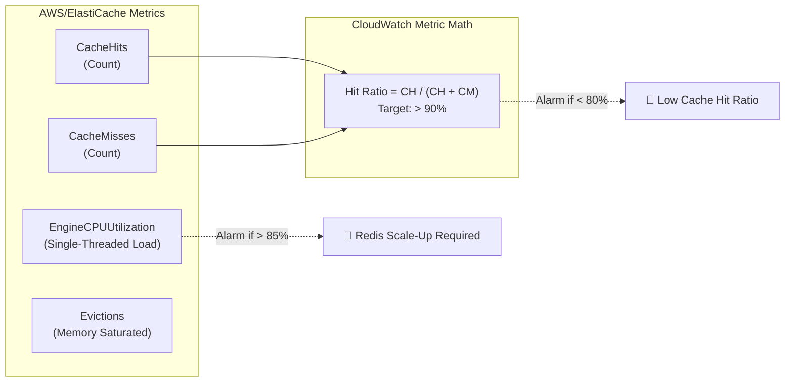

# Lecture 05.06 · 🧩 Live Verification: Measuring Cache Hit Ratio & S3 Request Metrics in CloudWatch

> **Section:** S05 · **Type:** 🧩 Live Verification · **Track:** ★ Core · **Time:** ~30 minutes  
> **Navigation:** ← [05.05 · 🎯 Your Turn: Presigned URLs & Cache Hits](./05.05-your-turn-presigned-urls-redis-cache.md) | [Section 05 Overview](./README.md) | [05.07 · 🐞 Debug Lab: S3 VPC Endpoint & CORS](./05.07-debug-s3-vpc-endpoint-and-cors-denial.md) →  
> **Project feature:** Production telemetry and monitoring for CloudOrder's caching tier. Inspects critical Amazon CloudWatch metrics for ElastiCache Redis (`CacheHits`, `CacheMisses`, `EngineCPUUtilization`, `Evictions`) and Amazon S3 (`4xxErrors`, `5xxErrors`).  
> **DVA-C02 High-Yield Metrics:** EngineCPUUtilization vs. CPUUtilization, Cache Hit Ratio metric math, S3 4xx signature errors.

---

## 1. ElastiCache Redis Core Telemetry

To ensure CloudOrder's cache operates efficiently and protects DynamoDB from excess read load, we must monitor specific ElastiCache CloudWatch metrics under the `AWS/ElastiCache` namespace.



### 1.1 The Critical Distinction: `EngineCPUUtilization` vs. `CPUUtilization`

> [!WARNING]
> **DVA-C02 Trapping Concept: The Multi-Core CPU Trap**  
> Because Redis runs execution commands on a **single CPU core**, a multi-core EC2/cache node can have an `EngineCPUUtilization` of **100%** (the Redis engine is completely saturated and blocking incoming requests) while host-level `CPUUtilization` reports only **25%** on a 4-core instance!  
> **Rule**: Always create CloudWatch alarms on **`EngineCPUUtilization`**, NOT `CPUUtilization`, for Redis workloads.

### 1.2 `Evictions` and Redis Memory Policies

The `Evictions` metric measures the number of keys removed from Redis due to `maxmemory` saturation.
* If `Evictions == 0`: The cluster has ample RAM for all active keys and TTLs.
* If `Evictions > 0` and growing: Keys are being purged before their natural TTL expires because memory is exhausted. This leads to cache miss spikes and increased database load.
* **Remediation**:
  1. Scale up the node size (e.g., from `cache.t4g.micro` to `cache.r6g.large`).
  2. Adjust the eviction policy parameter group (e.g. `allkeys-lru` vs. `volatile-lru`).

---

## 2. Calculating Cache Hit Ratio with CloudWatch Metric Math

Amazon CloudWatch does not emit a pre-calculated "CacheHitRatio" metric. Instead, you construct a Metric Math expression using `CacheHits` and `CacheMisses`:

### 2.1 Metric Math Formula
```text
Expression: e1 = m1 / (m1 + m2) * 100
Where:
  m1 = AWS/ElastiCache: CacheHits (Sum, Period: 300s)
  m2 = AWS/ElastiCache: CacheMisses (Sum, Period: 300s)
```

### 2.2 AWS CLI Command to Create Cache Hit Ratio Alarm
```bash
aws cloudwatch put-metric-alarm \
  --alarm-name "CloudOrder-Redis-LowCacheHitRatio" \
  --alarm-description "Triggers if cache hit ratio drops below 80% for two consecutive 5-minute periods" \
  --evaluation-periods 2 \
  --datapoints-to-alarm 2 \
  --threshold 80.0 \
  --comparison-operator LessThanThreshold \
  --metrics '[
    {
      "Id": "m1",
      "MetricStat": {
        "Metric": {
          "Namespace": "AWS/ElastiCache",
          "MetricName": "CacheHits",
          "Dimensions": [{"Name": "CacheClusterId", "Value": "cloudorder-cache-prod"}]
        },
        "Period": 300,
        "Stat": "Sum"
      },
      "ReturnData": false
    },
    {
      "Id": "m2",
      "MetricStat": {
        "Metric": {
          "Namespace": "AWS/ElastiCache",
          "MetricName": "CacheMisses",
          "Dimensions": [{"Name": "CacheClusterId", "Value": "cloudorder-cache-prod"}]
        },
        "Period": 300,
        "Stat": "Sum"
      },
      "ReturnData": false
    },
    {
      "Id": "e1",
      "Expression": "m1 / (m1 + m2) * 100",
      "Label": "CacheHitRatioPercentage",
      "ReturnData": true
    }
  ]'
```

---

## 3. Amazon S3 Request Metrics & 4xx Error Tracking

Amazon S3 publishes CloudWatch request metrics under `AWS/S3` when request metrics are enabled on the bucket.

| S3 Metric | Significance in CloudOrder |
|---|---|
| `AllRequests` | Total S3 requests (PUT, GET, HEAD, DELETE). |
| `4xxErrors` | Client errors. Spikes indicate **expired presigned URLs**, missing CORS headers, or invalid SigV4 signatures. |
| `5xxErrors` | S3 server errors. Indicates regional service degradation or severe internal retry conditions. |
| `FirstByteLatency` | Time elapsed between request receipt and first byte transmission. |

### Inspecting S3 4xx Errors via AWS CLI:
```bash
aws cloudwatch get-metric-statistics \
  --namespace AWS/S3 \
  --metric-name 4xxErrors \
  --dimensions Name=BucketName,Value=cloudorder-invoices-prod \
               Name=FilterId,Value=EntireBucket \
  --start-time $(date -u -d '1 hour ago' +%Y-%m-%dT%H:%M:%SZ) \
  --end-time $(date -u +%Y-%m-%dT%H:%M:%SZ) \
  --period 300 \
  --statistics Sum
```

If `4xxErrors` spikes after deploying a new client version, verify whether presigned URL expiration windows are too short or if browser clients are altering query string parameters.

---

## Storytelling Bridge to Debugging

In production, metrics are your early warning radar. When a metric like `4xxErrors` spikes or Lambda execution times hit the 30-second timeout ceiling, you must troubleshoot the root cause.

In [Lecture 05.07 · 🐞 Debug Lab: Missing S3 Gateway VPC Endpoint & S3 Bucket CORS Denial](./05.07-debug-s3-vpc-endpoint-and-cors-denial.md), we will diagnose and resolve two enterprise-grade production incidents: a VPC routing black hole to S3 and a browser CORS rejection on presigned PUT uploads.
