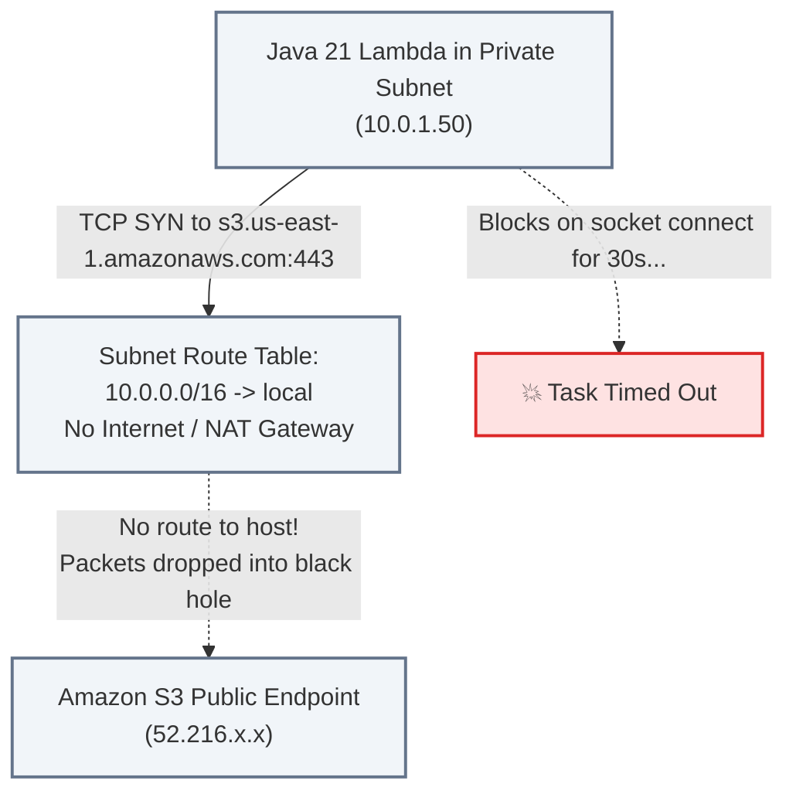

# Lecture 05.07 · 🐞 Debug Lab: Missing S3 Gateway VPC Endpoint & S3 Bucket CORS Denial

> **Section:** S05 · **Type:** 🐞 Debug Lab · **Track:** ★ Core · **Time:** ~35 minutes  
> **Navigation:** ← [05.06 · 🧩 Live Verification: CloudWatch Metrics](./05.06-live-verification-cache-hit-ratio-cloudwatch.md) | [Section 05 Overview](./README.md) | [05.08 · 🔓 Attack Lab: Cache Stampede & URL Tampering](./05.08-attack-lab-cache-stampede-and-presigned-tampering.md) →  
> **Project feature:** Systematic root-cause debugging of two notorious AWS enterprise production failures: Lambda timeout in a private VPC attempting to reach Amazon S3, and browser preflight CORS 403 rejection on direct presigned S3 uploads.

---

## Incident 1: Lambda VPC Execution Timeout on S3 Operations

### 1.1 The Production Symptom
A developer adds VPC configuration (`VpcConfig: SubnetIds, SecurityGroupIds`) to `S3InvoiceNotificationFunction` so it can talk to ElastiCache Redis. Immediately after deployment, the function stops processing S3 events and generates CloudWatch errors:

```text
2026-09-27T09:12:00.000Z START RequestId: 88aa11bb-22cc-33dd-44ee-55ff66aa77bb Version: $LATEST
2026-09-27T09:12:30.002Z 88aa11bb-22cc-33dd-44ee-55ff66aa77bb Task timed out after 30.00 seconds
2026-09-27T09:12:30.003Z END RequestId: 88aa11bb-22cc-33dd-44ee-55ff66aa77bb
2026-09-27T09:12:30.003Z REPORT RequestId: 88aa11bb-22cc-33dd-44ee-55ff66aa77bb Duration: 30002.15 ms Billed Duration: 30000 ms Memory Size: 512 MB
```

### 1.2 Root-Cause Forensic Analysis



1. When a Lambda function is placed inside a VPC, its Elastic Network Interfaces (ENIs) are assigned private IP addresses (e.g., `10.0.1.50`).
2. Private subnets typically do not have direct Internet Gateways (`igw-xxxx`).
3. Standard AWS service endpoints (like `s3.us-east-1.amazonaws.com`) resolve to public IP addresses.
4. Without a NAT Gateway ($32+/mo + data transfer fees) or a Gateway VPC Endpoint, outbound packets to S3 have no valid route and are silently dropped. The Java HTTP client hangs attempting to establish a TCP socket until the Lambda execution timeout trips.

### 1.3 The Production Fix: Provision an S3 Gateway VPC Endpoint
Unlike other AWS services that require paid PrivateLink Interface Endpoints, Amazon S3 supports **Gateway Endpoints**, which are **free** and operate via route table prefix list entries.

Add the following resource to your SAM template:

```yaml
S3GatewayVpcEndpoint:
  Type: AWS::EC2::VPCEndpoint
  Properties:
    VpcId: !Ref VpcId
    ServiceName: !Sub com.amazonaws.${AWS::Region}.s3
    VpcEndpointType: Gateway
    RouteTableIds:
      - !Ref PrivateRouteTableId
```

Upon provisioning, AWS modifies the private route table to inject the AWS S3 regional prefix list:
```text
Destination: pl-63a5400a (com.amazonaws.us-east-1.s3) -> Target: vpce-0a1b2c3d4e5f
```
Lambda establishes direct, private, sub-millisecond connectivity to S3 without internet egress.

---

## Incident 2: Browser CORS Preflight 403 on Presigned PUT Uploads

### 2.1 The Production Symptom
A web frontend attempts to upload a signed invoice PDF directly from the user's browser using JavaScript `fetch()`:

```javascript
const response = await fetch(presignedPutUrl, {
  method: 'PUT',
  headers: { 'Content-Type': 'application/pdf' },
  body: fileBlob
});
```

The browser console immediately reports:
```text
Access to fetch at 'https://cloudorder-invoices-prod.s3.amazonaws.com/invoices/...' 
from origin 'https://app.cloudorder.com' has been blocked by CORS policy: 
Response to preflight request doesn't pass access control check: 
No 'Access-Control-Allow-Origin' header is present on the requested resource.
Status: 403 Forbidden
```

### 2.2 Forensic Analysis
1. Browsers enforce the Same-Origin Policy. Because the web origin (`https://app.cloudorder.com`) does not match the S3 domain (`https://cloudorder-invoices-prod.s3.amazonaws.com`), and the request includes a custom header (`Content-Type: application/pdf`) or a non-simple method (`PUT`), the browser automatically sends an HTTP `OPTIONS` preflight request.
2. If the S3 bucket does not have a `CorsConfiguration` enabling the calling origin and method, S3 responds with `HTTP 403 Forbidden` and omits CORS headers (`Access-Control-Allow-Origin`).
3. The browser aborts the transfer before a single byte of the invoice is uploaded.

### 2.3 The Fix: Precise S3 CORS Configuration

Update the S3 Bucket resource in SAM:

```yaml
InvoicesBucket:
  Type: AWS::S3::Bucket
  Properties:
    CorsConfiguration:
      CorsRules:
        - Id: AllowWebAppPresignedUploads
          AllowedMethods:
            - GET
            - PUT
            - HEAD
          AllowedOrigins:
            - 'https://app.cloudorder.com'
          AllowedHeaders:
            - '*'
          ExposeHeaders:
            - ETag
            - x-amz-server-side-encryption
          MaxAge: 3600
```

### 2.4 Verification with Curl Preflight Emulation
Verify the preflight response before testing in the browser:

```bash
curl -i -X OPTIONS "https://cloudorder-invoices-prod.s3.amazonaws.com/invoices/2026/09/invoice-ord-5001.pdf" \
  -H "Origin: https://app.cloudorder.com" \
  -H "Access-Control-Request-Method: PUT" \
  -H "Access-Control-Request-Headers: content-type"
```

Expected Response:
```http
HTTP/1.1 200 OK
Access-Control-Allow-Origin: https://app.cloudorder.com
Access-Control-Allow-Methods: GET, PUT, HEAD
Access-Control-Allow-Headers: content-type
Access-Control-Max-Age: 3600
```

---

## Storytelling Bridge to Attack & Hardening

Now that our storage and caching pipelines are resilient to networking and browser security boundaries, we must test how our system stands up against adversarial traffic.

In [Lecture 05.08 · 🔓 Attack Lab: Cache Stampede & Presigned URL Tampering](./05.08-attack-lab-cache-stampede-and-presigned-tampering.md), we will simulate a concurrent Cache Stampede (Thundering Herd) and test whether attackers can tamper with SigV4 expiration parameters to bypass access controls.
