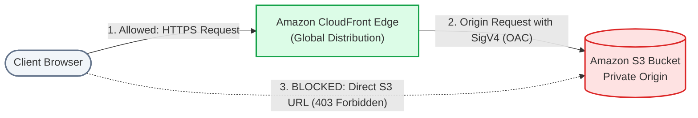
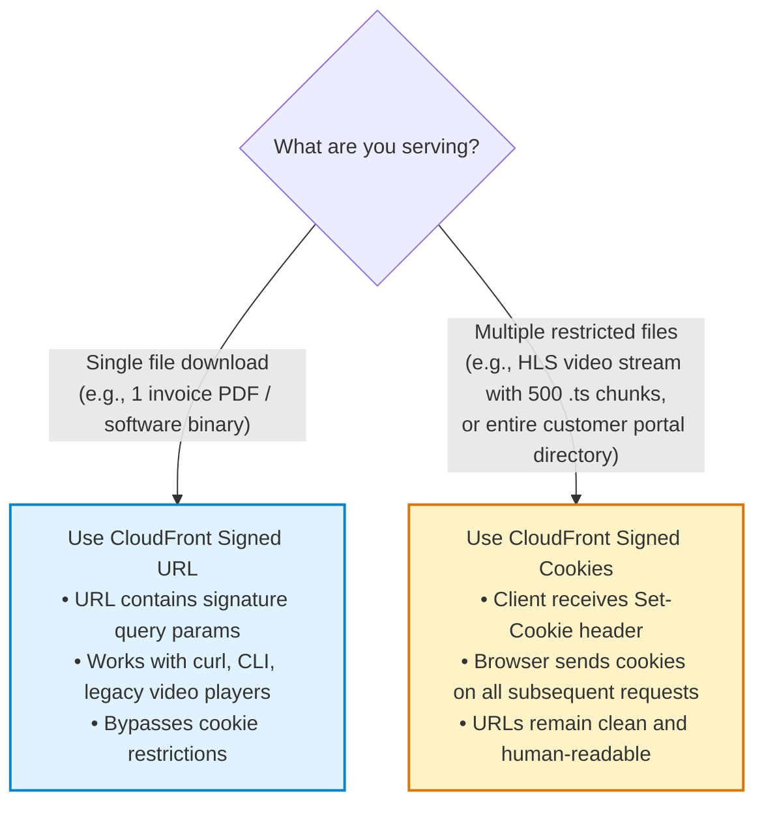

# Lecture 05.09 · ＋ Extended: CloudFront Distribution with Origin Access Control (OAC) & Signed Cookies

> **Section:** S05 · **Type:** ＋ Extended · **Track:** ＋ Extended · **Time:** ~30 minutes  
> **Navigation:** ← [05.08 · 🔓 Attack Lab: Cache Stampede & URL Tampering](./05.08-attack-lab-cache-stampede-and-presigned-tampering.md) | [Section 05 Overview](./README.md) | [05.99 · ✅ Knowledge Check](./05.99-knowledge-check.md) →  
> **Project feature:** Edge acceleration and multi-file asset delivery for CloudOrder. Evaluates the architectural evolution from legacy Origin Access Identity (OAI) to modern Origin Access Control (OAC), secures S3 origins, and compares CloudFront Signed URLs versus Signed Cookies for authenticated customer sessions.

---

## 1. Evolution of S3 Edge Security: OAI vs. OAC

In production architectures, serving user-facing assets directly out of regional S3 buckets introduces geographical latency and unneeded data egress costs. Deploying **Amazon CloudFront** caches static content across $600+$ global edge locations.

However, if users can directly access the S3 bucket URL, they bypass CloudFront caching, WAF inspection, and geo-restrictions.



### 1.1 Legacy Origin Access Identity (OAI) vs. Modern Origin Access Control (OAC)

For many years, AWS architectures relied on **Origin Access Identity (OAI)**. AWS released **Origin Access Control (OAC)** as its modern replacement.

| Feature | Legacy Origin Access Identity (OAI) | Modern Origin Access Control (OAC) |
|---|:---:|:---:|
| **Authentication Protocol** | Custom legacy HMAC | **AWS Signature Version 4 (SigV4)** |
| **AWS KMS (SSE-KMS) Support** | ❌ **Unsupported** | ✅ **Fully Supported** |
| **HTTP Methods Supported** | `GET`, `HEAD` | `GET`, `HEAD`, `PUT`, `POST`, `PATCH`, `DELETE` |
| **Region Coverage** | Excluded newer opt-in regions | Global (All AWS regions) |
| **Security Best Practice** | Deprecated / Maintenance mode | **AWS Recommended Architecture** |

> [!IMPORTANT]
> **DVA-C02 Exam Trap: S3 with SSE-KMS & CloudFront**  
> If an exam question describes an S3 bucket encrypted with **SSE-KMS (Customer Managed Key)** that must be served privately via CloudFront, **OAI will fail**. You **must** select **Origin Access Control (OAC)**, as OAI cannot pass SigV4 headers required by AWS KMS.

---

## 2. Declarative OAC Configuration in CloudFormation

To configure OAC, three resources are wired together:

### 2.1 Origin Access Control Resource
```yaml
CloudOrderOAC:
  Type: AWS::CloudFront::OriginAccessControl
  Properties:
    OriginAccessControlConfig:
      Name: CloudOrderInvoicesOAC
      OriginAccessControlOriginType: s3
      SigningBehavior: always
      SigningProtocol: sigv4
```

### 2.2 S3 Bucket Policy Restricting Access to the Distribution
The S3 bucket policy allows `s3:GetObject` ONLY when requested by the specific CloudFront distribution ARN:

```yaml
InvoicesBucketPolicy:
  Type: AWS::S3::BucketPolicy
  Properties:
    Bucket: !Ref InvoicesBucket
    PolicyDocument:
      Version: '2012-10-17'
      Statement:
        - Sid: AllowCloudFrontServicePrincipalReadOnly
          Effect: Allow
          Principal:
            Service: cloudfront.amazonaws.com
          Action: 's3:GetObject'
          Resource: !Sub '${InvoicesBucket.Arn}/*'
          Condition:
            StringEquals:
              'AWS:SourceArn': !Sub 'arn:aws:cloudfront::${AWS::AccountId}:distribution/${CloudFrontDistribution}'
```

---

## 3. CloudFront Signed URLs vs. Signed Cookies

When serving restricted content through CloudFront, developers can choose between **Signed URLs** and **Signed Cookies**.



### 3.1 Comparison Guide for DVA-C02

| Dimension | CloudFront Signed URLs | CloudFront Signed Cookies |
|---|---|---|
| **Scope** | Individual object (or directory if using custom policy with wildcards) | Multiple objects or entire application paths (`/*`) |
| **URL Appearance** | Query parameters appended to URL (`?Policy=...&Signature=...&Key-Pair-Id=...`) | Clean URLs (`https://cdn.cloudorder.com/invoices/doc.pdf`) |
| **Client Requirement** | Works with any client (web, mobile, CLI, `curl`) | Requires client that supports HTTP cookies (e.g. web browser) |
| **HLS / DASH Media Streaming** | Difficult (every segment chunk requires its own signature parameter) | **Ideal**: Browser receives 1 cookie and downloads all 1,000 video segments seamlessly |
| **Cryptographic Mechanism** | RSA-SHA1 with CloudFront Key Group / Public Key | RSA-SHA1 with CloudFront Key Group / Public Key |

---

## Summary & Next Step

We have evaluated:
1. Modern **Origin Access Control (OAC)** vs legacy OAI, specifically noting OAC's required support for SSE-KMS.
2. The restrictive S3 bucket policy utilizing `AWS:SourceArn` to eliminate direct S3 origin bypass.
3. The exact decision tree between **Signed URLs** (single file, cookie-less clients) and **Signed Cookies** (multi-file streaming, browser portals).

Now, test your comprehensive mastery of Section 05 in [Lecture 05.99 · ✅ DVA-C02 Knowledge Check](./05.99-knowledge-check.md).
