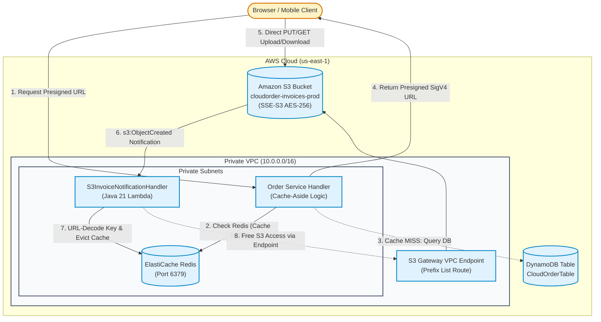

# Section 05 · S3 Event Notifications & ElastiCache Redis Caching
## High-Throughput Object Storage, Presigned URLs & Distributed In-Memory Caching

---

## 1. Executive Summary & Architecture

Section 05 equips **CloudOrder** with enterprise object storage and distributed in-memory caching capabilities. As orders are completed, invoice documents (PDFs, JSON audit manifests) are stored in private **Amazon S3** buckets encrypted via SSE-S3/KMS. To avoid proxying multi-megabyte binary payloads through AWS Lambda (which would consume excessive memory and hit API Gateway's 10 MB payload ceiling), clients upload and download documents directly via time-limited **Amazon S3 Presigned URLs** (`S3Presigner`) signed with AWS Signature Version 4 (SigV4).

Whenever an invoice is placed into S3, an asynchronous **S3 Event Notification** (`s3:ObjectCreated:*`) triggers a Java 21 Lambda function that extracts the decoded object key, parses order identifiers, and triggers downstream indexing.

To reduce read pressure on DynamoDB and deliver sub-millisecond query responses, we deploy an **Amazon ElastiCache Redis** cluster inside private VPC subnets. The application implements the **Cache-Aside (Lazy-Loading)** pattern with Time-To-Live (TTL) expiration, coupled with explicit cache eviction on document updates. To eliminate costly NAT Gateway data transfer fees when VPC Lambda functions talk to S3, we provision an **Amazon S3 Gateway VPC Endpoint**.

---

## 2. DVA-C02 Domain Mapping

* **Domain 1: Development with AWS Services (32%)**
  * S3 operations: `putObject`, `getObject`, metadata tags, prefix organization.
  * Presigned URLs with AWS SDK v2 `S3Presigner` and duration limits.
  * ElastiCache Redis: Cache-Aside (Lazy Loading), Write-Through, TTL strategies, eviction policies (`allkeys-lru`, `volatile-lru`).
* **Domain 2: Security (26%)**
  * S3 bucket policies enforcing HTTPS (`aws:SecureTransport: false` -> Deny).
  * Server-Side Encryption (SSE-S3 `AES256`, SSE-KMS `aws:kms`, SSE-C).
  * S3 Block Public Access (BPA) and Cross-Origin Resource Sharing (CORS).
  * VPC Security Group ingress chaining for ElastiCache (TCP port 6379).
* **Domain 4: Troubleshooting and Optimization (18%)**
  * Lambda in VPC timeout troubleshooting (resolving missing S3 Gateway VPC Endpoint).
  * S3 Event Notification URL-encoding pitfalls (`+` vs `%20`).
  * CloudWatch ElastiCache metrics: `CacheHits`, `CacheMisses`, `EngineCPUUtilization`, `Evictions`.
  * Cache stampede (thundering herd) mitigation and probabilistic early expiration.

---

## 3. Lecture Guide

| # | Type | Lecture | Track | Focus & Deliverable |
|---|:---:|---|:---:|---|
| **05.01** | 📖 | [Mechanical Sympathy: S3 Strong Consistency, Redis Memory Architecture & Cache-Aside](./05.01-mechanical-sympathy-s3-consistency-redis-cache-aside.md) | ★ | S3 prefix hash partitioning, read-after-write consistency, Redis single-threaded reactor, cache patterns. |
| **05.02** | 📇 | [API Card: S3Client, S3Presigner & Redis Commands](./05.02-api-card-s3-presigner-elasticache-redis.md) | ★ | AWS SDK v2 `S3Presigner`, `PutObjectRequest`, Lettuce `RedisCommands`, atomic `setex`. |
| **05.03** | 🛠 | [Build: S3 Invoice Storage, Presigned URL Generator & Redis Cache-Aside Service](./05.03-build-s3-presigner-and-redis-cache.md) | ★ | Compilable Java 21 `InvoiceStorageService`, `OrderCacheService`, and `S3InvoiceNotificationHandler`. |
| **05.04** | 🛠 | [Provisioning: S3 Bucket, Event Notifications & ElastiCache Redis](./05.04-provisioning-s3-elasticache-vpc-sam.md) | ★ | Declarative SAM template with S3 bucket, Redis in VPC, S3 Gateway VPC Endpoint, and raw JSON IAM. |
| **05.05** | 🎯 | [Your Turn: Generating Presigned URLs & Benchmarking Cache Hits](./05.05-your-turn-presigned-urls-redis-cache.md) | ★ | Practical lab generating SigV4 URLs, uploading invoices via curl, and validating Redis cache keys. |
| **05.06** | 🧩 | [Live Verification: Measuring Cache Hit Ratio & S3 Request Metrics in CloudWatch](./05.06-live-verification-cache-hit-ratio-cloudwatch.md) | ★ | Verifying `CacheHits`, `CacheMisses`, latency drop, and S3 4xx/5xx alarms in CloudWatch. |
| **05.07** | 🐞 | [Debug Lab: Missing S3 Gateway VPC Endpoint & S3 Bucket CORS Denial](./05.07-debug-s3-vpc-endpoint-and-cors-denial.md) | ★ | Debugging Lambda VPC connection timeouts to S3 and browser CORS preflight 403 errors. |
| **05.08** | 🔓 | [Attack Lab: Cache Stampede (Thundering Herd) & Presigned URL Expiration Tampering](./05.08-attack-lab-cache-stampede-and-presigned-tampering.md) | ★ | Stress-testing sudden cache expiration, database swamping, and testing forged SigV4 URL signatures. |
| **05.09** | ＋ | [Extended: CloudFront Distribution with Origin Access Control (OAC) & Signed Cookies](./05.09-extended-cloudfront-oac-and-signed-cookies.md) | ＋ | Migrating from legacy OAI to modern OAC, global edge caching, and signed cookies for multi-file content. |
| **05.99** | ✅ | [DVA-C02 Knowledge Check: S3 Security, Presigned URLs & ElastiCache](./05.99-knowledge-check.md) | ★ | 5 high-yield exam scenarios covering SigV4 validity, cache stampedes, S3 VPC endpoints, and OAC. |

---

## 4. Reference Code & Snapshot

* **Reference Implementation**: `reference/cloudorder/backend/module-05-s3-caching/`
* **Automated Test Suite**: `S05S3CachingTest` (6/6 passing tests)
* **Frozen Checkpoint**: `reference/snapshots/s05-end/`
* **Solution Walkthrough**: [`solutions/S05-s3-caching/05.05-solution.md`](../../solutions/S05-s3-caching/05.05-solution.md)
