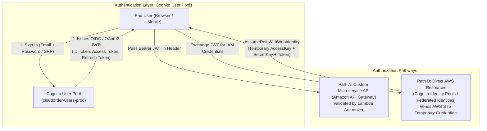
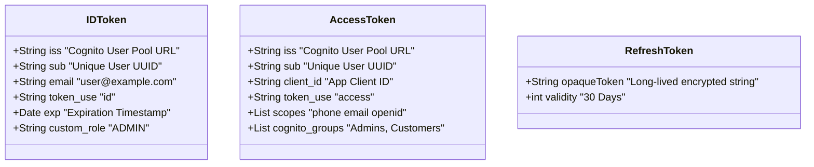
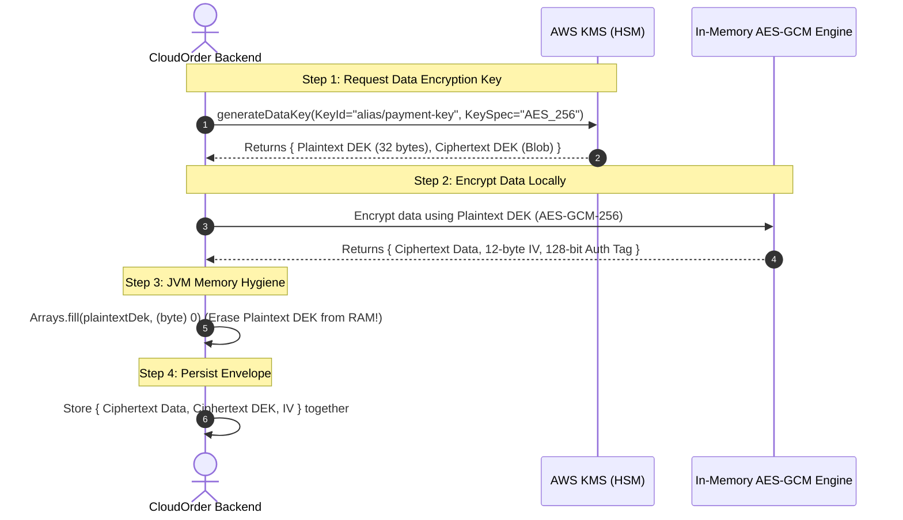

# Lecture 06.01 · 📖 Mechanical Sympathy: OAuth2/OIDC, JWT Claims Verification & KMS Envelope Encryption Math

> **Section:** S06 · **Type:** 📖 Theory · **Track:** ★ Core · **Time:** ~35 minutes  
> **Navigation:** ← [Section 05: 05.99 · Knowledge Check](../S05-s3-caching/05.99-knowledge-check.md) | [Section 06 Overview](./README.md) | [06.02 · 📇 API Card: KmsClient & Authorizers](./06.02-api-card-kms-secrets-manager-authorizer-events.md) →  
> **Project feature:** Identity federation and cryptographic foundation for CloudOrder. Decouples Cognito User Pools (Authentication & JWT issuance) from Identity Pools (AWS STS credential vending); analyzes RS256 token validation mechanics; and explores the mathematics and physical limitations of AWS KMS Envelope Encryption.  
> **Core Concepts:** User Pools vs. Identity Pools, ID Token vs. Access Token vs. Refresh Token, JWKS endpoint verification, KMS 4 KB ceiling, Envelope Encryption pattern, AES-256-GCM authentication tags.

---

## 1. The Identity Model: Cognito User Pools vs. Identity Pools

Amazon Cognito is divided into two distinct services that serve opposing ends of the identity and authorization spectrum:

### 1.1 The High-Yield DVA-C02 Comparison Table

| Dimension | Cognito User Pools (CUP) | Cognito Identity Pools (Federated Identities) |
|---|---|---|
| **Primary Purpose** | **Authentication** (User directory, registration, sign-in, MFA) | **Authorization** (Access control to AWS services) |
| **Output Token** | OIDC / OAuth2 **JSON Web Tokens (JWTs)** | Temporary **AWS IAM credentials** (Access Key, Secret Key, Session Token via AWS STS) |
| **Target Consumers** | Application servers, API Gateway, microservices | AWS SDKs calling AWS APIs directly (e.g., S3 `PutObject`, DynamoDB `GetItem`) |
| **Identity Federation** | Can federate with Google, Facebook, Apple, SAML, OIDC into the user directory | Federates with Cognito User Pools, Google, SAML to assume IAM roles |
| **Token Formats** | RS256-signed JSON Web Tokens | Signed AWS SigV4 requests |

---

## 2. Anatomy of Cognito JSON Web Tokens

Upon successful authentication, Cognito returns three tokens:

### 2.1 The Critical Token Difference: `ID Token` vs. `Access Token`
* **ID Token (`token_use: id`)**:
  * Contains identity claims about the authenticated user (email, verified attributes, custom profile metadata).
  * **Intended Audience**: The client application frontend (to render the user's name, avatar, and UI state).
* **Access Token (`token_use: access`)**:
  * Contains authorization claims, user groups, and OAuth2 scopes.
  * **Intended Audience**: Resource servers and API Gateway authorizers (to grant or deny API operations).

> [!WARNING]
> **DVA-C02 Exam Trap: `token_use` Validation**  
> If an API Gateway Lambda authorizer validates signature and expiration but fails to assert `token_use == "access"`, an attacker can submit an **ID Token** to an API endpoint. Because both tokens are signed by the same Cognito private key and have valid expirations, the request would succeed unless the authorizer explicitly validates `token_use`!

---

## 3. Physical Limitations of AWS KMS & Envelope Encryption

AWS Key Management Service (KMS) stores encryption master keys (Customer Managed Keys - CMKs) inside FIPS 140-2 Level 3 Hardware Security Modules (HSMs).

### 3.1 The 4 KB Physical Payload Limit
The KMS `Encrypt` and `Decrypt` APIs have a hard technical ceiling:

$$\text{Maximum Direct Payload Size} = 4,096\text{ bytes (4 KB)}$$

If an application attempts to encrypt an 8 KB customer profile or a 2 MB invoice PDF using `kmsClient.encrypt()`, the API immediately throws `ValidationException: 1 validation error detected: Value at 'plaintext' failed to satisfy constraint: Member must have length less than or equal to 4096`.

Furthermore, calling KMS for every read and write introduces substantial network latency ($15\text{--}30\text{ ms}$) and cost ($0.03$ per 10,000 requests).

### 3.2 The Envelope Encryption Protocol
To encrypt arbitrarily large payloads with maximum performance and zero data size limits, enterprise systems employ **Envelope Encryption**:

### 3.3 Decryption Mechanics
To decrypt:
1. The application extracts the **Ciphertext DEK** from the stored record.
2. It sends only the 32-byte Ciphertext DEK to KMS: `kmsClient.decrypt(ciphertextBlob)`.
3. KMS decrypts the DEK using the CMK inside the HSM and returns the **Plaintext DEK**.
4. The application initializes AES-GCM locally, decrypts the payload in milliseconds, and immediately wipes the plaintext DEK from RAM.

---

## Storytelling Bridge to API Contracts

Now that we understand the OAuth2/OIDC token claims and the mathematical mechanics of KMS envelope encryption, we need to inspect the exact Java SDK v2 APIs that execute these operations.

In [Lecture 06.02 · 📇 API Card: KmsClient & Authorizers](./06.02-api-card-kms-secrets-manager-authorizer-events.md), we will dissect `KmsClient.generateDataKey()`, `SecretsManagerClient`, and the API Gateway Authorizer IAM policy format.
