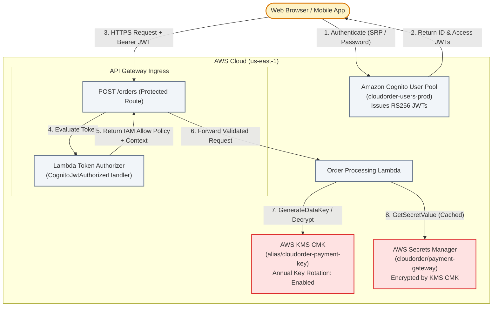

# Lecture 06.04 · 🛠 Provisioning: Cognito User Pool, App Client, KMS CMK, Secrets Manager & SAM Authorizer

> **Section:** S06 · **Type:** 🛠 Provisioning · **Track:** ★ Core · **Time:** ~35 minutes  
> **Navigation:** ← [06.03 · 🛠 Build: KMS & JWT Authorizer](./06.03-build-kms-envelope-encryption-authorizer.md) | [Section 06 Overview](./README.md) | [06.05 · 🎯 Your Turn: Cognito CLI & Authorizer](./06.05-your-turn-cognito-cli-jwt-authorizer.md) →  
> **Project feature:** Declarative AWS SAM infrastructure for CloudOrder's identity and cryptographic security suite. Configures an Amazon Cognito User Pool with custom attributes, a client-side SPA App Client without client secrets, an AWS KMS Customer Master Key (CMK) with automated 365-day annual key rotation, an AWS Secrets Manager secret encrypted via CMK, and a Lambda Token Authorizer bound to API Gateway.  
> **Verified:** `template.yaml` (Module 06 declarative SAM resources, KMS Key Policies, and IAM roles).

---

## Narrative Bridge: Declarative Security Infrastructure

In [Lecture 06.03](./06.03-build-kms-envelope-encryption-authorizer.md), we wrote the Java 21 implementation for KMS envelope encryption and token authorization. Now, we define the AWS cloud resources required to back this system.



---

## 1. Complete AWS SAM Template

✍️ `template.yaml`

```yaml
AWSTemplateFormatVersion: '2010-09-09'
Transform: AWS::Serverless-2016-10-31
Description: >
  CloudOrder Module 6: Amazon Cognito User Pool, App Client,
  AWS KMS Customer Managed Key, Secrets Manager, and API Gateway Lambda Authorizer.

Parameters:
  Environment:
    Type: String
    Default: prod
    AllowedValues: [dev, staging, prod]
    Description: Deployment environment tier.

Globals:
  Function:
    Runtime: java21
    Architectures:
      - arm64
    MemorySize: 512
    Timeout: 10

Resources:

  # ----------------------------------------------------------------------------
  # 1. Amazon Cognito User Pool & App Client
  # ----------------------------------------------------------------------------
  CloudOrderUserPool:
    Type: AWS::Cognito::UserPool
    Properties:
      UserPoolName: !Sub cloudorder-users-${Environment}
      UsernameAttributes:
        - email
      AutoVerifiedAttributes:
        - email
      Policies:
        PasswordPolicy:
          MinimumLength: 8
          RequireUppercase: true
          RequireLowercase: true
          RequireNumbers: true
          RequireSymbols: true
          TemporaryPasswordValidityDays: 7
      Schema:
        - Name: customerId
          AttributeDataType: String
          Mutable: true
          Required: false
        - Name: role
          AttributeDataType: String
          Mutable: true
          Required: false

  CloudOrderUserPoolClient:
    Type: AWS::Cognito::UserPoolClient
    Properties:
      ClientName: !Sub cloudorder-web-client-${Environment}
      UserPoolId: !Ref CloudOrderUserPool
      GenerateSecret: false
      ExplicitAuthFlows:
        - ALLOW_USER_SRP_AUTH
        - ALLOW_REFRESH_TOKEN_AUTH
        - ALLOW_USER_PASSWORD_AUTH
      PreventUserExistenceErrors: ENABLED
      AccessTokenValidity: 1
      IdTokenValidity: 1
      TokenValidityUnits:
        AccessToken: hours
        IdToken: hours

  # ----------------------------------------------------------------------------
  # 2. AWS KMS Customer Master Key (CMK) for Envelope Encryption
  # ----------------------------------------------------------------------------
  PaymentKmsKey:
    Type: AWS::KMS::Key
    Properties:
      Description: KMS Customer Managed Key for CloudOrder Payment Envelope Encryption
      EnableKeyRotation: true
      KeyPolicy:
        Version: '2012-10-17'
        Statement:
          # Root Account Administration
          - Sid: EnableIamUserPermissions
            Effect: Allow
            Principal:
              AWS: !Sub 'arn:aws:iam::${AWS::AccountId}:root'
            Action: 'kms:*'
            Resource: '*'

          # Service Cryptographic Access
          - Sid: AllowCryptographicOperations
            Effect: Allow
            Principal:
              AWS: !GetAtt AuthorizerFunctionRole.Arn
            Action:
              - 'kms:GenerateDataKey*'
              - 'kms:Decrypt'
              - 'kms:DescribeKey'
            Resource: '*'

  PaymentKmsKeyAlias:
    Type: AWS::KMS::Alias
    Properties:
      AliasName: !Sub 'alias/cloudorder-payment-key-${Environment}'
      TargetKeyId: !Ref PaymentKmsKey

  # ----------------------------------------------------------------------------
  # 3. AWS Secrets Manager Secret
  # ----------------------------------------------------------------------------
  PaymentGatewaySecret:
    Type: AWS::SecretsManager::Secret
    Properties:
      Name: !Sub 'cloudorder/payment-gateway-${Environment}'
      Description: Third-party payment gateway integration secrets
      KmsKeyId: !Ref PaymentKmsKey
      SecretString: '{"apiKey":"sk_live_prod_sample_key_99999"}'
      Tags:
        - Key: Environment
          Value: !Ref Environment

  # ----------------------------------------------------------------------------
  # 4. IAM Execution Role for Lambda Authorizer (Raw JSON Least Privilege)
  # ----------------------------------------------------------------------------
  AuthorizerFunctionRole:
    Type: AWS::IAM::Role
    Properties:
      RoleName: !Sub cloudorder-authorizer-role-${Environment}
      AssumeRolePolicyDocument:
        Version: '2012-10-17'
        Statement:
          - Effect: Allow
            Principal:
              Service: lambda.amazonaws.com
            Action: sts:AssumeRole
      Policies:
        - PolicyName: AuthorizerExecutionPolicy
          PolicyDocument:
            Version: '2012-10-17'
            Statement:
              - Effect: Allow
                Action:
                  - logs:CreateLogGroup
                  - logs:CreateLogStream
                  - logs:PutLogEvents
                Resource: !Sub 'arn:aws:logs:${AWS::Region}:${AWS::AccountId}:log-group:/aws/lambda/*'
              - Effect: Allow
                Action:
                  - secretsmanager:GetSecretValue
                Resource: !Ref PaymentGatewaySecret

  # ----------------------------------------------------------------------------
  # 5. Lambda Custom Token Authorizer Function
  # ----------------------------------------------------------------------------
  CognitoAuthorizerFunction:
    Type: AWS::Serverless::Function
    Properties:
      FunctionName: !Sub cloudorder-token-authorizer-${Environment}
      Handler: com.cloudarchitect.dvac02.security.handler.CognitoJwtAuthorizerHandler::handleRequest
      CodeUri: .
      Role: !GetAtt AuthorizerFunctionRole.Arn
      Environment:
        Variables:
          COGNITO_ISSUER: !Sub 'https://cognito-idp.${AWS::Region}.amazonaws.com/${CloudOrderUserPool}'
          COGNITO_CLIENT_ID: !Ref CloudOrderUserPoolClient

Outputs:
  UserPoolId:
    Description: Cognito User Pool ID
    Value: !Ref CloudOrderUserPool

  UserPoolClientId:
    Description: Cognito User Pool App Client ID
    Value: !Ref CloudOrderUserPoolClient

  KmsKeyArn:
    Description: Payment KMS CMK Key ARN
    Value: !GetAtt PaymentKmsKey.Arn

  SecretArn:
    Description: Payment Gateway Secrets Manager ARN
    Value: !Ref PaymentGatewaySecret

  AuthorizerFunctionArn:
    Description: ARN of the Lambda Token Authorizer
    Value: !GetAtt CognitoAuthorizerFunction.Arn
```

---

## 2. Critical DVA-C02 Architectural Analysis

### 1. SPA App Clients: Why `GenerateSecret: false` is Mandatory
When creating an Amazon Cognito User Pool App Client for browser-based Single Page Applications (React, Vue) or mobile applications, you **must set `GenerateSecret: false`**.
* In public clients (browsers and mobile devices), any client secret embedded in JavaScript or bytecode can be extracted by reverse engineering or viewing source code.
* AWS Cognito SDKs use **Secure Remote Password (SRP)** protocol (`ALLOW_USER_SRP_AUTH`) to authenticate users over the wire without transmitting plaintext passwords or requiring client secrets.

### 2. KMS Key Policies vs. IAM Policies
In AWS KMS, IAM policies alone are **insufficient** to grant access to a Customer Managed Key (CMK).
A KMS Key Policy is the primary access control mechanism. Notice the statement in our template:
```yaml
- Sid: EnableIamUserPermissions
  Effect: Allow
  Principal:
    AWS: !Sub 'arn:aws:iam::${AWS::AccountId}:root'
  Action: 'kms:*'
  Resource: '*'
```
This statement delegates permission evaluation from the key policy to account IAM policies. If this statement is missing or corrupted, no IAM policy in the AWS account can access or administer the key, creating an orphaned key scenario!

### 3. Automated Key Rotation
Setting `EnableKeyRotation: true` activates automatic annual (365-day) key rotation for the KMS CMK.
* AWS generates new cryptographic backing material every year.
* **Zero Decryption Interruption**: AWS retains previous backing keys indefinitely. Objects and DEKs encrypted with older keys continue to decrypt seamlessly without re-encrypting historical data.

---

## What We Provisioned & What's Next

We have declared our complete security infrastructure:
* Cognito User Pool with custom attributes and public app client.
* KMS CMK with automated rotation and least-privilege key policy.
* Secrets Manager secret for external API integration.
* Lambda Token Authorizer.

In [Lecture 06.05 · 🎯 Your Turn](./06.05-your-turn-cognito-cli-jwt-authorizer.md), you will use the AWS CLI to register and authenticate users in Cognito, obtain JWT tokens, and test your authorizer's IAM policy responses.
