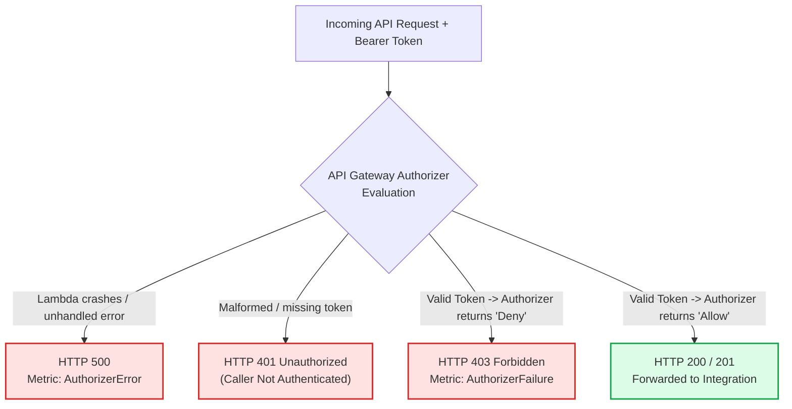

# Lecture 06.06 · 🧩 Live Verification: Auditing KMS Decrypt Calls & CloudTrail Authorization Logs

> **Section:** S06 · **Type:** 🧩 Live Verification · **Track:** ★ Core · **Time:** ~30 minutes  
> **Navigation:** ← [06.05 · 🎯 Your Turn: Cognito CLI & Authorizer](./06.05-your-turn-cognito-cli-jwt-authorizer.md) | [Section 06 Overview](./README.md) | [06.07 · 🐞 Debug Lab: Token Use & Policy Denial](./06.07-debug-token-use-authorizer-caching-kms-policy.md) →  
> **Project feature:** Security telemetry and cryptographic compliance verification for CloudOrder. Auditing AWS CloudTrail logs for `kms:GenerateDataKey` and `kms:Decrypt`, inspecting Encryption Context integrity, and monitoring API Gateway Authorizer execution metrics in CloudWatch.

---

## 1. Auditing Cryptographic Operations in AWS CloudTrail

AWS KMS logs all management and cryptographic operations to **AWS CloudTrail**. Because customer payment details are protected under PCI-DSS compliance requirements, our platform must verify that every decryption event is linked to an authorized order.

### 1.1 Anatomy of a `kms:Decrypt` CloudTrail Event
When our Java 21 backend calls `kmsClient.decrypt()`, CloudTrail captures the exact identity and context:

```json
{
  "eventVersion": "1.08",
  "userIdentity": {
    "type": "AssumedRole",
    "principalId": "AROA1234567890EXAMPLE:cloudorder-payment-handler",
    "arn": "arn:aws:sts::123456789012:assumed-role/cloudorder-payment-role-prod/cloudorder-payment-handler"
  },
  "eventTime": "2026-09-27T08:45:10Z",
  "eventSource": "kms.amazonaws.com",
  "eventName": "Decrypt",
  "awsRegion": "us-east-1",
  "requestParameters": {
    "keyId": "arn:aws:kms:us-east-1:123456789012:key/a1b2c3d4-e5f6-7890-abcd-ef1234567890",
    "encryptionContext": {
      "service": "cloudorder-payment",
      "orderId": "ord-5001"
    }
  },
  "responseElements": null,
  "resources": [
    {
      "accountId": "123456789012",
      "type": "AWS::KMS::Key",
      "ARN": "arn:aws:kms:us-east-1:123456789012:key/a1b2c3d4-e5f6-7890-abcd-ef1234567890"
    }
  ],
  "eventType": "AwsApiCall"
}
```

### Critical PCI-DSS Architectural Invariants:
1. **Plaintext is NEVER Logged**: CloudTrail records the Key ARN, caller identity, and `encryptionContext`, but **never** records the plaintext or ciphertext bytes.
2. **Context Binding**: If a malicious insider attempts to decrypt `ord-5001`'s ciphertext while specifying `orderId: ord-9999` in the encryption context, KMS fails the request and CloudTrail logs an `AccessDeniedException` or `InvalidCiphertextException`.

---

## 2. API Gateway Authorizer CloudWatch Metrics

When troubleshooting authorization issues, API Gateway emits distinct authorizer metrics under `AWS/ApiGateway`:



| Metric | Cause & Meaning | Troubleshooting Action |
|---|---|---|
| `AuthorizerError` | The authorizer Lambda function **crashed or timed out** (threw an unhandled Java exception, OutOfMemory, or exceeded 10s timeout). Returns **HTTP 500**. | Inspect `/aws/lambda/cloudorder-token-authorizer-prod` CloudWatch logs for stack traces. |
| `AuthorizerFailure` | The authorizer Lambda function ran to completion and explicitly returned an IAM **`Deny`** policy. Returns **HTTP 403**. | Verify user permissions, group claims, or check if token is expired. |
| `AuthorizerLatency` | Execution duration of the authorizer Lambda function. | If $> 100\text{ ms}$, check for slow external HTTP calls or cold starts. |

---

## 3. Detecting Unauthorized Decrypt Attempts with CloudWatch Alarms

Create a CloudWatch Metric Filter on CloudTrail logs to detect rogue decryption attempts:

```bash
aws logs put-metric-filter \
  --log-group-name "CloudTrail/DefaultLogGroup" \
  --filter-name "KmsUnauthorizedDecryptAttempts" \
  --filter-pattern '{ ($.eventSource = "kms.amazonaws.com") && ($.eventName = "Decrypt") && ($.errorCode = "*Unauthorized*" || $.errorCode = "*AccessDenied*") }' \
  --metric-transformations \
      metricName=UnauthorizedKmsDecrypts,metricNamespace=CloudOrder/Security,metricValue=1
```

Set an alarm on this metric to trigger SNS alerts to the SecOps team immediately if an unauthorized identity attempts to use the payment master key.

---

## Storytelling Bridge to Debugging

In our live testing, authorization and cryptography behave predictably when configurations are pristine. However, subtle mismatches in token usage or IAM policy caching can cause baffling production outages.

In [Lecture 06.07 · 🐞 Debug Lab: Token Use Mismatch, Authorizer Caching Collision & KMS Key Policy Denial](./06.07-debug-token-use-authorizer-caching-kms-policy.md), we will diagnose and resolve three real-world production defects.
