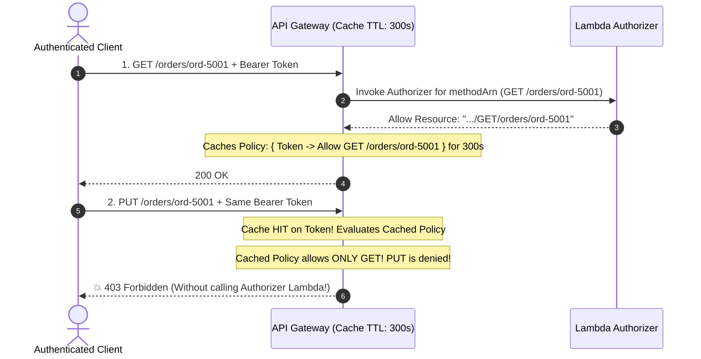

# Lecture 06.07 · 🐞 Debug Lab: Token Use Mismatch, Authorizer Caching Collision & KMS Key Policy Denial

> **Section:** S06 · **Type:** 🐞 Debug Lab · **Track:** ★ Core · **Time:** ~35 minutes  
> **Navigation:** ← [06.06 · 🧩 Live Verification: CloudTrail & KMS Auditing](./06.06-live-verification-cloudtrail-kms-auth.md) | [Section 06 Overview](./README.md) | [06.08 · 🔓 Attack Lab: JWT Tampering & Heap Leakage](./06.08-attack-lab-jwt-tampering-heap-dump-leak.md) →  
> **Project feature:** Systematic root-cause debugging of three enterprise authentication and cryptographic defects: Cognito ID Token vs. Access Token mismatches, the notorious API Gateway Authorizer policy caching collision, and KMS Customer Managed Key access denials.

---

## Defect 1: The Token Use Mismatch (`id` vs. `access`)

### 1.1 The Production Symptom
A mobile app developer reports that users can log in successfully, but all subsequent API Gateway calls to `POST /orders` return:
```http
HTTP/1.1 403 Forbidden
{"message": "User is not authorized to access this resource"}
```

Checking the Authorizer CloudWatch logs reveals:
```text
[AUTHORIZER] Invalid token_use: id
```

### 1.2 Forensic Analysis
* In the frontend code, the developer extracted the token using:
  ```javascript
  // BUG: Extracted ID Token instead of Access Token
  const token = authSession.getIdToken().getJwtToken();
  ```
* **Mechanical Distinction**:
  * The **ID Token** is designed for the application frontend to display user profile data (email, name, sub). It contains `token_use: id` and does not carry OAuth2 resource authorization scopes.
  * The **Access Token** is designed for API Gateway and resource servers. It contains `token_use: access` and OAuth2 scopes.
* Because our Java authorizer strictly enforces:
  ```java
  if (!"access".equals(tokenUse)) {
      return AuthPolicyResponse.deny("anonymous", methodArn);
  }
  ```
  The authorizer correctly rejected the ID token.

### 1.3 The Fix
Update the client-side authentication handler to supply the Access Token in the Authorization header:
```javascript
// FIX: Supply the Access Token for API authorization
const token = authSession.getAccessToken().getJwtToken();
headers['Authorization'] = `Bearer ${token}`;
```

---

## Defect 2: The Authorizer Policy Caching Collision (The Cross-Method 403 Black Hole)

### 2.1 The Production Symptom
A user calls `GET /orders/ord-5001`. The call succeeds with `HTTP 200 OK`.  
Two seconds later, the exact same user with the exact same valid token calls `PUT /orders/ord-5001` to update the order.  
API Gateway immediately returns:
```http
HTTP/1.1 403 Forbidden
{"Message": "User is not authorized to access this resource with an explicit deny"}
```
**Bizarre Detail**: The authorizer Lambda function did **not** execute during the `PUT` call (zero new log streams in CloudWatch).

### 2.2 Forensic Analysis



By default, API Gateway caches authorizer results using the `Authorization` header as the cache key for **300 seconds**.
If the authorizer sets the statement `Resource` strictly equal to the incoming `event.getMethodArn()`:
```text
arn:aws:execute-api:us-east-1:123456789012:api-123/prod/GET/orders/ord-5001
```
Then for the next 5 minutes, any request made with that same token to a *different* endpoint (e.g., `PUT`, `DELETE`, or a different path) is evaluated against the cached policy, which explicitly lacks permissions for the new method, resulting in an immediate 403 Forbidden!

### 2.3 The Fix: Wildcard Method ARN in Authorizer Responses
Parse the incoming `methodArn` to extract the API Stage root and append `/*/*`:

```java
public static String buildWildcardResourceArn(String methodArn) {
    // Input:  arn:aws:execute-api:us-east-1:123456789012:api-123/prod/GET/orders
    // Output: arn:aws:execute-api:us-east-1:123456789012:api-123/prod/*/*
    String[] parts = methodArn.split("/", 3);
    String apiStagePrefix = parts[0] + "/" + parts[1]; // arn:...:api-123/prod
    return apiStagePrefix + "/*/*";
}
```
Now, the cached IAM policy permits all valid routes for the authenticated user for the duration of the 300-second cache window.

---

## Defect 3: KMS CMK Key Policy Denial (Missing Root Account Delegation)

### 3.1 The Production Symptom
The checkout Lambda function possesses an IAM execution role with full KMS permissions:
```json
{
  "Effect": "Allow",
  "Action": "kms:*",
  "Resource": "*"
}
```
Yet, when the Lambda function attempts to call `kmsClient.generateDataKey()`, it crashes with:
```text
software.amazon.awssdk.services.kms.model.KmsException: 
User: arn:aws:sts::123456789012:assumed-role/checkout-role/handler is not authorized 
to perform: kms:GenerateDataKey on resource: arn:aws:kms:us-east-1:123456789012:key/... 
because no identity-based policy allows the kms:GenerateDataKey action
```

### 3.2 Forensic Analysis
Unlike Amazon S3 or DynamoDB, **IAM policies alone cannot grant access to AWS KMS Customer Managed Keys (CMKs)**.
The primary access control document for any KMS key is its **Key Policy**:
* If the Key Policy does not explicitly grant permission to the calling role, OR
* If the Key Policy does not contain the root delegation statement:
  ```json
  {
    "Sid": "EnableIamUserPermissions",
    "Effect": "Allow",
    "Principal": { "AWS": "arn:aws:iam::123456789012:root" },
    "Action": "kms:*",
    "Resource": "*"
  }
  ```
Then IAM policies have **zero authority** over the key!

### 3.3 The Fix
Add the root account delegation statement to the KMS Key Policy, or explicitly include the Lambda execution role ARN in the Key Policy's `Principal` block.

---

## Storytelling Bridge to Attack & Hardening

Now that we have fortified our system against token misuse, authorizer caching bugs, and KMS access misconfigurations, we must subject our authentication and cryptographic components to adversarial attack.

In [Lecture 06.08 · 🔓 Attack Lab: Signature Forgery, Replay Attacks & Plaintext Key Heap Leakage](./06.08-attack-lab-jwt-tampering-heap-dump-leak.md), we will test `alg: none` JWT signature bypasses and memory dumping attacks against JVM heap allocations.
