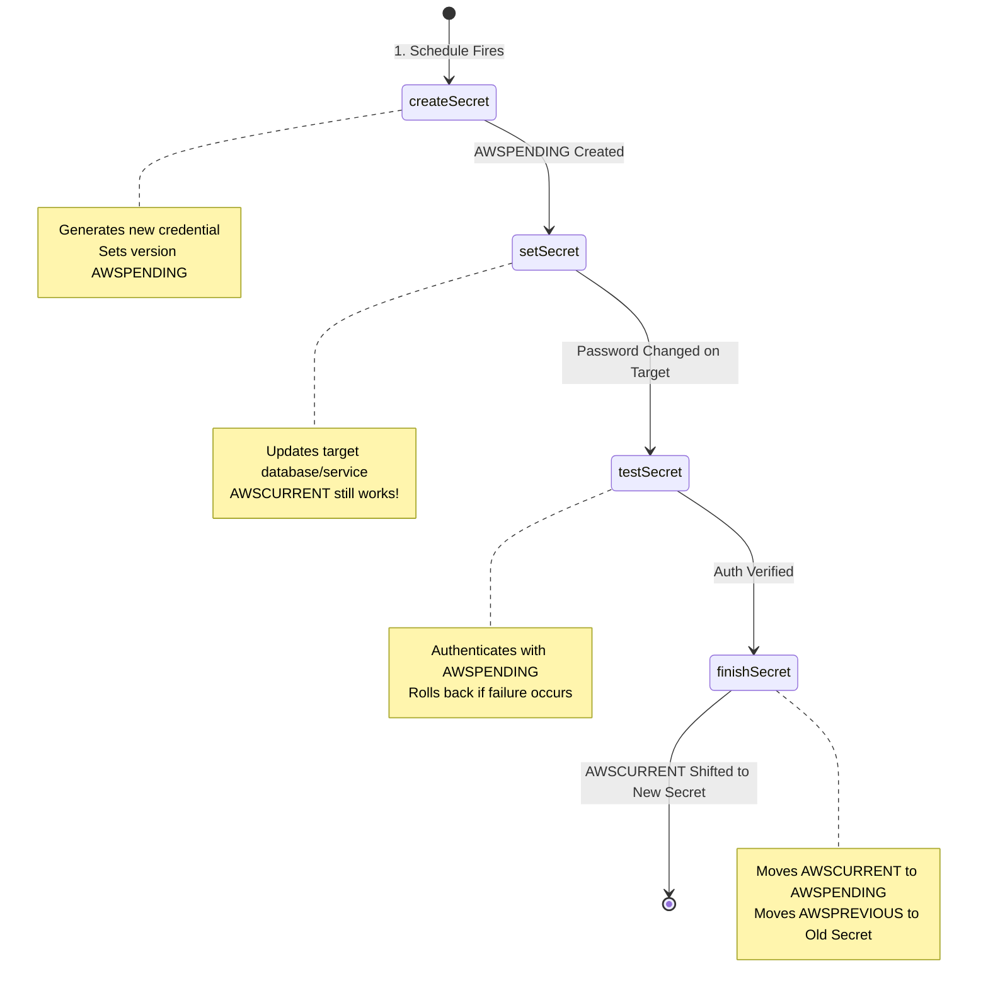
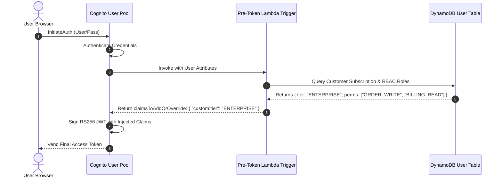

# Lecture 06.09 · ＋ Extended: Secrets Manager Automated Rotation with Lambda & Cognito Pre-Token Generation Triggers

> **Section:** S06 · **Type:** ＋ Extended · **Track:** ＋ Extended · **Time:** ~30 minutes  
> **Navigation:** ← [06.08 · 🔓 Attack Lab: JWT Tampering & Heap Leakage](./06.08-attack-lab-jwt-tampering-heap-dump-leak.md) | [Section 06 Overview](./README.md) | [06.99 · ✅ Knowledge Check](./06.99-knowledge-check.md) →  
> **Project feature:** Advanced operational security features for CloudOrder. Implements the 4-step zero-downtime AWS Secrets Manager automated rotation lifecycle via Lambda, and leverages Amazon Cognito Pre-Token Generation triggers to dynamically inject claims into RS256 JWTs.

---

## 1. AWS Secrets Manager: The 4-Step Rotation Lifecycle

Under compliance frameworks (SOC 2, PCI-DSS), database passwords and API keys must rotate on a regular schedule (e.g. every 30 or 90 days). To achieve this with **zero application downtime**, AWS Secrets Manager orchestrates a 4-step state machine invoking a rotation Lambda function.



### 1.1 The 4 Rotation Steps Explained for DVA-C02

| Step | Action | Mechanical Purpose & Safety Guard |
|---|---|---|
| **1. `createSecret`** | Generates a new random credential and writes it to Secrets Manager. | Marked with version stage **`AWSPENDING`**. The active secret remains **`AWSCURRENT`**. |
| **2. `setSecret`** | Applies the new credential to the target database or external service. | The target system now accepts the new credential. Live applications still reading `AWSCURRENT` continue uninterrupted. |
| **3. `testSecret`** | Tests a login handshake to the target system using the `AWSPENDING` credential. | If the test fails, rotation aborts immediately. **`AWSCURRENT` is untouched**, ensuring zero customer-facing outage. |
| **4. `finishSecret`** | Atomically moves the `AWSCURRENT` label from the old secret to the new secret. | The old secret receives `AWSPREVIOUS` for emergency rollback. Future calls to `getSecretValue()` receive the new credential. |

---

## 2. Amazon Cognito Pre-Token Generation Triggers

By default, Cognito tokens contain standard claims (`sub`, `iss`, `email`, `cognito:groups`). If an enterprise application needs to inject dynamic tenant permissions, subscription tiers, or role-based access control (RBAC) scopes directly into the JWT, doing so on the client side is insecure.

The **Pre-Token Generation Lambda Trigger** executes synchronously on Cognito right before tokens are signed and vended.



### 2.1 Java Implementation Pattern for Pre-Token Lambda

```java
import com.amazonaws.services.lambda.runtime.Context;
import com.amazonaws.services.lambda.runtime.RequestHandler;
import java.util.Map;

public class CognitoPreTokenTriggerHandler implements RequestHandler<Map<String, Object>, Map<String, Object>> {

    @Override
    @SuppressWarnings("unchecked")
    public Map<String, Object> handleRequest(Map<String, Object> event, Context context) {
        Map<String, Object> request = (Map<String, Object>) event.get("request");
        Map<String, Object> userAttributes = (Map<String, Object>) request.get("userAttributes");
        String email = (String) userAttributes.get("email");

        // Query database or calculate dynamic permissions
        String tenantTier = email.endsWith("@enterprise.com") ? "ENTERPRISE" : "STANDARD";

        // Inject dynamic claims into the output response
        Map<String, Object> response = (Map<String, Object>) event.get("response");
        Map<String, Object> claimsOverrideDetails = (Map<String, Object>) response.get("claimsOverrideDetails");
        
        claimsOverrideDetails.put("claimsToAddOrOverride", Map.of(
                "tier", tenantTier,
                "permissions", "orders:create,orders:read"
        ));

        return event;
    }
}
```

### Mechanical Advantage:
Because the dynamic claims are cryptographically baked into the RS256 signature by Cognito, downstream API Gateway Authorizers and microservices can read user permissions directly from the JWT without issuing expensive database lookups on every request!

---

## Summary & Next Step

We have mastered:
1. The **4-step Secrets Manager rotation lifecycle** (`createSecret` $\rightarrow$ `setSecret` $\rightarrow$ `testSecret` $\rightarrow$ `finishSecret`) and its zero-downtime architecture.
2. **Cognito Pre-Token Generation Lambda triggers** for secure server-side claim enrichment.

Now, test your full comprehension of Section 06 in [Lecture 06.99 · ✅ DVA-C02 Knowledge Check](./06.99-knowledge-check.md).
