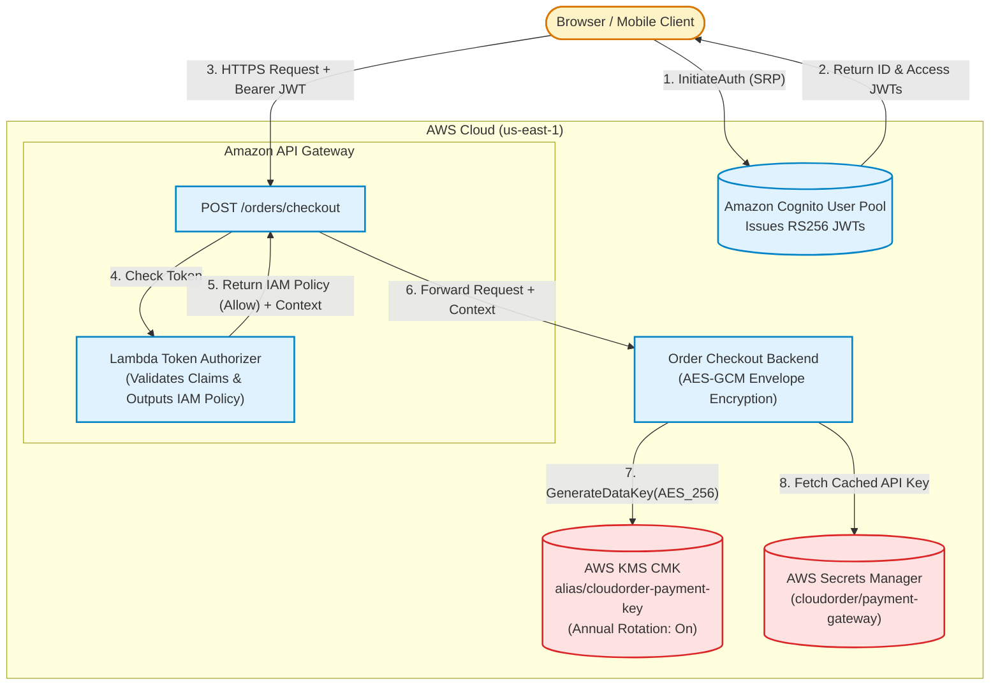

# Section 06 · Cognito Auth, Lambda Authorizers & KMS Envelope Encryption
## Identity Federation, API Gateway Authorization & Cryptographic Envelope Encryption

---

## 1. Executive Summary & Architecture

Section 06 establishes the enterprise security, authentication, and cryptographic foundation of **CloudOrder**. Using **Amazon Cognito User Pools**, the platform provides customer user sign-up, sign-in, MFA, and identity lifecycle management, issuing cryptographically signed RS256 JSON Web Tokens (JWTs).

To protect sensitive API Gateway microservices without tightly coupling business logic to identity providers, we implement a **Java 21 Lambda Custom Token Authorizer**. The authorizer inspects incoming `Authorization: Bearer <JWT>` tokens, validates signature integrity, issuer identity, token usage (`token_use: access` vs. `id`), and expiration, and outputs granular AWS IAM execution policies (`Allow`/`Deny`) cached by API Gateway.

For sensitive customer payment instruments (credit cards, banking tokens), CloudOrder enforces **AWS KMS Envelope Encryption**. Instead of sending bulk data to AWS KMS (which is capped at 4 KB payloads and incurs $0.03 per 10,000 API calls), we call KMS `GenerateDataKey` to generate an AES-256 Data Encryption Key (DEK). Encryption occurs locally via AES-GCM-256 with an authenticated 128-bit tag, and the plaintext key is immediately purged from JVM heap memory. Third-party payment gateway API secrets are managed and cached via **AWS Secrets Manager**.

---

## 2. DVA-C02 Domain Mapping

* **Domain 1: Development with AWS Services (32%)**
  * Cognito User Pools vs. Identity Pools (Federated Identities).
  * Cognito tokens: Access Token vs. ID Token vs. Refresh Token.
  * API Gateway Lambda Authorizers: `TOKEN` authorizers vs. `REQUEST` authorizers, policy caching TTL, and context passing.
  * AWS Secrets Manager: `GetSecretValue`, in-memory caching, automated rotation with Lambda.
* **Domain 2: Security (26%)**
  * AWS KMS Envelope Encryption: Master keys (CMKs) vs. Data Encryption Keys (DEKs).
  * `GenerateDataKey` vs. `GenerateDataKeyWithoutPlaintext`.
  * KMS Key Policies vs. IAM Policies (enabling root account delegation).
  * JVM heap memory hygiene (zeroing byte arrays vs. String pool leaks).
  * Public client security: Why SPA app clients must disable client secrets.

---

## 3. Lecture Guide

| # | Type | Lecture | Track | Focus & Deliverable |
|---|:---:|---|:---:|---|
| **06.01** | 📖 | [Mechanical Sympathy: OAuth2/OIDC, JWT Claims & KMS Envelope Encryption](./06.01-mechanical-sympathy-oauth-jwt-kms.md) | ★ | User Pools vs. Identity Pools, token types, RS256 JWKS verification, envelope encryption math, AES-GCM. |
| **06.02** | 📇 | [API Card: KmsClient, SecretsManagerClient & Authorizer Events](./06.02-api-card-kms-secrets-manager-authorizer-events.md) | ★ | AWS SDK v2 `GenerateDataKeyRequest`, zeroing byte arrays, `GetSecretValueRequest`, IAM `AuthPolicyResponse`. |
| **06.03** | 🛠 | [Build: KMS Envelope Encryption Service, Secrets Cache & JWT Lambda Authorizer](./06.03-build-kms-envelope-encryption-authorizer.md) | ★ | Compilable Java 21 `KmsEnvelopeEncryptionService`, `SecretsManagerCacheService`, and `CognitoJwtAuthorizerHandler`. |
| **06.04** | 🛠 | [Provisioning: Cognito User Pool, KMS CMK, Secrets Manager & SAM Authorizer](./06.04-provisioning-cognito-kms-secrets-sam.md) | ★ | SAM infrastructure declaring Cognito User Pool, KMS Key with annual rotation, Secrets Manager secret, and raw IAM. |
| **06.05** | 🎯 | [Your Turn: Authenticating with Cognito via CLI, Generating JWTs & Testing Authorizers](./06.05-your-turn-cognito-cli-jwt-authorizer.md) | ★ | Hands-on lab registering Cognito users, generating JWTs, invoking authorizers via CLI, and inspecting IAM policies. |
| **06.06** | 🧩 | [Live Verification: Auditing KMS Decrypt Calls & CloudTrail Authorization Logs](./06.06-live-verification-cloudtrail-kms-auth.md) | ★ | Auditing `kms:Decrypt` CloudWatch metrics, CloudTrail authorization events, and authorizer caching metrics. |
| **06.07** | 🐞 | [Debug Lab: Token Use Mismatch, Authorizer Caching Collision & KMS Key Policy Denial](./06.07-debug-token-use-authorizer-caching-kms-policy.md) | ★ | Diagnosing `token_use` mismatch (id vs. access), cross-method authorizer caching black hole, and KMS AccessDenied. |
| **06.08** | 🔓 | [Attack Lab: Signature Forgery, Replay Attacks & Plaintext Key Heap Leakage](./06.08-attack-lab-jwt-tampering-heap-dump-leak.md) | ★ | Exploiting `alg: none` JWTs, replay past expiration, and extracting plaintext keys from JVM heap dumps. |
| **06.09** | ＋ | [Extended: Secrets Manager Automated Rotation & Cognito Pre-Token Triggers](./06.09-extended-secrets-rotation-lambda-triggers.md) | ＋ | Zero-downtime secrets rotation lifecycle (4-step Lambda) and Cognito Pre-Token Generation triggers for claims injection. |
| **06.99** | ✅ | [DVA-C02 Knowledge Check: Cognito, KMS Envelope Encryption & Authorizers](./06.99-knowledge-check.md) | ★ | 5 high-yield scenario exam questions testing token verification, authorizer caching, and KMS CMK policies. |

---

## 4. Reference Code & Snapshot

* **Reference Implementation**: `reference/cloudorder/backend/module-06-auth-security/`
* **Automated Test Suite**: `S06AuthSecurityTest` (5/5 passing tests)
* **Frozen Checkpoint**: `reference/snapshots/s06-end/`
* **Solution Walkthrough**: [`solutions/S06-cognito-kms/06.05-solution.md`](../../solutions/S06-cognito-kms/06.05-solution.md)
