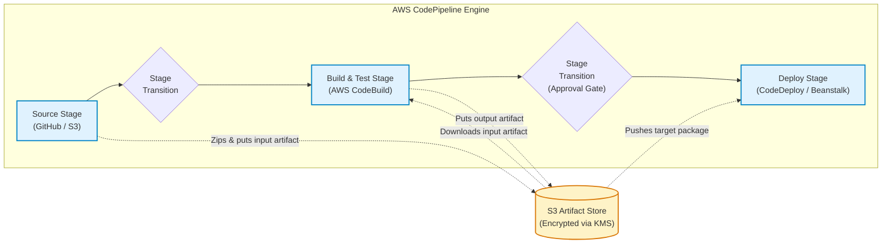
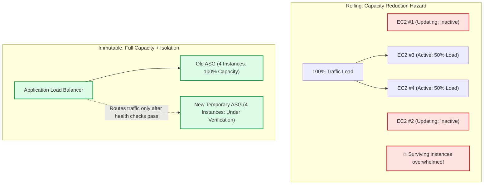
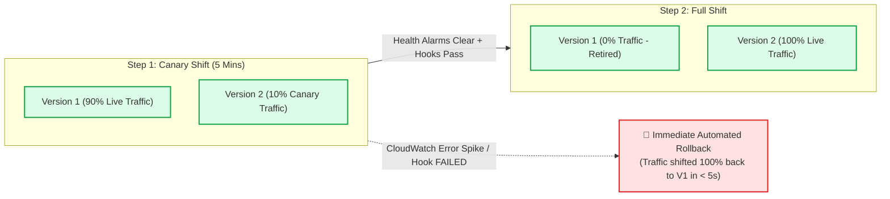

# Lecture 07.01 · 📖 Mechanical Sympathy: CI/CD Pipeline Topologies, Deployment Strategies & Rollback Mechanics

> **Section:** S07 · **Type:** 📖 Theory · **Track:** ★ Core · **Time:** ~35 minutes  
> **Navigation:** ← [Section 06: 06.99 · Knowledge Check](../S06-cognito-kms/06.99-knowledge-check.md) | [Section 07 Overview](./README.md) | [07.02 · 📇 API Card: buildspec, appspec & Hooks](./07.02-api-card-buildspec-appspec-codedeploy-hooks.md) →  
> **Project feature:** Continuous delivery architecture and deployment strategies for CloudOrder. Deconstructs AWS CodePipeline stages and artifact encryption; evaluates AWS CodeBuild phases and dependency caching; and conducts a rigorous comparative analysis of Elastic Beanstalk and CodeDeploy deployment policies.  
> **Core Concepts:** CodePipeline transitions and artifact buckets, CodeBuild phase lifecycles, Elastic Beanstalk deployment policies (All-at-Once, Rolling, Rolling with Additional Batch, Immutable, Traffic Splitting), CodeDeploy Lambda Canary vs. Linear traffic shifting, CloudWatch alarm-driven rollbacks.

---

## 1. Physical Architecture of AWS CodePipeline

AWS CodePipeline is a fully managed continuous delivery orchestrator that models the path from source code to production deployment.

### 1.1 The Role of Artifact Stores
Every stage in CodePipeline communicates through an **Amazon S3 Artifact Store**:
1. When a change triggers the Source stage, CodePipeline packages the repository into a `.zip` archive, generates a revision ID, encrypts it using an AWS KMS key, and uploads it to the pipeline artifact bucket.
2. In the Build stage, AWS CodeBuild pulls this zip archive, unzips it into an ephemeral Linux container, executes the build, packages the compiled output (e.g. `fat-jar.jar`), and writes the new artifact back to S3.
3. In the Deploy stage, AWS CodeDeploy or Elastic Beanstalk pulls the compiled artifact from S3 to commence deployment.

### 1.2 Pipeline Transitions & Release Gates
Between any two stages, an administrator can **disable transitions**:
* **Release Freeze**: Disabling the transition between Build and Production Deploy prevents newly compiled code from deploying during high-volume business hours (e.g. Black Friday) while still allowing continuous automated builds and tests to run.
* **Manual Approvals**: An approval action can notify SecOps or Product Managers via Amazon SNS, pausing the pipeline until a reviewer approves the release.

---

## 2. Elastic Beanstalk Deployment Strategies Compared

Deploying application updates to EC2 fleets via Elastic Beanstalk involves critical trade-offs between downtime, capacity availability, deployment speed, and cost.

### 2.1 The Master DVA-C02 Comparison Matrix

| Strategy | Downtime? | Capacity Maintained? | Cost | Rollback Speed | Best Use Case |
|---|:---:|:---:|:---:|:---:|---|
| **All at Once** | ⚠️ **Yes** | ❌ No (0% capacity during deploy) | Lowest (Zero extra) | Slow | Development, non-critical internal tools. |
| **Rolling** | ❌ No | ❌ **No** (Drops below 100% capacity) | Lowest (Zero extra) | Slow | Non-peak updates where temporary capacity drop is acceptable. |
| **Rolling with Additional Batch** | ❌ No | ✅ **Yes** (100% maintained) | Minimal (1 batch extra) | Moderate | Production systems with strict capacity requirements on budget. |
| **Immutable** | ❌ No | ✅ **Yes** (100% maintained) | Temporary 2x cost | **Fast** | Mission-critical production systems requiring complete failure isolation. |
| **Traffic Splitting** | ❌ No | ✅ **Yes** (100% maintained) | Temporary 2x cost | **Instant** | Canary testing of new versions against live user traffic. |

---

## 3. Progressive Traffic Shifting in AWS CodeDeploy

When deploying serverless architectures (AWS Lambda) or microservices behind an Application Load Balancer, all-at-once deployments introduce catastrophic risk if a regression slips through.

AWS CodeDeploy provides automated **Progressive Traffic Shifting**:

### 3.1 Predefined Lambda Deployment Configurations
* **`LambdaCanary10Percent5Minutes`**: Routes 10% of traffic to the new Lambda version immediately. Waits 5 minutes. If no CloudWatch alarms fire and lifecycle hooks pass, routes the remaining 90% in one step.
* **`LambdaLinear10PercentEvery1Minute`**: Increases traffic to the new version by 10% every minute over 10 minutes until 100% is reached.
* **`LambdaAllAtOnce`**: Shifts 100% of traffic immediately.

---

## Storytelling Bridge to API Contracts

Now that we understand pipeline topologies, artifact flows, Beanstalk deployment policies, and CodeDeploy traffic shifting, we must inspect the configuration files that drive this automation.

In [Lecture 07.02 · 📇 API Card: buildspec.yml, appspec.yaml & CodeDeploy Lifecycle Hooks](./07.02-api-card-buildspec-appspec-codedeploy-hooks.md), we will dissect the exact structure of `buildspec.yml`, `appspec.yaml`, and the CodeDeploy lifecycle event API.
