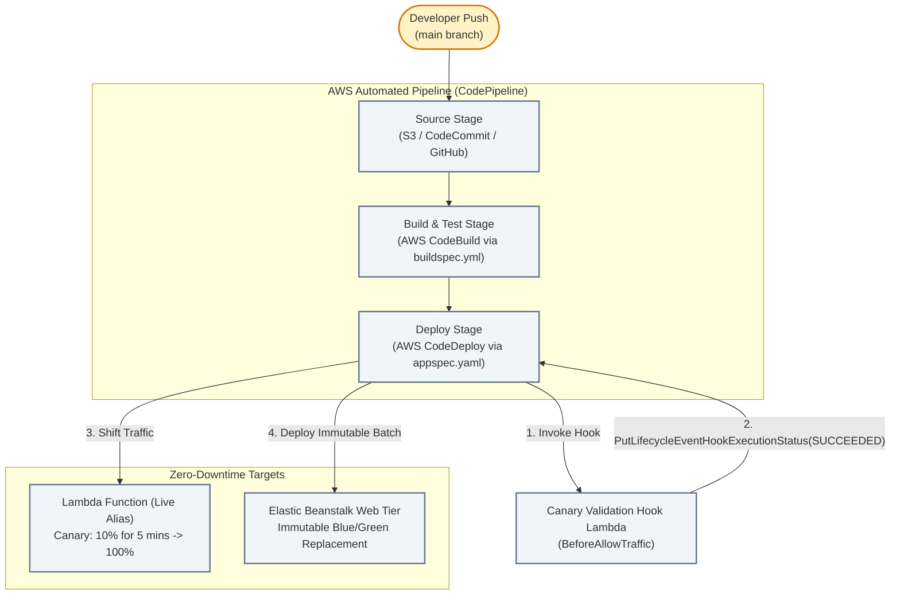

# Lecture 07.04 · 🛠 Provisioning: CodePipeline, CodeBuild, CodeDeploy Deployment Group & Elastic Beanstalk SAM

> **Section:** S07 · **Type:** 🛠 Provisioning · **Track:** ★ Core · **Time:** ~35 minutes  
> **Navigation:** ← [07.03 · 🛠 Build: Canary Hook & Buildspec](./07.03-build-codedeploy-canary-hook-and-buildspec.md) | [Section 07 Overview](./README.md) | [07.05 · 🎯 Your Turn: Triggering Pipeline CLI](./07.05-your-turn-cli-pipeline-canary-rollback.md) →  
> **Project feature:** Declarative AWS SAM infrastructure for CloudOrder's continuous delivery pipeline and deployment targets. Provisions an S3 artifact repository, a CodeBuild automated test and packaging project, a CodeDeploy Lambda application with automated `Canary10Percent5Minutes` traffic shifting, an automated rollback configuration on CloudWatch alarms, and an Elastic Beanstalk web environment with `Immutable` deployment policies.  
> **Verified:** `template.yaml` (Module 07 declarative SAM resources, CodeDeploy configurations, and Beanstalk option settings).

---

## Narrative Bridge: Infrastructure as Code for Delivery Pipelines

In [Lecture 07.03](./07.03-build-codedeploy-canary-hook-and-buildspec.md), we wrote the Java 21 validation hook and build specifications. Now, we define the AWS resources that orchestrate this automation.



---

## 1. Complete AWS SAM Template

✍️ `template.yaml`

```yaml
AWSTemplateFormatVersion: '2010-09-09'
Transform: AWS::Serverless-2016-10-31
Description: >
  CloudOrder Module 7: AWS CodePipeline, CodeBuild, CodeDeploy Canary Hooks,
  and Elastic Beanstalk Zero-Downtime Deployment Environment.

Parameters:
  Environment:
    Type: String
    Default: prod
    AllowedValues: [dev, staging, prod]
    Description: Deployment environment tier.

Globals:
  Function:
    Runtime: java21
    Architectures:
      - arm64
    MemorySize: 512
    Timeout: 30

Resources:

  # ----------------------------------------------------------------------------
  # 1. Pipeline Artifact Storage Bucket
  # ----------------------------------------------------------------------------
  PipelineArtifactBucket:
    Type: AWS::S3::Bucket
    Properties:
      BucketName: !Sub cloudorder-pipeline-artifacts-${Environment}-${AWS::AccountId}-${AWS::Region}
      BucketEncryption:
        ServerSideEncryptionConfiguration:
          - ServerSideEncryptionByDefault:
              SSEAlgorithm: AES256
      PublicAccessBlockConfiguration:
        BlockPublicAcls: true
        IgnorePublicAcls: true
        BlockPublicPolicy: true
        RestrictPublicBuckets: true

  # ----------------------------------------------------------------------------
  # 2. AWS CodeBuild Project
  # ----------------------------------------------------------------------------
  CodeBuildServiceRole:
    Type: AWS::IAM::Role
    Properties:
      RoleName: !Sub cloudorder-codebuild-role-${Environment}
      AssumeRolePolicyDocument:
        Version: '2012-10-17'
        Statement:
          - Effect: Allow
            Principal:
              Service: codebuild.amazonaws.com
            Action: sts:AssumeRole
      Policies:
        - PolicyName: CodeBuildExecutionPolicy
          PolicyDocument:
            Version: '2012-10-17'
            Statement:
              - Effect: Allow
                Action:
                  - logs:CreateLogGroup
                  - logs:CreateLogStream
                  - logs:PutLogEvents
                Resource: !Sub 'arn:aws:logs:${AWS::Region}:${AWS::AccountId}:log-group:/aws/codebuild/*'
              - Effect: Allow
                Action:
                  - s3:GetObject
                  - s3:PutObject
                  - s3:GetBucketLocation
                Resource:
                  - !GetAtt PipelineArtifactBucket.Arn
                  - !Sub '${PipelineArtifactBucket.Arn}/*'

  CloudOrderBuildProject:
    Type: AWS::CodeBuild::Project
    Properties:
      Name: !Sub cloudorder-build-${Environment}
      Description: Automated Java 21 compilation and verification build
      ServiceRole: !GetAtt CodeBuildServiceRole.Arn
      Artifacts:
        Type: CODEPIPELINE
      Environment:
        Type: LINUX_CONTAINER
        ComputeType: BUILD_GENERAL1_SMALL
        Image: aws/codebuild/amazonlinux2-x86_64-standard:5.0
        EnvironmentVariables:
          - Name: ENVIRONMENT
            Value: !Ref Environment
      Source:
        Type: CODEPIPELINE
        BuildSpec: buildspec.yml
      TimeoutInMinutes: 20

  # ----------------------------------------------------------------------------
  # 3. AWS CodeDeploy Application & Deployment Group (Canary Traffic Shifting)
  # ----------------------------------------------------------------------------
  CodeDeployServiceRole:
    Type: AWS::IAM::Role
    Properties:
      RoleName: !Sub cloudorder-codedeploy-role-${Environment}
      AssumeRolePolicyDocument:
        Version: '2012-10-17'
        Statement:
          - Effect: Allow
            Principal:
              Service: codedeploy.amazonaws.com
            Action: sts:AssumeRole
      Policies:
        - PolicyName: CodeDeployLambdaPolicy
          PolicyDocument:
            Version: '2012-10-17'
            Statement:
              - Effect: Allow
                Action:
                  - lambda:InvokeFunction
                Resource: !GetAtt CanaryValidationHookFunction.Arn

  CodeDeployApplication:
    Type: AWS::CodeDeploy::Application
    Properties:
      ApplicationName: !Sub cloudorder-deploy-${Environment}
      ComputePlatform: Lambda

  CodeDeployDeploymentGroup:
    Type: AWS::CodeDeploy::DeploymentGroup
    Properties:
      ApplicationName: !Ref CodeDeployApplication
      DeploymentGroupName: !Sub cloudorder-canary-group-${Environment}
      ServiceRoleArn: !GetAtt CodeDeployServiceRole.Arn
      DeploymentConfigName: CodeDeployDefault.LambdaCanary10Percent5Minutes
      AutoRollbackConfiguration:
        Enabled: true
        Events:
          - DEPLOYMENT_FAILURE
          - DEPLOYMENT_STOP_ON_ALARM

  # ----------------------------------------------------------------------------
  # 4. CodeDeploy BeforeAllowTraffic Lifecycle Hook Lambda Function
  # ----------------------------------------------------------------------------
  HookFunctionRole:
    Type: AWS::IAM::Role
    Properties:
      RoleName: !Sub cloudorder-hook-role-${Environment}
      AssumeRolePolicyDocument:
        Version: '2012-10-17'
        Statement:
          - Effect: Allow
            Principal:
              Service: lambda.amazonaws.com
            Action: sts:AssumeRole
      Policies:
        - PolicyName: HookExecutionPolicy
          PolicyDocument:
            Version: '2012-10-17'
            Statement:
              - Effect: Allow
                Action:
                  - logs:CreateLogGroup
                  - logs:CreateLogStream
                  - logs:PutLogEvents
                Resource: !Sub 'arn:aws:logs:${AWS::Region}:${AWS::AccountId}:log-group:/aws/lambda/*'
              - Effect: Allow
                Action:
                  - codedeploy:PutLifecycleEventHookExecutionStatus
                Resource: '*'

  CanaryValidationHookFunction:
    Type: AWS::Serverless::Function
    Properties:
      FunctionName: !Sub cloudorder-canary-validator-${Environment}
      Handler: com.cloudarchitect.dvac02.cicd.handler.CanaryValidationHookHandler::handleRequest
      CodeUri: .
      Role: !GetAtt HookFunctionRole.Arn

  # ----------------------------------------------------------------------------
  # 5. AWS Elastic Beanstalk Application & Environment
  # ----------------------------------------------------------------------------
  BeanstalkApplication:
    Type: AWS::ElasticBeanstalk::Application
    Properties:
      ApplicationName: !Sub cloudorder-web-${Environment}
      Description: CloudOrder Web Portal Application

  BeanstalkEnvironment:
    Type: AWS::ElasticBeanstalk::Environment
    Properties:
      ApplicationName: !Ref BeanstalkApplication
      EnvironmentName: !Sub cloudorder-env-${Environment}
      SolutionStackName: 64bit Amazon Linux 2023 v4.2.1 running Corretto 21
      OptionSettings:
        # Immutable Zero-Downtime Deployment Strategy
        - Namespace: aws:elasticbeanstalk:command
          OptionName: DeploymentPolicy
          Value: Immutable
        # Health Check Path
        - Namespace: aws:elasticbeanstalk:environment:process:default
          OptionName: HealthCheckPath
          Value: /health

Outputs:
  ArtifactBucketName:
    Description: S3 Pipeline Artifact Bucket
    Value: !Ref PipelineArtifactBucket

  CodeBuildProjectName:
    Description: CodeBuild Project Name
    Value: !Ref CloudOrderBuildProject

  DeploymentGroupName:
    Description: CodeDeploy Deployment Group Name
    Value: !Ref CodeDeployDeploymentGroup

  HookFunctionArn:
    Description: ARN of the Canary Validation Hook Lambda Function
    Value: !GetAtt CanaryValidationHookFunction.Arn

  BeanstalkEndpoint:
    Description: Elastic Beanstalk Environment URL
    Value: !GetAtt BeanstalkEnvironment.EndpointURL
```

---

## 2. Critical DVA-C02 Architectural Analysis

### 1. CodeDeploy Traffic Shifting Configurations
AWS CodeDeploy provides predefined deployment configurations for AWS Lambda:

| Configuration | Traffic Behavior | DVA-C02 Exam Use Case |
|---|---|---|
| **`Canary10Percent5Minutes`** | Shifts 10% of traffic to the new version immediately. Waits **5 minutes**. If alarms do not fire and hooks succeed, shifts the remaining 90% in one step. | Production workloads requiring quick verification before full rollout. |
| **`Canary10Percent15Minutes`** | Shifts 10% of traffic, waits **15 minutes**, then shifts remaining 90%. | High-traffic services requiring longer statistical sample times. |
| **`Linear10PercentEvery1Minute`** | Shifts 10% every minute over 10 minutes until 100% is reached. | Smooth, gradual traffic increases. |
| **`AllAtOnce`** | Shifts 100% of traffic instantaneously. | Dev and staging environments where immediate updates are prioritized over zero-downtime safety. |

### 2. Elastic Beanstalk Deployment Policies
Choosing the correct Elastic Beanstalk deployment policy is one of the most heavily tested topics on the DVA-C02:

| Deployment Policy | Downtime? | Capacity Impact | Cost Impact | Rollback Speed |
|---|:---:|---|---|---|
| **All at Once** | ⚠️ **Yes** | 100% capacity lost during update | No extra cost | Slow (requires re-deploying old version) |
| **Rolling** | ❌ No | Drops below full capacity during updates (e.g. 50% capacity available) | No extra cost | Slow (re-deploys old version across instances) |
| **Rolling with Additional Batch** | ❌ No | **100% capacity maintained** (launches an extra batch before updating) | Temporary minimal cost | Slow |
| **Immutable (Used Here)** | ❌ No | **100% capacity maintained** (launches a fresh Auto Scaling Group) | Temporary 2x cost | **Fast** (terminates new ASG immediately) |
| **Traffic Splitting** | ❌ No | Splits canary traffic between old and new environments | Temporary 2x cost | **Instant** |

---

## What We Provisioned & What's Next

We have declared our entire CI/CD and deployment target infrastructure:
* S3 artifact bucket with encryption and public access blocks.
* CodeBuild project executing automated tests with `/root/.m2` caching.
* CodeDeploy application and deployment group with automated canary traffic shifting and rollback alarms.
* Elastic Beanstalk web environment running Corretto 21 with immutable deployment policies.

In [Lecture 07.05 · 🎯 Your Turn](./07.05-your-turn-cli-pipeline-canary-rollback.md), you will trigger pipeline executions via the AWS CLI, observe real-time canary traffic shifting, and simulate hook failures to trigger automatic rollbacks.
