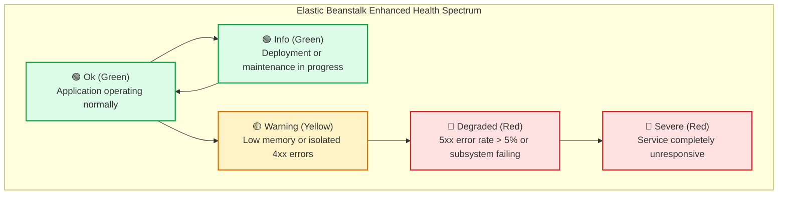
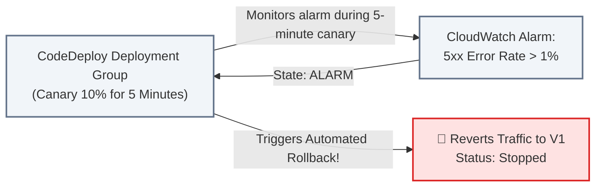

# Lecture 07.06 · 🧩 Live Verification: Monitoring Deployment Metrics & Beanstalk Enhanced Health

> **Section:** S07 · **Type:** 🧩 Live Verification · **Track:** ★ Core · **Time:** ~30 minutes  
> **Navigation:** ← [07.05 · 🎯 Your Turn: Triggering Pipeline CLI](./07.05-your-turn-cli-pipeline-canary-rollback.md) | [Section 07 Overview](./README.md) | [07.07 · 🐞 Debug Lab: Cache Miss & AppSpec Timeout](./07.07-debug-buildspec-cache-appspec-hook-timeout.md) →  
> **Project feature:** Deployment telemetry and infrastructure health verification for CloudOrder. Evaluates AWS CodeDeploy CloudWatch metrics, configures alarm-driven rollback thresholds, and inspects Elastic Beanstalk Enhanced Health states.

---

## 1. Elastic Beanstalk Enhanced Health System

While Basic Health reporting only checks EC2 hypervisor status checks and simple ALB HTTP pings, **Enhanced Health Reporting** samples instance OS metrics, application response codes (4xx/5xx distributions), and web server latency every 10 seconds.



### 1.1 The Health Color Spectrum for DVA-C02

| State | Color | System Condition | ALB Health Action |
|---|:---:|---|---|
| **Ok** | 🟢 Green | Application responding with 2xx/3xx; latency within baseline. | Traffic routed normally. |
| **Info** | 🟢 Green | A command or deployment is actively executing across the fleet. | Traffic routed normally. |
| **Warning** | 🟡 Yellow | Moderate issues: High CPU/RAM utilization or transient 4xx errors. | Monitored; traffic continues. |
| **Degraded** | 🔴 Red | High 5xx error rate or custom `/health` probe failing on instances. | Load balancer flags instances as unhealthy. |
| **Severe** | 🔴 Red | Severe system failure: multiple instances failed or crashed. | Immediate alert; Auto Scaling replaces instances. |

### 1.2 Inspecting Health via AWS CLI:
```bash
aws elasticbeanstalk describe-environment-health \
  --environment-name "cloudorder-env-prod" \
  --attribute-names Status Color HealthStatus Causes \
  --output json
```

Sample Healthy Output:
```json
{
  "EnvironmentName": "cloudorder-env-prod",
  "Color": "Green",
  "Status": "Ready",
  "HealthStatus": "Ok",
  "Causes": []
}
```

---

## 2. CodeDeploy Rollback Triggers on CloudWatch Alarms

In production, synthetic hooks cannot test every real-world user condition. To catch real regressions during the 5-minute canary window, CodeDeploy integrates directly with **Amazon CloudWatch Alarms**.



### Configuring Alarm-Based Rollback in SAM:
```yaml
CodeDeployDeploymentGroup:
  Type: AWS::CodeDeploy::DeploymentGroup
  Properties:
    ApplicationName: !Ref CodeDeployApplication
    DeploymentGroupName: !Sub cloudorder-canary-group-${Environment}
    DeploymentConfigName: CodeDeployDefault.LambdaCanary10Percent5Minutes
    AlarmConfiguration:
      Enabled: true
      Alarms:
        - Name: !Ref Lambda5xxErrorAlarm
      IgnorePollAlarmFailure: false
    AutoRollbackConfiguration:
      Enabled: true
      Events:
        - DEPLOYMENT_FAILURE
        - DEPLOYMENT_STOP_ON_ALARM
```

If the 10% canary traffic causes the `Lambda5xxErrorAlarm` to breach its threshold at minute 2 of the 5-minute evaluation, CodeDeploy halts the deployment immediately, shifts traffic back to Version 1, and marks the deployment `Stopped`.

---

## Storytelling Bridge to Debugging

Monitoring gives us clear visibility into deployment health and alarm thresholds. But what happens when the pipeline itself gets stuck or times out?

In [Lecture 07.07 · 🐞 Debug Lab: CodeBuild Cache Miss Latency, AppSpec Hook Timeout & Beanstalk 502](./07.07-debug-buildspec-cache-appspec-hook-timeout.md), we will troubleshoot build pipeline performance bottlenecks, lifecycle hook timeouts, and Beanstalk NGINX proxy issues.
