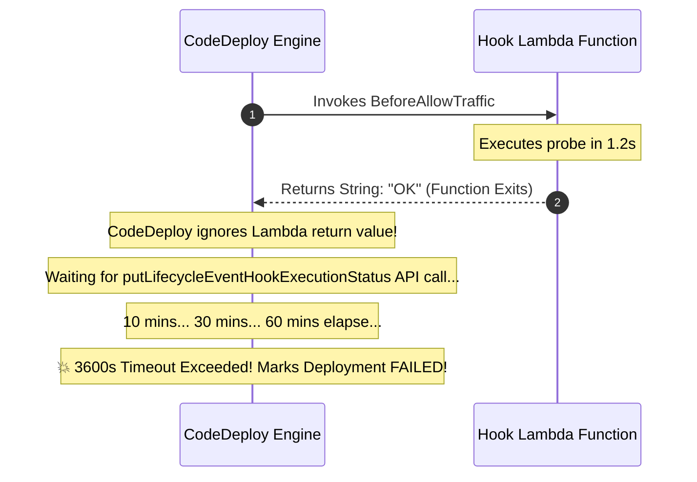

# Lecture 07.07 · 🐞 Debug Lab: CodeBuild Cache Miss Latency, AppSpec Hook Timeout & Beanstalk 502

> **Section:** S07 · **Type:** 🐞 Debug Lab · **Track:** ★ Core · **Time:** ~35 minutes  
> **Navigation:** ← [07.06 · 🧩 Live Verification: Beanstalk Health](./07.06-live-verification-cloudwatch-beanstalk-health.md) | [Section 07 Overview](./README.md) | [07.08 · 🔓 Attack Lab: Poison Pipeline Execution](./07.08-attack-lab-poison-pipeline-synthetic-tampering.md) →  
> **Project feature:** Systematic root-cause debugging of three enterprise continuous delivery pipeline failures: CodeBuild dependency cache miss latency spikes, CodeDeploy lifecycle hook 60-minute freezes, and Elastic Beanstalk NGINX reverse proxy 502 Bad Gateway errors.

---

## Defect 1: CodeBuild Dependency Cache Miss Latency

### 1.1 The Production Symptom
A team notices their CI/CD pipeline duration jumps from 45 seconds to over 11 minutes. CodeBuild execution times have blown past SLAs, delaying critical hotfixes.

### 1.2 Forensic Analysis
Inspecting the CodeBuild execution log:
```text
[INFO] Downloading from central: https://repo.maven.apache.org/maven2/software/amazon/awssdk/bom/2.29.50/bom-2.29.50.pom
[INFO] Downloading from central: https://repo.maven.apache.org/maven2/com/fasterxml/jackson/core/jackson-databind/2.18.2/jackson-databind-2.18.2.jar
... (4,200 lines of downloading Maven dependencies)
```
CodeBuild uses **ephemeral Docker containers**. Every build starts from a blank filesystem image.
Without explicit caching, Maven downloads every library from Maven Central over the public internet on every single commit.

### 1.3 The Fix: Configure Local or S3 Caching
1. Add the cache block to `buildspec.yml`:
   ```yaml
   cache:
     paths:
       - '/root/.m2/**/*'
   ```
2. Enable caching in the CloudFormation `AWS::CodeBuild::Project` resource:
   ```yaml
   CloudOrderBuildProject:
     Type: AWS::CodeBuild::Project
     Properties:
       Cache:
         Type: LOCAL
         Modes:
           - LOCAL_CUSTOM_CACHE
   ```
On the subsequent execution, Maven finds all dependencies pre-cached in `/root/.m2`, dropping build time back to **35 seconds**.

---

## Defect 2: The CodeDeploy Hook 60-Minute Freeze

### 2.1 The Production Symptom
A developer creates a `BeforeAllowTraffic` Lambda hook to validate database migrations before shifting canary traffic. When triggered, the deployment enters `InProgress` and **hangs for exactly 60 minutes**, locking all pipeline deployments. After 1 hour, it fails with:
```text
The lifecycle event hook execution timed out after 3600 seconds.
Status: Failed
```
Looking at the hook Lambda logs, the function executed in 1.2 seconds and printed:
```text
[HOOK] Verification completed successfully! Returning OK.
```

### 2.2 Forensic Analysis



> [!WARNING]
> **DVA-C02 Trap: CodeDeploy Does NOT Read Lambda Return Values!**  
> Unlike API Gateway, AWS CodeDeploy does **not** evaluate the return value or stdout of your hook Lambda function. It strictly listens for an authenticated AWS SDK API call: **`putLifecycleEventHookExecutionStatus`**.  
> If your function returns without making this SDK call, CodeDeploy treats the hook as still running until the 60-minute timeout trips!

### 2.3 The Fix
Call `codeDeployClient.putLifecycleEventHookExecutionStatus()` inside a `finally` block:
```java
PutLifecycleEventHookExecutionStatusRequest request = PutLifecycleEventHookExecutionStatusRequest.builder()
        .deploymentId(deploymentId)
        .lifecycleEventHookExecutionId(hookExecutionId)
        .status(LifecycleEventStatus.SUCCEEDED)
        .build();

codeDeployClient.putLifecycleEventHookExecutionStatus(request);
```

---

## Defect 3: Elastic Beanstalk NGINX 502 Bad Gateway

### 3.1 The Production Symptom
A developer deploys a Spring Boot Java web microservice to Elastic Beanstalk (Amazon Linux 2023 Corretto 21 platform). The deployment completes with `Status: Ok`, but browsing to `http://cloudorder-env.elasticbeanstalk.com` returns:
```http
HTTP/1.1 502 Bad Gateway
Server: nginx/1.24.0
Content-Type: text/html
```

### 3.2 Forensic Analysis
Checking `/var/log/nginx/error.log` via the Beanstalk console:
```text
2026/09/27 09:20:15 [error] 3214#3214: *1 connect() failed (111: Connection refused) 
while connecting to upstream, client: 10.0.1.20, server: , 
request: "GET / HTTP/1.1", upstream: "http://127.0.0.1:5000/"
```
* **Architecture**: The Elastic Beanstalk Java SE platform runs an **NGINX** reverse proxy on port 80 that forwards incoming requests to `http://127.0.0.1:5000`.
* **Root Cause**: The Java application was configured on the default Spring Boot port **8080**. Because nothing was listening on port 5000, NGINX refused the connection and emitted `502 Bad Gateway`.

### 3.3 The Fix
Set the `PORT` environment variable to `5000` in the Beanstalk environment options:
```yaml
OptionSettings:
  - Namespace: aws:elasticbeanstalk:application:environment
    OptionName: PORT
    Value: '5000'
```
NGINX connects to port 5000, and the application serves 200 OK.

---

## Storytelling Bridge to Attack & Hardening

Now that we have debugged pipeline bottlenecks, hook freezes, and proxy mismatches, we must test whether an adversary can poison our pipeline or trick CodeDeploy into promoting bad builds.

In [Lecture 07.08 · 🔓 Attack Lab: Poison Pipeline Execution & Premature Canary Promotion](./07.08-attack-lab-poison-pipeline-synthetic-tampering.md), we will simulate supply chain test poisoning and test hook tamper resistance.
