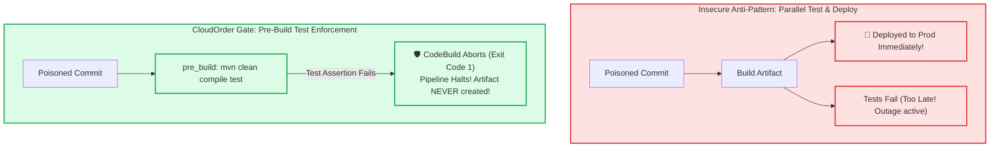

# Lecture 07.08 · 🔓 Attack Lab: Poison Pipeline Execution & Premature Canary Promotion via Tampered Health Checks

> **Section:** S07 · **Type:** 🔓 Attack Lab · **Track:** ★ Core · **Time:** ~35 minutes  
> **Navigation:** ← [07.07 · 🐞 Debug Lab: Cache Miss & AppSpec Timeout](./07.07-debug-buildspec-cache-appspec-hook-timeout.md) | [Section 07 Overview](./README.md) | [07.09 · ＋ Extended: .ebextensions & Playwright](./07.09-extended-ebextensions-playwright-testing.md) →  
> **Project feature:** Adversarial stress testing of CloudOrder's continuous delivery pipeline and deployment safety gates. We will simulate a poisoned commit with failing tests to verify CodeBuild's pre-build gates, and evaluate the vulnerability of shallow health checks during progressive canary promotions.

---

## Attack Vector 1: Poison Pipeline Build Injection

### 1.1 The Vulnerability Mechanics
In insecure CI/CD pipelines where unit tests are deferred or run in parallel with deployment, a commit containing regressions or failing business logic can slip into production before tests finish executing.



### 1.2 Simulating the Poisoned Commit
Inject a failing test into the test directory:
```java
@Test
void testPoisonInjection_forcesFailure() {
    assertThat(1 + 1).isEqualTo(3); // Intentional assertion failure
}
```

Trigger the pipeline and inspect the CodeBuild phase logs:
```text
[INFO] Running com.cloudarchitect.dvac02.cicd.S07DeploymentValidationTest
[ERROR] Failures: 
[ERROR]   S07DeploymentValidationTest.testPoisonInjection_forcesFailure:42 
Expecting actual: 2 to be equal to: 3
[INFO] BUILD FAILURE
[Container] 2026/09/27 09:30:15 Command did not exit successfully mvn clean compile test exit status 1
[Container] 2026/09/27 09:30:15 Phase complete: PRE_BUILD State: FAILED
[Container] 2026/09/27 09:30:15 Phase context status code: COMMAND_EXECUTION_ERROR Message: Error while executing command
```

🛡️ **Gate Verified**: CodePipeline halts immediately. The `build` phase is skipped, no artifacts are emitted to the S3 bucket, and CodeDeploy is never invoked.

---

## Attack Vector 2: The Shallow Health Check (False Canary Promotion)

### 2.1 The Vulnerability: Static 200 OK Health Probes
A critical security flaw in deployment automation is a "shallow" health check:
```java
// VULNERABLE SHALLOW HEALTH PROBE:
@GetMapping("/health")
public ResponseEntity<String> shallowHealth() {
    return ResponseEntity.ok("OK"); // Returns 200 OK regardless of dependencies!
}
```

If the newly deployed Canary Lambda version has an invalid database connection string or missing KMS permissions:
1. The `BeforeAllowTraffic` hook queries `/health`.
2. The probe returns `HTTP 200 OK` (shallow check passes).
3. The hook signals `SUCCEEDED` to CodeDeploy.
4. CodeDeploy begins routing real customer traffic to the canary.
5. All live customer transactions fail with `DatabaseConnectionRefused`!

### 2.2 Enterprise Defense: Deep Synthetic Health Probes & CloudWatch Rollbacks
To prevent false canary promotions, CloudOrder implements a **Two-Tier Defense**:

#### Defense Tier 1: Deep Probe Verification
In [`CanaryValidationHookHandler.java`](file:///C:/Users/Admin/Desktop/courses/aws-dva-c02-developer-course/reference/cloudorder/backend/module-07-cicd-beanstalk/src/main/java/com/cloudarchitect/dvac02/cicd/handler/CanaryValidationHookHandler.java), the probe tests actual dependency connectivity (database ping, cache get/set, and secret retrieval). If any dependency fails, it reports `FAILED` before shifting 1 single byte of user traffic.

#### Defense Tier 2: Real-Traffic CloudWatch Alarms
Even if a synthetic probe passes, real customer traffic during the 5-minute canary window is monitored by CloudWatch alarms (`Lambda5xxErrors`). The moment 5xx errors spike, CodeDeploy aborts and shifts 100% of traffic back to the previous version.

---

## Storytelling Bridge to Extended Topics

We have verified that strict pre-build gates prevent bad builds from compiling, and deep canary probes prevent broken versions from receiving production traffic.

What about automated end-to-end user journey verification in real headless browsers? And how do we customize the underlying Linux operating system for Elastic Beanstalk fleets?

In [Lecture 07.09 · ＋ Extended: Elastic Beanstalk .ebextensions & Playwright Testing](./07.09-extended-ebextensions-playwright-testing.md), we explore `.ebextensions` configuration management and running Playwright browser test suites inside AWS CodeBuild.
