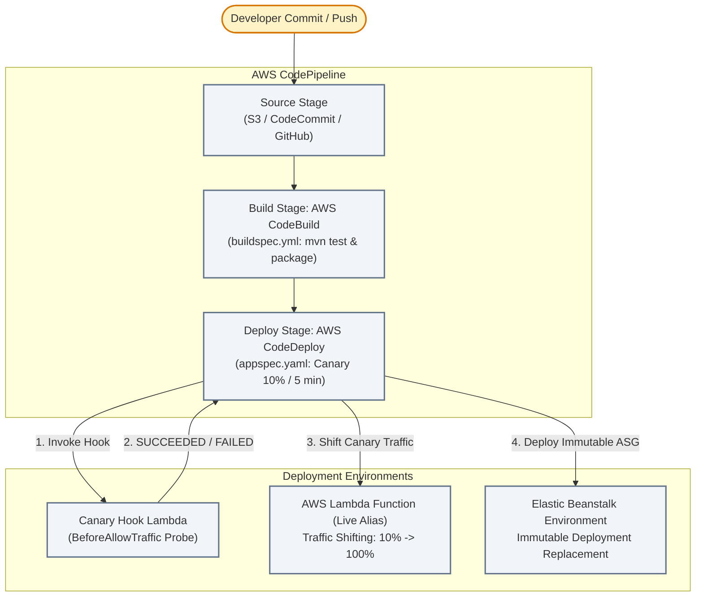

# Section 07 · Automated CI/CD, Beanstalk & Playwright Testing
## Pipeline Orchestration, Progressive Traffic Shifting & Zero-Downtime Deployments

---

## 1. Executive Summary & Architecture

Section 07 establishes the enterprise continuous delivery and deployment automation pipeline for **CloudOrder**. Using **AWS CodePipeline**, the platform connects source control, automated build and verification in **AWS CodeBuild**, and zero-downtime progressive traffic shifting in **AWS CodeDeploy**.

To eliminate deployment failures and broken code in production, CodeBuild runs comprehensive Java 21 compilation and automated unit testing in the `pre_build` phase governed by [`buildspec.yml`](file:///C:/Users/Admin/Desktop/courses/aws-dva-c02-developer-course/reference/cloudorder/backend/module-07-cicd-beanstalk/buildspec.yml). Caching of `/root/.m2` dependencies accelerates recurring build times.

Deployments to AWS Lambda leverage CodeDeploy's **`Canary10Percent5Minutes`** traffic shifting strategy. Before user traffic is routed to the new version, a custom Java 21 **`BeforeAllowTraffic`** lifecycle hook ([`CanaryValidationHookHandler.java`](file:///C:/Users/Admin/Desktop/courses/aws-dva-c02-developer-course/reference/cloudorder/backend/module-07-cicd-beanstalk/src/main/java/com/cloudarchitect/dvac02/cicd/handler/CanaryValidationHookHandler.java)) executes synthetic probes. If probes succeed, it signals `SUCCEEDED` to the CodeDeploy API; if probes fail, it signals `FAILED`, immediately rolling back traffic.

For our web microservice tier, we configure **AWS Elastic Beanstalk** with **Immutable** and **Rolling with Additional Batch** deployment policies, preventing capacity degradation while testing instances via deep `/health` check endpoints.

---

## 2. DVA-C02 Domain Mapping

* **Domain 3: Deployment (24%)**
  * AWS CodePipeline: Stages, actions, transitions, manual approvals.
  * AWS CodeBuild: Build phases (`install`, `pre_build`, `build`, `post_build`), environment variables, artifacts, and local/S3 caching.
  * AWS CodeDeploy: Deployment types (In-place vs. Blue/Green), Lambda deployment configurations (`Canary10Percent5Minutes`, `Linear10PercentEvery1Minute`, `AllAtOnce`).
  * AWS Elastic Beanstalk: Deployment policies (All at Once, Rolling, Rolling with Additional Batch, Immutable, Traffic Splitting), `.ebextensions` configuration files, and custom health check paths.
* **Domain 4: Troubleshooting and Optimization (18%)**
  * Automated rollbacks triggered by CloudWatch alarms and CodeDeploy lifecycle hook failures.
  * Elastic Beanstalk Enhanced Health monitoring (Severe, Degraded, Warning, Ok).
  * Build performance optimization using CodeBuild dependency caching.

---

## 3. Lecture Guide

| # | Type | Lecture | Track | Focus & Deliverable |
|---|:---:|---|:---:|---|
| **07.01** | 📖 | [Mechanical Sympathy: CI/CD Pipeline Topologies, Deployment Strategies & Rollbacks](./07.01-mechanical-sympathy-cicd-blue-green-canary.md) | ★ | CodePipeline stages, CodeBuild caching, Beanstalk deployment policies comparison, CodeDeploy traffic shifting. |
| **07.02** | 📇 | [API Card: buildspec.yml, appspec.yaml & CodeDeploy Lifecycle Hooks](./07.02-api-card-buildspec-appspec-codedeploy-hooks.md) | ★ | Detailed syntax for `buildspec.yml`, `appspec.yaml`, `BeforeAllowTraffic`, and `putLifecycleEventHookExecutionStatus`. |
| **07.03** | 🛠 | [Build: CodeDeploy Pre-Traffic Canary Hook, Health Check Controller & Buildspec](./07.03-build-codedeploy-canary-hook-and-buildspec.md) | ★ | Java 21 `CanaryValidationHookHandler`, `BeanstalkHealthCheckController`, `buildspec.yml`, and `appspec.yaml`. |
| **07.04** | 🛠 | [Provisioning: CodePipeline, CodeBuild, CodeDeploy Deployment Group & Elastic Beanstalk SAM](./07.04-provisioning-codepipeline-codedeploy-beanstalk-sam.md) | ★ | Declarative SAM template declaring CodeBuild, CodeDeploy Canary group with automated rollback, and Beanstalk. |
| **07.05** | 🎯 | [Your Turn: Triggering Pipeline Executions via CLI, Observing Canary Shifting & Rollbacks](./07.05-your-turn-cli-pipeline-canary-rollback.md) | ★ | Hands-on lab triggering pipeline executions, tracking canary traffic shifting, and observing automatic rollbacks. |
| **07.06** | 🧩 | [Live Verification: Monitoring Deployment Metrics & Beanstalk Enhanced Health](./07.06-live-verification-cloudwatch-beanstalk-health.md) | ★ | Tracking CodeDeploy deployment status, Elastic Beanstalk Enhanced Health colors, and CloudWatch rollback alarms. |
| **07.07** | 🐞 | [Debug Lab: CodeBuild Cache Miss Latency, AppSpec Hook Timeout & Beanstalk 502](./07.07-debug-buildspec-cache-appspec-hook-timeout.md) | ★ | Diagnosing slow Maven builds, hook timeouts, and Elastic Beanstalk NGINX port 5000/8080 proxy mismatches. |
| **07.08** | 🔓 | [Attack Lab: Poison Pipeline Execution & Premature Canary Promotion via Tampered Health Checks](./07.08-attack-lab-poison-pipeline-synthetic-tampering.md) | ★ | Injecting failing test code to verify pipeline build gates, testing hook tamper resistance. |
| **07.09** | ＋ | [Extended: Elastic Beanstalk .ebextensions Configuration & Playwright End-to-End Testing](./07.09-extended-ebextensions-playwright-testing.md) | ＋ | Automating EC2 environment provisioning with `.ebextensions`, running headless Playwright browser tests in CodeBuild. |
| **07.99** | ✅ | [DVA-C02 Knowledge Check: CodePipeline, CodeBuild, CodeDeploy Strategies & Beanstalk](./07.99-knowledge-check.md) | ★ | 5 high-yield exam scenarios covering deployment configurations, lifecycle hooks, and Beanstalk deployment policies. |

---

## 4. Reference Code & Snapshot

* **Reference Implementation**: `reference/cloudorder/backend/module-07-cicd-beanstalk/`
* **Automated Test Suite**: `S07DeploymentValidationTest` (5/5 passing tests)
* **Frozen Checkpoint**: `reference/snapshots/s07-end/`
* **Solution Walkthrough**: [`solutions/S07-cicd-beanstalk/07.05-solution.md`](../../solutions/S07-cicd-beanstalk/07.05-solution.md)
