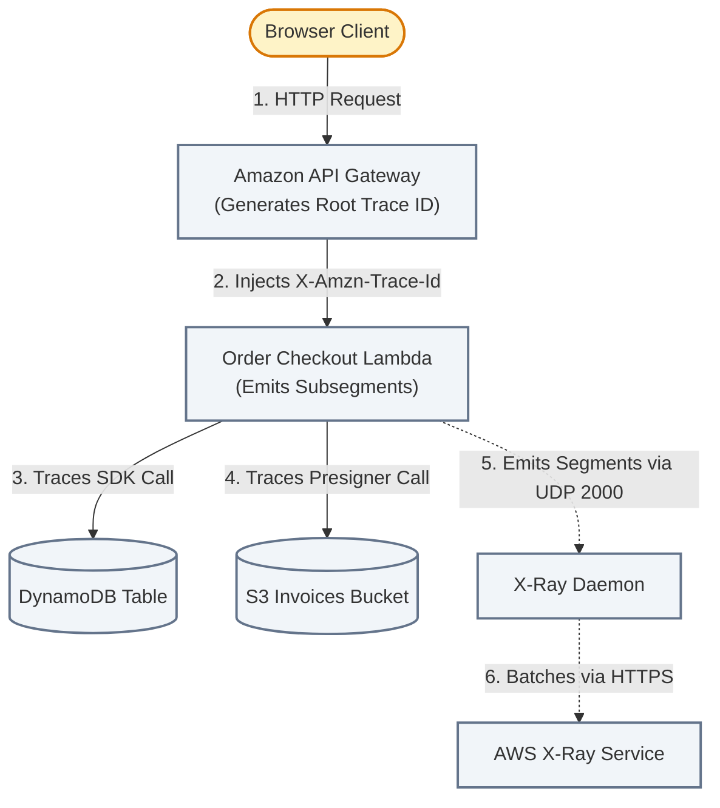
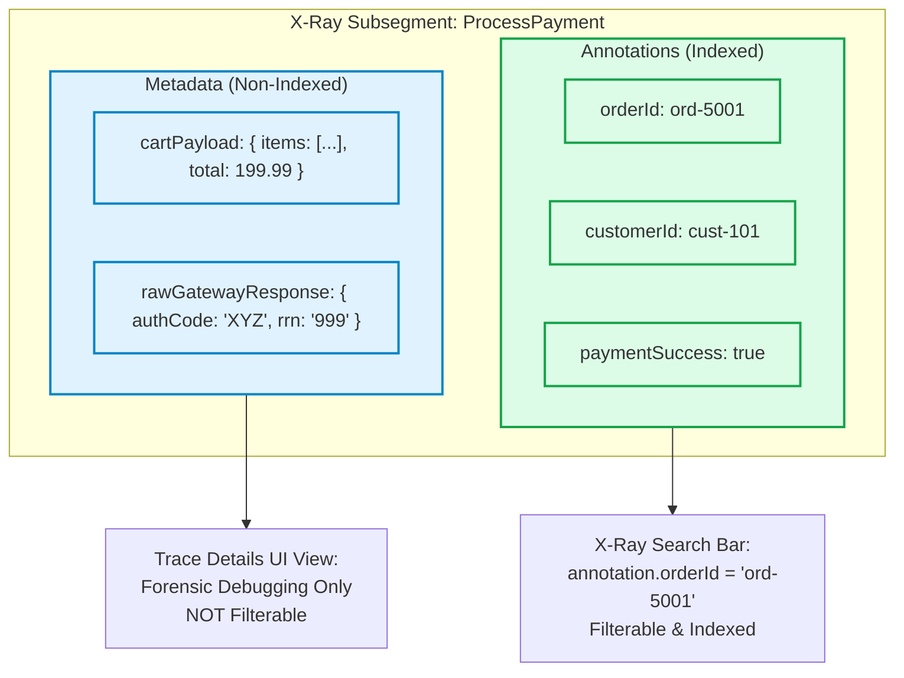
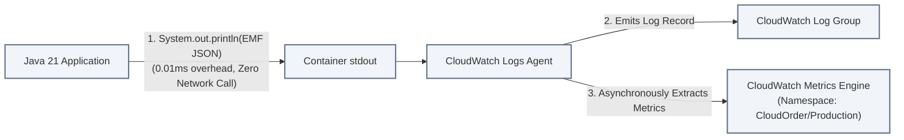

# Lecture 08.01 · 📖 Mechanical Sympathy: Distributed Tracing Protocols, Sampling Math & Embedded Metric Format

> **Section:** S08 · **Type:** 📖 Theory · **Track:** ★ Core · **Time:** ~35 minutes  
> **Navigation:** ← [Section 07: 07.99 · Knowledge Check](../S07-cicd-beanstalk/07.99-knowledge-check.md) | [Section 08 Overview](./README.md) | [08.02 · 📇 API Card: X-Ray SDK & EMF Schema](./08.02-api-card-xray-sdk-emf-specification.md) →  
> **Project feature:** Observability foundations and distributed telemetry architecture for CloudOrder. Deconstructs AWS X-Ray trace header propagation, UDP daemon mechanics, and sampling mathematical formulas; examines the critical distinction between indexed Annotations and non-indexed Metadata; and analyzes the latency and cost advantages of CloudWatch Embedded Metric Format (EMF) over synchronous `PutMetricData`.  
> **Core Concepts:** `X-Amzn-Trace-Id` format, X-Ray daemon UDP 2000, Reservoir vs. Fixed Rate sampling math, Annotations vs. Metadata, CloudWatch EMF `_aws` directive, metric dimension explosion prevention.

---

## 1. Physical Mechanics of AWS X-Ray

In a modern distributed architecture, a single user click on "Checkout" touches Amazon API Gateway, a Lambda authorizer, a Saga Step Functions workflow, DynamoDB tables, an SQS queue, and an S3 bucket.

When a customer reports an intermittent 3-second delay, traditional server logs are isolated. **AWS X-Ray** stitches these disparate distributed hops into a single unified trace graph.



### 1.1 The Anatomy of the `X-Amzn-Trace-Id` Header

Trace context travels across HTTP headers and message envelopes via the standard AWS trace header:

```text
X-Amzn-Trace-Id: Root=1-6789abcd-0123456789abcdef01234567;Parent=53995cbe4196f34e;Sampled=1
```

| Field | Mechanical Format | Purpose |
|---|---|---|
| **`Root`** | `1-[8 hex chars epoch]-[24 hex chars unique]` | Global trace ID created at the first AWS ingress point (e.g. API Gateway or Application Load Balancer). Remains identical across all downstream microservices. |
| **`Parent`** | `[16 hex chars]` | The Segment or Subsegment ID of the immediate upstream caller, allowing X-Ray to reconstruct parent-child execution graphs. |
| **`Sampled`** | `1`, `0`, or `?` | `1` = Trace is recorded; `0` = Trace is not recorded; `?` = Downstream service decides based on local sampling rules. |

### 1.2 The X-Ray Daemon: Why UDP Port 2000?
AWS X-Ray does not make synchronous HTTPS calls from your application runtime to the X-Ray backend. Making an HTTPS call on every function invocation would add $20\text{--}50\text{ ms}$ of latency and introduce connection overhead.
* The AWS X-Ray SDK serializes trace segments and sends them via **UDP to port 2000** on `127.0.0.1` (or local container daemon).
* **Non-Blocking Invariant**: Because UDP is a fire-and-forget protocol with no TCP handshakes or ACKs, your application never waits. If the X-Ray daemon crashes or memory saturates, packets are silently dropped without slowing down customer checkout transactions.

---

## 2. Sampling Rules: Mathematical Formula

Tracing every single request in a platform processing $10,000\text{ req/s}$ would generate $864,000,000$ traces daily, producing overwhelming CloudWatch costs.
AWS X-Ray uses a two-parameter algorithm: **Reservoir Size** and **Fixed Rate**.

$$\text{Sampled Traces/Sec} = \min(\text{Requests/Sec}, \text{Reservoir}) + \max(0, \text{Requests/Sec} - \text{Reservoir}) \times \text{FixedRate}$$

### Sample Calculation:
* `ReservoirSize` = $2\text{ req/s}$
* `FixedRate` = $0.05\text{ (5\%)}$
* Current Traffic = $1,000\text{ req/s}$

$$\text{Total Sampled} = 2 + (1,000 - 2) \times 0.05 = 2 + 49.9 = 51.9 \approx 52\text{ traces/sec}$$

The reservoir ensures you always capture traces during low-traffic periods (even at 1 req/min), while the fixed rate caps volume predictably during traffic spikes.

---

## 3. Annotations vs. Metadata

In AWS X-Ray, subsegments can be enriched with business context. Understanding the difference between Annotations and Metadata is one of the most critical concepts on the DVA-C02 exam:



| Dimension | X-Ray Annotations | X-Ray Metadata |
|---|---|---|
| **Indexing** | ✅ **Indexed** for search and filtering. | ❌ **Non-Indexed**. |
| **Searchability** | Can be queried in the X-Ray console using filter expressions: `annotation.customerId = "cust-101"`. | Cannot be searched or queried; visible only when viewing a specific trace details page. |
| **Data Types** | Simple scalar types only: **String, Number, Boolean**. | Any complex JSON data structure (nested maps, lists, objects). |
| **Limit** | Up to **50 annotations** per trace segment. | No 50-item limit (subject to 64 KB total segment size limit). |

---

## 4. Telemetry: Synchronous `PutMetricData` vs. Embedded Metric Format (EMF)

Traditionally, applications emitted custom CloudWatch metrics by calling the AWS SDK `cloudwatchClient.putMetricData()`:
* **Latency Overhead**: Every `PutMetricData` call incurs a synchronous HTTPS round-trip ($20\text{--}50\text{ ms}$), directly slowing down Lambda execution and inflating billed duration.
* **API Cost**: CloudWatch charges $0.01$ per 1,000 metric requests.
* **Throttling Risk**: Account-level limits (150 TPS) throttle high-throughput applications.

### 4.1 The Embedded Metric Format (EMF) Revolution
With **CloudWatch Embedded Metric Format (EMF)**, your application writes a structured JSON payload directly to `stdout`:

```json
{
  "_aws": {
    "Timestamp": 1790500000000,
    "CloudWatchMetrics": [
      {
        "Namespace": "CloudOrder/Production",
        "Dimensions": [["Service", "Environment"]],
        "Metrics": [
          {"Name": "OrderProcessingLatencyMs", "Unit": "Milliseconds"}
        ]
      }
    ]
  },
  "Service": "OrderService",
  "Environment": "prod",
  "OrderProcessingLatencyMs": 142.5,
  "OrderId": "ord-8888",
  "CustomerId": "cust-101"
}
```



### 4.2 Preventing the Metric Dimension Explosion
Every unique combination of dimensions in CloudWatch creates a separate custom metric billed at **$0.30/metric/month**.
* **The Catastrophic Anti-Pattern**: Putting `OrderId` or `CustomerId` inside the `Dimensions` array. For 1,000,000 orders, you will be billed for 1,000,000 custom metrics ($300,000/month!).
* **The EMF Architecture**: `OrderId` is placed in the JSON body, but **excluded from the `Dimensions` list**. CloudWatch creates zero custom metrics for the order ID, but the order ID is completely indexed and queryable in **CloudWatch Logs Insights**!

---

## Storytelling Bridge to API Contracts

Now that we understand the mechanics of X-Ray header propagation, UDP daemons, Annotations vs. Metadata, and the cost/latency benefits of EMF, we need to inspect the code interfaces that emit them.

In [Lecture 08.02 · 📇 API Card: AWS X-Ray SDK & CloudWatch EMF Specification](./08.02-api-card-xray-sdk-emf-specification.md), we will dissect the X-Ray subsegment API and the formal EMF JSON specification.
