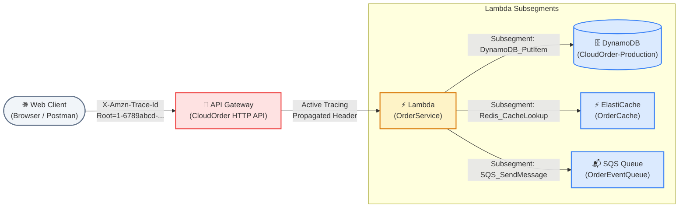
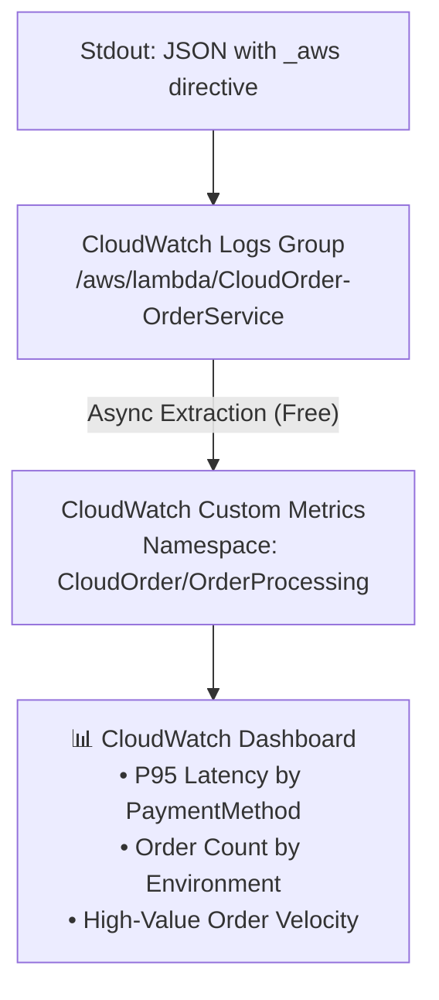

# Lecture 08.06 · 🧩 Live Verification: Inspecting Service Maps, Subsegment Latencies & EMF Metric Dashboards

> **Section:** S08 · **Type:** 🧩 Live Verification · **Track:** ★ Core · **Time:** ~30 minutes  
> **Navigation:** ← [08.05 · 🎯 Your Turn: Generating Distributed Traces](./08.05-your-turn-cli-xray-traces-insights-alarms.md) | [Section 08 Overview](./README.md) | [08.07 · 🐞 Debug Lab: Thread Context & Metric Explosion](./08.07-debug-unpropagated-trace-context-metric-explosion.md) →  
> **Project feature:** Live operational verification of CloudOrder's distributed tracing and metric telemetry pipeline. We inspect the AWS X-Ray Service Map topology graph, analyze subsegment execution timelines to identify latency bottlenecks, verify indexed annotations vs. forensic metadata, and construct CloudWatch dashboards powered by the Embedded Metric Format (EMF).

---

## 1. Inspecting the AWS X-Ray Service Map

The **AWS X-Ray Service Map** generates an interactive visual graph of the CloudOrder distributed architecture. It synthesizes trace headers passed across API Gateway, Lambda, Step Functions, DynamoDB, SQS, and Redis.



### 1.1 Service Map Node Color Codes & Indicators

Every node and connecting edge in the Service Map displays real-time performance indicators calculated across all sampled traces:

| Node Indicator | Color | Meaning | Operational Diagnosis |
|---|:---:|---|---|
| **Green Circle** | 🟢 | Normal Operation (2xx / 3xx) | Service is operating within latency and error SLAs. |
| **Yellow Arc** | 🟡 | Client Errors (4xx Faults) | Invalid client requests (validation errors, 404, 403 Forbidden). |
| **Red Arc** | 🔴 | Server Errors (5xx Errors) | Unhandled Java runtime exceptions or downstream service failures. |
| **Purple Arc** | 🟣 | Throttling | Request exceeded service limits (DynamoDB `ProvisionedThroughputExceededException` or API Gateway 429). |

### 1.2 Querying the Service Graph via AWS CLI

To programmatically inspect the topology and error rates without logging into the AWS Management Console:

```bash
START_TIME=$(date -u -d '1 hour ago' +%s)
END_TIME=$(date -u +%s)

aws xray get-service-graph \
  --start-time "$START_TIME" \
  --end-time "$END_TIME" \
  --output json
```

Sample Node JSON Output:
```json
{
  "Services": [
    {
      "ReferenceId": 0,
      "Name": "CloudOrderApiGateway",
      "Type": "AWS::ApiGateway",
      "ResponseTimeHistogram": [
        { "BinCounter": 1420, "Value": 0.025 },
        { "BinCounter": 58, "Value": 0.120 }
      ],
      "SummaryStatistics": {
        "OkCount": 1420,
        "ErrorStatistics": {
          "OtherCount": 0,
          "ThrottleCount": 0,
          "TotalCount": 0
        },
        "FaultStatistics": {
          "OtherCount": 2,
          "TotalCount": 2
        },
        "TotalCount": 1480,
        "TotalResponseTime": 42.85
      }
    }
  ]
}
```

---

## 2. Trace Timeline Waterfall & Latency Bottleneck Isolation

When drilling into an individual trace, X-Ray presents an execution waterfall illustrating parent segments and child subsegments.

```mermaid
gantt
    title CloudOrder Order Processing Trace Timeline (Total: 285ms)
    dateFormat X
    axisFormat %s ms

    section API Gateway
    Request Ingestion & Auth        :0, 25
    
    section Lambda Function
    Cold Start Initialization (@init) :25, 110
    Function Invocation Handler     :110, 285
    
    section Subsegments
    Redis_CacheLookup               :115, 130
    DynamoDB_PutItem                :132, 210
    SQS_SendMessage                 :212, 245
    EMF_MetricsFlush                :246, 252
```



### 2.1 Identifying the Cold Start Bottleneck

Notice the **`@initDuration`** phase in the timeline above:
- When a Lambda execution environment is first provisioned, the JVM runtime initializes the JVM, loads classes, and executes static initializers.
- In X-Ray, this appears as an initialization subsegment named `Initialization`.
- If `Initialization` takes 85ms and the handler takes 175ms, the overall user latency is 260ms.
- **DVA-C02 Insight**: To differentiate cold starts from execution overhead in CloudWatch Logs Insights, query the hidden report fields:
  ```text
  filter @type = "REPORT"
  | stats count(*) as Invocations, 
          count(@initDuration) as ColdStarts, 
          avg(@initDuration) as AvgColdStartMs, 
          avg(@duration) as AvgExecutionMs
  ```

---

## 3. Annotations vs. Metadata Verification

In our Java 21 implementation ([`XRayTracingService.java`](file:///C:/Users/Admin/Desktop/courses/aws-dva-c02-developer-course/reference/cloudorder/backend/module-08-observability-xray/src/main/java/com/cloudorder/observability/XRayTracingService.java)), we attached both indexed annotations and forensic metadata to subsegments:

```java
// 1. Indexed Annotations (searchable in console & CLI)
subsegment.putAnnotation("orderId", "ord-98214");
subsegment.putAnnotation("paymentMethod", "CREDIT_CARD");
subsegment.putAnnotation("isHighValue", true);

// 2. Unindexed Metadata (drill-down forensic inspection)
Map<String, Object> cartDetails = Map.of(
    "itemCount", 4,
    "couponCode", "SPRING25",
    "deliveryTier", "NEXT_DAY"
);
subsegment.putMetadata("cartContext", cartDetails);
```

### 3.1 Filtering Traces by Annotation

Because annotations are indexed by AWS X-Ray, you can use the X-Ray Filter Expression syntax to find specific transactions in seconds:

```bash
# Query traces where orderId equals 'ord-98214'
aws xray get-trace-summaries \
  --start-time "$START_TIME" \
  --end-time "$END_TIME" \
  --filter-expression 'annotation.orderId = "ord-98214"' \
  --output table
```

### 3.2 Key Differences Summary Table

| Feature | Annotations | Metadata |
|---|---|---|
| **Indexing** | ✅ Fully indexed by X-Ray query engine. | ❌ Not indexed (cannot filter traces). |
| **Supported Types** | String, Number, Boolean only. | Any JSON object, array, or nested structure. |
| **Max Limit** | Up to **50** annotations per trace segment. | No strict limit (subject to 64KB document cap). |
| **Console Search** | Searchable in Filter Expression bar. | Visible only after clicking into a specific trace. |
| **Use Case** | Business keys: `orderId`, `customerId`, `status`. | Diagnostic payloads: Cart items, stack traces, headers. |

---

## 4. CloudWatch EMF Metric Dashboard

Because CloudWatch Logs automatically extracts metric directives from EMF JSON strings emitted to stdout, custom metrics appear in CloudWatch under the namespace **`CloudOrder/OrderProcessing`** without any `PutMetricData` API cost.



### 4.1 Constructing CloudWatch Metric Math Expressions

In the CloudWatch Metrics console or SAM template, we define Metric Math to monitor performance percentiles:

```text
# CloudWatch Metric Math expression for P95 Order Latency:
e1 = SELECT percentile(OrderProcessingLatency, 95) 
     FROM SCHEMA("CloudOrder/OrderProcessing", Environment, PaymentMethod)
     WHERE Environment = 'production'
     GROUP BY PaymentMethod
```

### 4.2 CLI Verification of EMF Metrics

Verify that CloudWatch is receiving and aggregating the EMF metrics:

```bash
aws cloudwatch get-metric-data \
  --metric-data-queries '[
    {
      "Id": "m1",
      "MetricStat": {
        "Metric": {
          "Namespace": "CloudOrder/OrderProcessing",
          "MetricName": "OrderProcessingLatency",
          "Dimensions": [
            { "Name": "Environment", "Value": "production" }
          ]
        },
        "Period": 60,
        "Stat": "p95"
      },
      "ReturnData": true
    }
  ]' \
  --start-time "$START_TIME" \
  --end-time "$END_TIME"
```

Sample Response:
```json
{
  "MetricDataResults": [
    {
      "Id": "m1",
      "Label": "OrderProcessingLatency p95",
      "Timestamps": ["2026-09-27T08:00:00Z", "2026-09-27T08:01:00Z"],
      "Values": [142.5, 138.2],
      "StatusCode": "Complete"
    }
  ]
}
```

---

## 5. Live Verification Checklist

Before advancing to the Debug Lab, ensure you can confirm all five verification points:

- [ ] **Service Map Graph**: The Service Map displays API Gateway, Lambda, and downstream service nodes with clean green edges.
- [ ] **Subsegment Breakdown**: Traces show custom subsegments (`DynamoDB_PutItem`, `SQS_SendMessage`, etc.) nested cleanly under the Lambda invocation.
- [ ] **Annotation Filterability**: Running `annotation.orderId = "..."` in the X-Ray console returns exact trace matches immediately.
- [ ] **Metadata Availability**: Expanding a subsegment reveals the raw unindexed `cartContext` JSON object.
- [ ] **EMF Metric Generation**: The custom namespace `CloudOrder/OrderProcessing` contains the expected low-cardinality dimension sets without high-cardinality leakage.

---

> **Next Up:** [08.07 · 🐞 Debug Lab: Missing Subsegment in Multi-Threaded Execution & High-Cardinality Metric Explosion](./08.07-debug-unpropagated-trace-context-metric-explosion.md)
