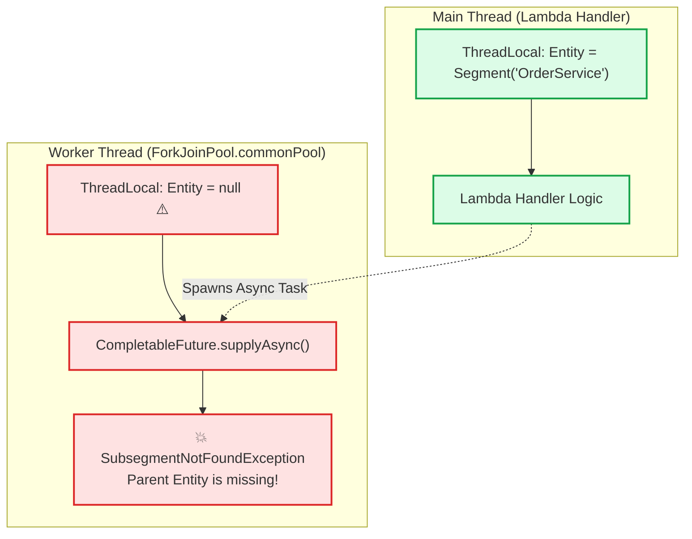

# Lecture 08.07 · 🐞 Debug Lab: Missing Subsegment in Multi-Threaded Execution & High-Cardinality Metric Explosion

> **Section:** S08 · **Type:** 🐞 Debug Lab · **Track:** ★ Core · **Time:** ~35 minutes  
> **Navigation:** ← [08.06 · 🧩 Live Verification: Service Maps](./08.06-live-verification-xray-service-map-emf-dashboard.md) | [Section 08 Overview](./README.md) | [08.08 · 🔓 Attack Lab: Trace Injection & DoS Logging](./08.08-attack-lab-trace-injection-dos-logging.md) →  
> **Project feature:** Systematic root-cause debugging of three high-impact enterprise observability defects: asynchronous thread context loss resulting in dropped X-Ray subsegments, catastrophic CloudWatch metric billing explosion caused by high-cardinality EMF dimensions, and missing AWS SDK v2 client subsegments.

---

## Defect 1: Missing Subsegments in Asynchronous Multi-Threaded Execution

### 1.1 The Production Symptom
To accelerate order fulfillment, a developer refactored the order processing Lambda to run credit card fraud checks and inventory reservation concurrently using Java 21's `CompletableFuture`:

```java
// Antipattern: Running asynchronous tasks without propagating X-Ray context
CompletableFuture<FraudResult> fraudCheck = CompletableFuture.supplyAsync(() -> {
    Subsegment sub = AWSXRay.beginSubsegment("FraudService_Check"); // 💥 Throws Exception or dropped!
    try {
        return fraudClient.evaluate(order);
    } finally {
        AWSXRay.endSubsegment();
    }
});
```

When deployed to production, the AWS X-Ray console displays the main Lambda handler segment, but **none of the child subsegments appear** on the timeline! Worse, intermittent Lambda errors appear in CloudWatch Logs:
```text
com.amazonaws.xray.exceptions.SubsegmentNotFoundException: 
    Failed to begin subsegment 'FraudService_Check': Cannot find an active segment or subsegment in ThreadLocal context.
    at com.amazonaws.xray.strategy.DefaultThrowableContextStrategy.getContext(DefaultThrowableContextStrategy.java:34)
```

### 1.2 Forensic Root-Cause Analysis

The AWS X-Ray Java SDK relies on **`ThreadLocal` storage** (`ThreadLocal<Entity>`) to maintain trace hierarchy. When a thread calls `AWSXRay.beginSubsegment()`, the SDK inspects the current thread's `ThreadLocal` for an existing parent `Segment` or `Subsegment`.



When work is dispatched to a separate thread pool (`ForkJoinPool.commonPool()` or an `ExecutorService`), the worker thread has an empty `ThreadLocal` map. As a result:
1. If the SDK is configured with `ContextMissingStrategy.RUNTIME_EXCEPTION`, it throws `SubsegmentNotFoundException`.
2. If configured with `ContextMissingStrategy.LOG_ERROR`, it logs an error and silently discards the trace subsegment!

### 1.3 The Resolution: Explicit Context Propagation

To propagate trace context across thread boundaries in Java, capture the active `Entity` on the parent thread and attach it to the worker thread via `AWSXRay.setTraceEntity()`:

```java
// 1. Capture the parent entity on the calling thread
Entity parentEntity = AWSXRay.getTraceEntity();

// 2. Dispatch work, binding the parent entity inside the worker thread
CompletableFuture<FraudResult> fraudCheck = CompletableFuture.supplyAsync(() -> {
    // Explicitly set the trace entity in the worker thread's ThreadLocal
    AWSXRay.setTraceEntity(parentEntity);
    
    Subsegment sub = AWSXRay.beginSubsegment("FraudService_Check");
    try {
        sub.putAnnotation("orderId", order.getOrderId());
        return fraudClient.evaluate(order);
    } catch (Exception ex) {
        sub.addException(ex);
        throw ex;
    } finally {
        AWSXRay.endSubsegment();
        // Clear trace entity to prevent thread pool leakage
        AWSXRay.clearTraceEntity();
    }
});
```

---

## Defect 2: High-Cardinality Dimension Explosion in CloudWatch EMF

### 2.1 The Production Symptom
At the end of the month, the engineering director calls an emergency incident: CloudWatch billing skyrocketed from $150/month to **$32,400/month**.

Navigating to CloudWatch Metrics in the AWS Console, the team discovers over **108,000 distinct custom metrics** under `CloudOrder/OrderProcessing`!

### 2.2 Forensic Root-Cause Analysis

Inspecting the developer's EMF emission logic:

```json
{
  "_aws": {
    "Timestamp": 1727424000000,
    "CloudWatchMetrics": [
      {
        "Namespace": "CloudOrder/OrderProcessing",
        "Dimensions": [
          ["Environment", "OrderId", "CustomerId"]  // 💥 CATASTROPHIC ANTI-PATTERN
        ],
        "Metrics": [
          { "Name": "OrderProcessingLatency", "Unit": "Milliseconds" }
        ]
      }
    ]
  },
  "Environment": "production",
  "OrderId": "ord-8831492",
  "CustomerId": "cust-99120",
  "OrderProcessingLatency": 142.0
}
```

#### The Cost Mechanics:
- Amazon CloudWatch charges **$0.30 per custom metric per month** for the first 10,000 metrics, and $0.10 thereafter.
- Every unique combination of dimension key-value pairs creates a separate, independent metric time series.
- Because `OrderId` and `CustomerId` are UUIDs / unique strings, each of the 100,000 orders placed created a brand-new metric stream!
- Math: $100,000 \times \$0.30 = \$30,000$ per month!

### 2.3 The Resolution: Move High-Cardinality Keys to Root JSON Context

As implemented in our [`EmfMetricsEmitter.java`](file:///C:/Users/Admin/Desktop/courses/aws-dva-c02-developer-course/reference/cloudorder/backend/module-08-observability-xray/src/main/java/com/cloudorder/observability/EmfMetricsEmitter.java):

```java
// Rule 1: ONLY low-cardinality dimensions inside CloudWatchMetrics
Map<String, String> lowCardinalityDims = Map.of(
    "Environment", "production",
    "PaymentMethod", "CREDIT_CARD" // Finite set (CREDIT_CARD, PAYPAL, CRYPTO)
);

// Rule 2: High-cardinality data placed at ROOT JSON level, NOT in Dimensions
Map<String, Object> highCardinalityContext = Map.of(
    "OrderId", order.getOrderId(),         // Unique ID
    "CustomerId", order.getCustomerId(),   // Unique ID
    "ItemCount", 3,
    "Subtotal", 149.99
);
```

#### Resulting Validated EMF Structure:
```json
{
  "_aws": {
    "Timestamp": 1727424000000,
    "CloudWatchMetrics": [
      {
        "Namespace": "CloudOrder/OrderProcessing",
        "Dimensions": [["Environment", "PaymentMethod"]],
        "Metrics": [{ "Name": "OrderProcessingLatency", "Unit": "Milliseconds" }]
      }
    ]
  },
  "Environment": "production",
  "PaymentMethod": "CREDIT_CARD",
  "OrderId": "ord-8831492",
  "CustomerId": "cust-99120",
  "OrderProcessingLatency": 142.0
}
```

- **Cost Impact**: Only 3 unique dimension sets (one per payment method in production) = $0.90 / month.
- **Searchability Retained**: `OrderId` and `CustomerId` are still parsed and stored by CloudWatch Logs, meaning CloudWatch Logs Insights queries can filter on them instantly:
  ```text
  fields @timestamp, OrderId, CustomerId, OrderProcessingLatency
  | filter OrderId = "ord-8831492"
  ```

---

## Defect 3: Missing AWS SDK v2 Downstream Client Tracing

### 3.1 The Production Symptom
In the X-Ray Service Map, the Lambda function shows up, but DynamoDB and SQS nodes are missing completely. When looking at the trace waterfall, database queries to `CloudOrder-Production` and queue messages are absent.

### 3.2 Forensic Root-Cause Analysis
In AWS SDK for Java v1 (`aws-java-sdk`), tracing was enabled globally via JVM properties or build configurations.

In **AWS SDK for Java v2 (`software.amazon.awssdk`)**, client tracing requires an explicit execution interceptor (`TracingInterceptor`) from the `software.amazon.awssdk:xray-metric-publisher` module:

```xml
<!-- Required dependency in pom.xml -->
<dependency>
    <groupId>software.amazon.awssdk</groupId>
    <artifactId>xray-metric-publisher</artifactId>
    <version>2.29.50</version>
</dependency>
```

If the client is initialized without this interceptor:
```java
// Missing TracingInterceptor!
DynamoDbClient client = DynamoDbClient.builder()
    .region(Region.US_EAST_1)
    .build();
```
No subsegments will be emitted for `GetItem`, `PutItem`, or `Query`.

### 3.3 The Resolution: Registering `TracingInterceptor`

Add the `TracingInterceptor` to the SDK client builder configuration:

```java
import software.amazon.awssdk.core.client.config.ClientOverrideConfiguration;
import software.amazon.awssdk.services.dynamodb.DynamoDbClient;
import com.amazonaws.xray.interceptors.TracingInterceptor;

DynamoDbClient ddb = DynamoDbClient.builder()
    .region(Region.US_EAST_1)
    .overrideConfiguration(ClientOverrideConfiguration.builder()
        .addExecutionInterceptor(new TracingInterceptor())
        .build())
    .build();
```

Once registered, AWS SDK v2 automatically intercepts every HTTP call to AWS services, begins an X-Ray subsegment with the operation name (e.g. `DynamoDB.PutItem`), captures HTTP response codes, and records retries.

---

## Debugging Summary Cheat Sheet for DVA-C02

| Problem | Root Cause | Fix |
|---|---|---|
| **Subsegment dropped in thread pool** | `ThreadLocal` context not inherited across threads. | Pass `AWSXRay.getTraceEntity()` to worker thread; invoke `AWSXRay.setTraceEntity()`. |
| **Massive CloudWatch billing spike** | High-cardinality keys (`OrderId`, `UserId`) placed in EMF `Dimensions`. | Restrict `Dimensions` to low-cardinality enums; put IDs in root JSON context for Logs Insights. |
| **Missing AWS SDK v2 subsegments** | AWS SDK v2 clients do not trace by default. | Add `TracingInterceptor` to `ClientOverrideConfiguration`. |
| **Lambda trace shows no downstream calls** | Active Tracing not enabled on the function. | Set `Tracing: Active` in SAM/CloudFormation template. |

---

> **Next Up:** [08.08 · 🔓 Attack Lab: Trace Injection Tampering & Metric Denial-of-Service via High-Volume Logging](./08.08-attack-lab-trace-injection-dos-logging.md)
