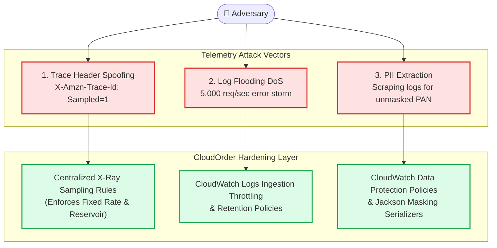
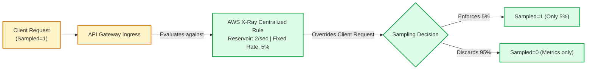
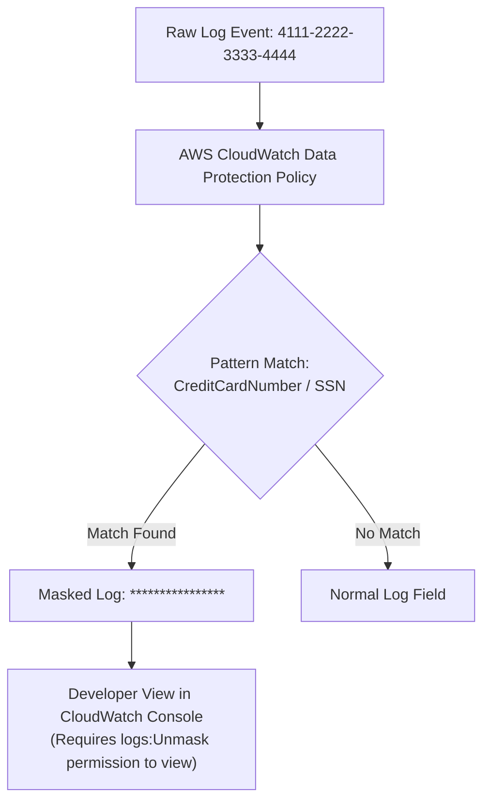

# Lecture 08.08 · 🔓 Attack Lab: Trace Injection Tampering & Metric Denial-of-Service via High-Volume Logging

> **Section:** S08 · **Type:** 🔓 Attack Lab · **Track:** ★ Core · **Time:** ~30 minutes  
> **Navigation:** ← [08.07 · 🐞 Debug Lab: Thread Context & Metric Explosion](./08.07-debug-unpropagated-trace-context-metric-explosion.md) | [Section 08 Overview](./README.md) | [08.09 · ＋ Extended: ADOT & Application Signals](./08.09-extended-adot-opentelemetry-application-signals.md) →  
> **Project feature:** Adversarial security and resilience hardening for CloudOrder's observability infrastructure. We simulate three real-world attacks: trace header injection to bypass sampling quotas and inflate cloud bills, log-flooding attacks to trigger CloudWatch Logs ingestion throttling, and sensitive PII data leakage into unencrypted telemetry streams.

---

## Threat Model Overview: Observability Attack Surface

Observability pipelines are frequently overlooked as attack vectors. Because telemetry systems process unvalidated user inputs (HTTP headers, query strings, error messages) and write them directly into logging and tracing datastores, adversaries exploit them to induce **financial denial-of-service (FDoS)**, exhaust ingestion quotas, or harvest sensitive customer records.



---

## Attack Vector 1: Malicious Trace Header Injection & Sampling Inflation

### 1.1 The Attack Execution
An attacker crafts automated curl requests passing an explicit `X-Amzn-Trace-Id` header with `Sampled=1` on every single request:

```bash
# Simulating an adversary attempting to force 100% trace sampling
curl -X POST https://api.cloudorder.internal/v1/orders \
  -H "X-Amzn-Trace-Id: Root=1-6789abcd-000000000000000000000001;Sampled=1" \
  -H "Content-Type: application/json" \
  -d '{"customerId":"cust-attacker","items":[]}'
```

#### The Threat:
1. **Financial Denial-of-Service**: AWS X-Ray charges **$5.00 per million traces stored** and **$0.50 per million traces scanned**. For an application processing 500 million requests/month, forcing 100% sampling inflates tracing costs from $12.50 (at 5% sampling) to over **$2,500/month**.
2. **Trace ID Collision & Desynchronization**: If an attacker reuses existing trace IDs or injects malformed timestamps, downstream correlation systems become polluted.

### 1.2 The Defense: API Gateway Ingress Rules & Centralized Sampling



1. **API Gateway Normalization**: API Gateway parses incoming `X-Amzn-Trace-Id` headers. If the root timestamp is older than 30 days or invalid hex, API Gateway discards the client-provided header and generates a cryptographically random root ID.
2. **Centralized Sampling Rules**: In [`template.yaml`](file:///C:/Users/Admin/Desktop/courses/aws-dva-c02-developer-course/reference/cloudorder/backend/module-08-observability-xray/template.yaml), we defined an explicit `AWS::XRay::SamplingRule` with `Priority: 10`. Centralized rules evaluated by the X-Ray daemon take precedence over client-supplied sampling headers, bounding total ingested traces regardless of client flags.

---

## Attack Vector 2: Log Flooding & Ingestion Quota Denial of Service

### 2.1 The Attack Execution
The adversary sends thousands of requests with payload sizes just under the API Gateway 10MB limit, targeting an endpoint with un-throttled error logging:

```bash
# Flooding endpoint with junk JSON to trigger stack trace logging
for i in {1..1000}; do
  curl -s -X POST https://api.cloudorder.internal/v1/orders \
    -H "Content-Type: application/json" \
    -d "{\"junk\":\"$(head -c 100000 /dev/urandom | base64)\"}" &
done
```

#### The Threat:
1. **CloudWatch Logs Ingestion Throttling**: Amazon CloudWatch Logs enforces a default per-log-stream ingestion quota of **5 MB/second**. When an attack exceeds this quota, CloudWatch returns HTTP 429 (`ThrottlingException`).
2. **Lambda Invocation Halts**: If a synchronous logging framework or blocking stdout buffer fills up under throttling, the Lambda runtime thread blocks, exhausting concurrency and causing order dropouts for legitimate shoppers.
3. **Storage Billing Shock**: CloudWatch Logs charges **$0.50 per GB ingested** and **$0.03 per GB/month for archive storage**. Unchecked logging easily generates multi-terabyte log groups costing thousands of dollars if left with the default retention policy of "Never Expire".

### 2.2 The Defense: Retention Windows & Non-Blocking Asynchronous Buffers

1. **Explicit Retention In SAM**: Never deploy a Lambda function without configuring `RetentionInDays` on its corresponding CloudWatch Log Group:
   ```yaml
   OrderServiceLogGroup:
     Type: AWS::Logs::LogGroup
     Properties:
       LogGroupName: !Sub "/aws/lambda/${OrderServiceFunction}"
       RetentionInDays: 14  # Logs automatically purge after 14 days
   ```
2. **EMF Stdout Decoupling**: Because CloudWatch EMF writes directly to standard output, stdout writes in the AWS Lambda execution environment write to a local FIFO buffer managed by the microVM hypervisor (Firecracker). The hypervisor flushes logs to CloudWatch asynchronously in background threads without blocking user request completion.

---

## Attack Vector 3: Sensitive Information Leakage in Telemetry

### 3.1 The Attack Execution
A developer logs the entire unredacted checkout payload into X-Ray metadata or CloudWatch EMF root context:

```java
// Vulnerable Code: Leaking PCI/PII data into unencrypted telemetry
subsegment.putMetadata("paymentPayload", Map.of(
    "cardNumber", "4111-2222-3333-4444",
    "cvv", "912",
    "cardHolder", "Jane Doe",
    "billingZip", "94107"
));
```

#### The Threat:
- Telemetry data is often distributed widely across logging aggregators, APM tools, and junior developer read-only accounts.
- Storing credit card PAN numbers or CVVs in telemetry directly violates **PCI-DSS Requirement 3.4** and **GDPR Article 32**, subjecting the company to severe regulatory fines and credential harvesting.

### 3.2 The Defense: Data Protection Policies & Jackson Serialization Masking



#### 1. SAM Template Data Protection Policy:
In CloudFormation/SAM, attach an `AWS::Logs::DataProtectionPolicy` to the Log Group:

```yaml
OrderServiceDataProtection:
  Type: AWS::Logs::AccountPolicy
  Properties:
    PolicyName: PiiDataProtectionPolicy
    PolicyType: DATA_PROTECTION_POLICY
    Scope: ALL
    PolicyDocument: !Sub |
      {
        "Version": "2021-06-01",
        "Statement": [
          {
            "Sid": "AuditAndMaskPCI",
            "DataIdentifier": [
              "arn:aws:dataprotection::aws:data-identifier/CreditCardNumber",
              "arn:aws:dataprotection::aws:data-identifier/UsaSsn"
            ],
            "Operation": {
              "Deidentify": {
                "MaskConfig": {}
              }
            }
          }
        ]
      }
```

#### 2. Code-Level Jackson Masking Annotation:
In Java 21, use custom Jackson serializers to sanitize fields before serialization:

```java
public record PaymentRequest(
    String orderId,
    @JsonSerialize(using = CardMaskingSerializer.class)
    String cardNumber,
    @JsonIgnore // Completely exclude CVV from JSON serialization
    String cvv
) {}
```

---

## Security Verification Checklist

| Control | Verification Command / Check | Expected Result |
|---|---|---|
| **Centralized Sampling** | `aws xray get-sampling-rules` | Priority rule with 5% fixed rate and 2 reservoir active. |
| **Log Retention** | `aws logs describe-log-groups --log-group-name-prefix /aws/lambda/` | `retentionInDays` is set to 14 or 30 (not null). |
| **PII Data Protection** | `aws logs get-data-protection-policy` | Audit and Mask statement active for Credit Cards and SSNs. |
| **EMF Cardinality** | `grep -r "Dimensions" .` | No customer IDs, timestamps, or order IDs in dimension arrays. |

---

> **Next Up:** [08.09 · ＋ Extended: AWS Distro for OpenTelemetry (ADOT) & Application Signals](./08.09-extended-adot-opentelemetry-application-signals.md)
