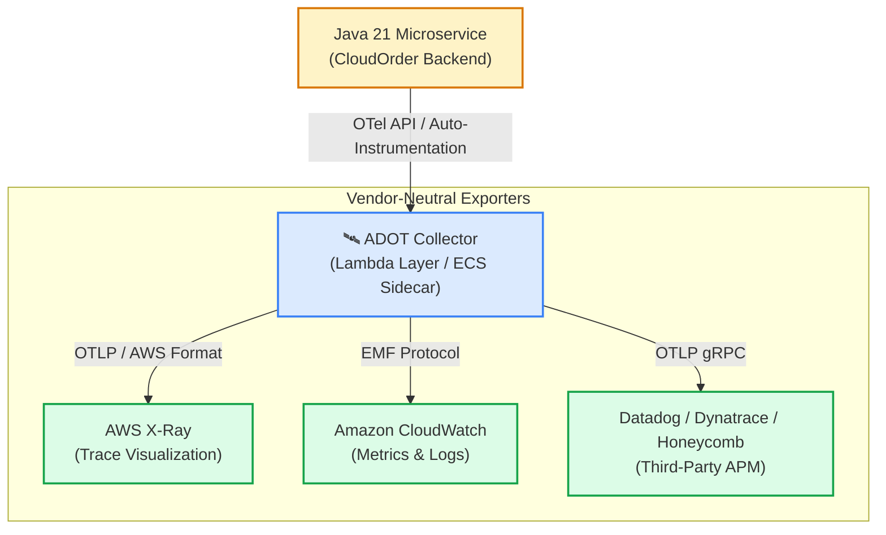
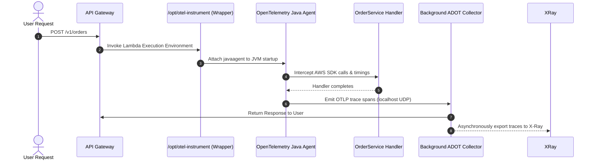

# Lecture 08.09 · ＋ Extended: AWS Distro for OpenTelemetry (ADOT) & Application Signals Integration

> **Section:** S08 · **Type:** ＋ Extended · **Track:** ＋ Extended · **Time:** ~30 minutes  
> **Navigation:** ← [08.08 · 🔓 Attack Lab: Trace Injection & DoS Logging](./08.08-attack-lab-trace-injection-dos-logging.md) | [Section 08 Overview](./README.md) | [08.99 · ✅ DVA-C02 Knowledge Check](./08.99-knowledge-check.md) →  
> **Project feature:** Advanced modern telemetry architecture using the AWS Distro for OpenTelemetry (ADOT) and Amazon CloudWatch Application Signals. We explore migrating from proprietary X-Ray SDKs to open CNCF standards, zero-code auto-instrumentation using AWS Lambda layers, and configuring Service Level Objectives (SLOs) with automated error budget tracking.

---

## 1. Why OpenTelemetry and ADOT?

While the native AWS X-Ray SDK provides tight integration with AWS services, it couples application source code to AWS-proprietary APIs (`com.amazonaws.xray:aws-xray-recorder-sdk-core`).

**OpenTelemetry (OTel)** is a Cloud Native Computing Foundation (CNCF) open standard defining vendor-neutral APIs, SDKs, and wire protocols (OTLP) for traces, metrics, and logs.

**AWS Distro for OpenTelemetry (ADOT)** is a secure, production-ready, AWS-supported distribution of the OpenTelemetry project.



### Key Advantages for Modern Cloud Architects:
1. **Zero Vendor Lock-In**: Telemetry can be mirrored or redirected from AWS CloudWatch/X-Ray to open-source systems (Jaeger, Prometheus) or SaaS APMs simply by updating collector YAML configurations.
2. **Standardized Context Propagation**: Implements W3C Trace Context (`traceparent: 00-4bf92f3577b34da6a3ce929d0e0e4736-00f067aa0ba902b7-01`) alongside legacy `X-Amzn-Trace-Id` headers.
3. **Automatic Java Instrumentation**: Injects bytecode hooks into Apache HttpClient, OkHttp, JDBC, Spring Boot, and AWS SDK v2 without modifying a single line of Java code!

---

## 2. Zero-Code Lambda Auto-Instrumentation with ADOT

Instead of adding Maven dependencies and manually calling `AWSXRay.beginSubsegment()` in every handler, ADOT allows you to instrument Java Lambda functions purely through **Lambda Layers** and **Environment Variables**.



### 2.1 SAM Configuration for ADOT Java Layer

In your SAM template (`template.yaml`), attach the managed ADOT Java layer and set the initialization wrapper:

```yaml
OrderServiceFunction:
  Type: AWS::Serverless::Function
  Properties:
    CodeUri: backend/module-08-observability-xray/
    Handler: com.cloudorder.observability.OrderServiceHandler::handleRequest
    Runtime: java21
    MemorySize: 1024
    Timeout: 30
    Tracing: Active
    Layers:
      # AWS-managed ADOT Layer for Java 21 (x86_64 in us-east-1)
      - !Sub "arn:aws:lambda:${AWS::Region}:901920587774:layer:aws-otel-java-agent-x86_64-ver-1-32-0:1"
    Environment:
      Variables:
        # Wrapper script executes before JVM starts
        AWS_LAMBDA_EXEC_WRAPPER: /opt/otel-instrument
        
        # Telemetry Exporters
        OTEL_TRACES_EXPORTER: xray
        OTEL_METRICS_EXPORTER: none
        
        # Service Identifiers
        OTEL_SERVICE_NAME: CloudOrderService
        OTEL_RESOURCE_ATTRIBUTES: service.namespace=CloudOrder,deployment.environment=production
```

When this function boots, the `/opt/otel-instrument` wrapper passes `-javaagent:/opt/opentelemetry-javaagent.jar` to the JVM arguments. Every outgoing HTTP request, AWS SDK client invocation, and unhandled exception is automatically traced as an OTel Span and mapped directly to AWS X-Ray format!

---

## 3. Amazon CloudWatch Application Signals

**Amazon CloudWatch Application Signals** is an observability feature built on top of ADOT that shifts monitoring from low-level infrastructure metrics (CPU, RAM) to **business-focused Service Level Objectives (SLOs)**.

```mermaid
flowchart LR
    subgraph Golden_Signals ["Four Golden Signals (Auto-Collected by ADOT)"]
        Latency["⏱️ Latency\n(P90, P99)"]
        Errors["❌ Errors\n(5xx Faults)"]
        Faults["⚠️ Faults\n(Exceptions)"]
        Availability["📈 Availability\n(Success %)"]
    end

    Golden_Signals --> AppSignals["CloudWatch Application Signals Engine"]
    
    AppSignals --> SLO["🎯 SLO Contract\n99.9% of orders processed < 300ms"]
    
    SLO --> ErrorBudget{"Error Budget Monitor"}
    ErrorBudget -->|"Budget Burn Rate > 2x"| Alarm["🚨 Composite Alarm\nPage On-Call Team"]
    ErrorBudget -->|"Normal Consumption"| OK["🟢 Budget Healthy"]

    classDef signals fill:#dbeafe,stroke:#3b82f6,stroke-width:2px;
    classDef engine fill:#fef3c7,stroke:#d97706,stroke-width:2px;
    classDef budget fill:#dcfce7,stroke:#16a34a,stroke-width:2px;
    classDef alarm fill:#fee2e2,stroke:#dc2626,stroke-width:2px;

    class Latency,Errors,Faults,Availability signals;
    class AppSignals,SLO engine;
    class ErrorBudget,OK budget;
    class Alarm alarm;
```



### 3.1 Defining Service Level Objectives (SLOs)

In Application Signals, an SLO is defined by:
1. **Service Level Indicator (SLI)**: The measurable metric (e.g. `OrderService` `Latency` or `Availability`).
2. **Target Goal**: The percentage of requests that must satisfy the threshold (e.g. `99.9%`).
3. **Evaluation Interval**: Rolling window over which compliance is calculated (e.g. 28 days or 7 days).

#### Example: SAM Template for CloudWatch SLO
```yaml
OrderServiceLatencySLO:
  Type: AWS::ApplicationSignals::ServiceLevelObjective
  Properties:
    Name: CloudOrderLatencySlo
    Description: 99.9% of order processing requests must finish in under 300ms
    Sli:
      ComparisonOperator: LessThanOrEqualTo
      MetricThreshold: 300  # milliseconds
      MetricKey:
        Key: Latency
        OperationName: handleRequest
      MetricType: LATENCY
    Goal:
      Target: 99.9
      Interval:
        RollingInterval:
          DurationUnit: DAY
          Duration: 28
```

### 3.2 Error Budgets and Burn Rate Alerting

The **Error Budget** represents the allowable room for failure:
- At **99.9% Availability**, the error budget allows $0.1\%$ of total requests to fail or exceed the 300ms threshold.
- If your system processes 1,000,000 requests per month, your error budget is **1,000 slow or failed requests**.
- **Burn Rate**: The rate at which the error budget is being consumed. A burn rate of 1 consumes the entire budget exactly at the end of 28 days. A burn rate of 14 consumes the budget in just 2 days.
- **DVA-C02 Exam Tip**: Composite Alarms based on **Error Budget Burn Rate** are superior to static threshold alarms because they alert you based on *how quickly* customer trust is deteriorating, eliminating noise from brief transient spikes.

---

## 4. Architectural Comparison: Native X-Ray SDK vs. ADOT vs. EMF

| Dimension | Native AWS X-Ray SDK | AWS Distro for OpenTelemetry (ADOT) | CloudWatch EMF |
|---|---|---|---|
| **Standards** | Proprietary AWS APIs | Open CNCF Standard (OTel / OTLP) | CloudWatch JSON Schema |
| **Code Changes** | High (Requires Java imports, manual code) | Zero (Auto-instrumentation via layer) | Minimal (JSON emission to stdout) |
| **Metrics Support** | Traces only | Traces + Metrics + Logs | High-cardinality Custom Metrics |
| **Cold Start Overhead** | Low (~10ms) | Moderate (~80ms-150ms due to agent) | Near Zero (<1ms) |
| **Vendor Portability** | AWS Only | Universal (AWS, Datadog, Grafana) | CloudWatch Only |
| **Primary Use Case** | Legacy serverless apps on AWS | Microservices requiring vendor neutrality | High-volume metric aggregation at zero API cost |

---

> **Next Up:** [08.99 · ✅ DVA-C02 Knowledge Check: Distributed Tracing & Observability](./08.99-knowledge-check.md)
