# Lecture 08.99 · ✅ DVA-C02 Knowledge Check: AWS X-Ray, CloudWatch EMF, Logs Insights & Alarms

> **Section:** S08 · **Type:** ✅ Knowledge Check · **Track:** ★ Core · **Time:** ~25 minutes  
> **Navigation:** ← [08.09 · ＋ Extended: ADOT & Application Signals](./08.09-extended-adot-opentelemetry-application-signals.md) | [Section 08 Overview](./README.md) | [Course Conclusion: 37/37 Tests Passed](../../README.md) →  
> **Project feature:** Final exam readiness evaluation for Section 08 and the complete CloudOrder enterprise backend. Five high-yield scenario questions modeled after the actual AWS Certified Developer - Associate (DVA-C02) examination, testing X-Ray sampling calculations, annotations vs. metadata, CloudWatch EMF cost optimization, multi-threaded context propagation, and composite alarms.

---

## Question 1: Calculating AWS X-Ray Sampling Rates Under Variable Load

A developer configures an AWS X-Ray sampling rule for an e-commerce checkout API Gateway and Lambda service with the following configuration:
* **Reservoir Size**: 5 requests per second
* **Fixed Rate**: 10% (0.10)

During a marketing flash sale, the checkout service receives a steady incoming load of **85 requests per second**.

How many requests per second will the AWS X-Ray daemon sample and record traces for?

- [ ] A) 5 requests per second
- [ ] B) 8.5 requests per second
- [ ] C) 13 requests per second
- [ ] D) 13.5 requests per second

<details>
<summary><b>View Answer & Explanation</b></summary>

**Correct Answer:** **C** (13 requests per second)

**Explanation:**
The AWS X-Ray sampling algorithm evaluates traces using a two-step formula:
1. **Reservoir Phase**: The reservoir guarantees that the first $N$ requests per second are sampled unconditionally (100% sampling until the reservoir is filled).
   - $\text{Reservoir} = 5\text{ req/sec}$
2. **Fixed Rate Phase**: All incoming requests *exceeding* the reservoir size are sampled at the configured `FixedRate`.
   - $\text{Remaining Requests} = \text{Total Requests} - \text{Reservoir} = 85 - 5 = 80\text{ req/sec}$
   - $\text{Fixed Rate Sampled} = 80 \times 10\% = 8\text{ req/sec}$
3. **Total Sampled Requests**:
   - $\text{Total Sampled} = \text{Reservoir} + \text{Fixed Rate Sampled} = 5 + 8 = \mathbf{13}\text{ req/sec}$.

* **Option A is incorrect**: 5 req/sec only accounts for the reservoir, ignoring the 10% fixed rate applied to the remaining 80 requests.
* **Option B is incorrect**: 8.5 req/sec applies 10% to the total 85 requests without accounting for the first 5 requests guaranteed by the reservoir.
* **Option D is incorrect**: 13.5 req/sec results from incorrectly adding $5 + (85 \times 10\%)$, which double-counts the reservoir requests.
</details>

---

## Question 2: Designing Searchable Traces with Annotations vs. Metadata

A developer is building a high-volume order processing service. Support engineers must be able to search for traces in the AWS X-Ray console using specific business identifiers (`orderId`, `customerId`) and the order status (`status = "FAILED"`). Additionally, for failed traces, support engineers need to inspect the full unredacted shopping cart payload (a complex nested JSON structure containing 15 attributes per item) to reproduce the defect.

How should the developer instrument the AWS X-Ray SDK to satisfy both requirements with optimal cost and performance?

- [ ] A) Record `orderId`, `customerId`, and `status` using `AWSXRay.putAnnotation()`. Record the shopping cart payload using `AWSXRay.putMetadata()`.
- [ ] B) Record all fields (`orderId`, `customerId`, `status`, and the shopping cart payload) using `AWSXRay.putAnnotation()`.
- [ ] C) Record all fields using `AWSXRay.putMetadata()` and query them in the X-Ray console using Filter Expressions.
- [ ] D) Store `orderId` and `customerId` in CloudWatch Logs, and store the shopping cart payload using `AWSXRay.putAnnotation()`.

<details>
<summary><b>View Answer & Explanation</b></summary>

**Correct Answer:** **A**

**Explanation:**
AWS X-Ray divides custom trace data into two distinct categories:
1. **Annotations**:
   - Fully **indexed** by the X-Ray query engine.
   - Searchable in the AWS X-Ray console or CLI via **Filter Expressions** (e.g. `annotation.orderId = "ord-101" AND annotation.status = "FAILED"`).
   - Restricted to **scalar types only** (String, Number, Boolean) and limited to **50 annotations per trace**.
   - Ideal for business identifiers and categorical status codes.
2. **Metadata**:
   - **Not indexed** (cannot be searched via Filter Expressions).
   - Supports **arbitrary, complex nested JSON objects and arrays**.
   - Available when inspecting an individual trace's timeline in the console or via `GetTraceGraph`.
   - Ideal for forensic payloads, detailed error contexts, and shopping cart item arrays.

* **Option B is incorrect**: Annotations only support scalar values (String, Number, Boolean) and cannot serialize complex nested JSON objects or arrays.
* **Option C is incorrect**: Metadata is not indexed and cannot be filtered or queried in the X-Ray console search bar.
* **Option D is incorrect**: The shopping cart payload cannot be stored in an annotation due to type and size limitations.
</details>

---

## Question 3: Eliminating Metric Cost Explosion with CloudWatch EMF

A serverless application emits telemetry for 5,000,000 orders every month across three geographic regions (`us-east-1`, `eu-west-1`, `ap-northeast-1`). The application currently calls the synchronous `CloudWatchClient.putMetricData()` API on every order to record latency and order values, including `Region`, `CustomerId`, and `OrderId` in each metric dimension. The monthly AWS bill shows a catastrophic charge of over $500,000 for custom metrics.

What architectural refactoring will minimize latency and reduce custom metric costs to less than $2.00 per month while preserving log searchability for specific `OrderId`s?

- [ ] A) Increase the batch size of `putMetricData()` to 1,000 metrics per call.
- [ ] B) Transition to CloudWatch Embedded Metric Format (EMF) via stdout. Set `Region` as the only dimension in the `_aws.CloudWatchMetrics` array, and write `CustomerId` and `OrderId` as root JSON fields outside the dimension list.
- [ ] C) Transition to CloudWatch Embedded Metric Format (EMF). Include `Region`, `CustomerId`, and `OrderId` in the `Dimensions` array to ensure real-time graph filtering.
- [ ] D) Configure an AWS Lambda CloudWatch Logs Subscription Filter to write metrics to Amazon DynamoDB.

<details>
<summary><b>View Answer & Explanation</b></summary>

**Correct Answer:** **B**

**Explanation:**
CloudWatch charges **$0.30 per custom metric per month per unique dimension set**.
1. When high-cardinality keys like `OrderId` or `CustomerId` are included in the metric dimensions, every distinct order creates a new custom metric time series ($5,000,000 \times \$0.30 = \$1,500,000$).
2. By transitioning to **CloudWatch Embedded Metric Format (EMF)**:
   - Metrics are written to standard output (`stdout`) as structured JSON. The Lambda execution environment flushes stdout asynchronously without adding network latency to user requests (unlike synchronous `PutMetricData` HTTP calls).
   - In the EMF metadata (`_aws`), only include low-cardinality dimensions (`Region`). 3 regions $\times$ 2 metrics = 6 custom metrics = **$1.80 per month**!
   - High-cardinality keys (`OrderId`, `CustomerId`) are included at the root level of the JSON payload. They are indexed and stored by CloudWatch Logs, enabling instant querying with **CloudWatch Logs Insights** at zero custom metric cost!

* **Option A is incorrect**: Batching `putMetricData()` reduces HTTP call overhead, but custom metric pricing is based on the number of unique metric time series per month, not the number of API calls.
* **Option C is incorrect**: Including `CustomerId` and `OrderId` in the EMF `Dimensions` array still creates 5,000,000 custom metric streams and incurs the exact same metric billing explosion.
* **Option D is incorrect**: Writing metrics to DynamoDB adds unnecessary architectural complexity and storage/write capacity costs when CloudWatch EMF natively solves the problem.
</details>

---

## Question 4: Resolving Missing Subsegments in Asynchronous Worker Threads

A developer parallelizes payment gateway verification and inventory allocation in a Java 21 Lambda function using `CompletableFuture.runAsync()`. In unit tests running in a single thread, X-Ray subsegments are generated properly. However, in production, child subsegments inside `runAsync()` are missing from the X-Ray console, and CloudWatch Logs reports:
`com.amazonaws.xray.exceptions.SubsegmentNotFoundException: Cannot find an active segment or subsegment in ThreadLocal context.`

What must the developer do to fix this issue?

- [ ] A) Increase the Lambda function memory from 512 MB to 3008 MB to enable multi-core execution.
- [ ] B) Capture the active trace entity on the parent thread using `AWSXRay.getTraceEntity()` and pass it into the asynchronous worker thread, calling `AWSXRay.setTraceEntity()` before beginning child subsegments.
- [ ] C) Replace `CompletableFuture.runAsync()` with a synchronous `for` loop.
- [ ] D) Set the environment variable `AWS_XRAY_CONTEXT_MISSING=IGNORE_ERROR` in the Lambda function.

<details>
<summary><b>View Answer & Explanation</b></summary>

**Correct Answer:** **B**

**Explanation:**
The AWS X-Ray Java SDK tracks active segments and subsegments using Java **`ThreadLocal`** variables.
1. When work is submitted to a separate thread pool (such as `ForkJoinPool.commonPool()` used by `CompletableFuture.runAsync()`), the newly spawned worker thread has its own empty `ThreadLocal` context.
2. When the worker thread executes `AWSXRay.beginSubsegment()`, the SDK searches `ThreadLocal` for an existing parent segment. Because the parent entity is null, the SDK throws `SubsegmentNotFoundException`.
3. The solution is to explicitly pass the trace context across the thread boundary:
   ```java
   Entity currentTrace = AWSXRay.getTraceEntity();
   CompletableFuture.runAsync(() -> {
       AWSXRay.setTraceEntity(currentTrace);
       AWSXRay.beginSubsegment("PaymentVerification");
       try {
           processPayment();
       } finally {
           AWSXRay.endSubsegment();
           AWSXRay.clearTraceEntity();
       }
   });
   ```

* **Option A is incorrect**: Memory allocation does not alter JVM `ThreadLocal` inheritance.
* **Option C is incorrect**: Eliminating parallelism sacrifices concurrency and increases overall user latency.
* **Option D is incorrect**: `AWS_XRAY_CONTEXT_MISSING=IGNORE_ERROR` suppresses the runtime exception, but subsegments on the worker thread will still be silently dropped from the X-Ray trace timeline.
</details>

---

## Question 5: Preventing Cascading Alarm Fatigue with CloudWatch Composite Alarms

An enterprise serverless architecture consists of 12 microservices that communicate through Amazon DynamoDB and Amazon SQS. During a scheduled DynamoDB maintenance failover or transient partition throttling, the primary database throws throttling exceptions. This causes all 12 upstream Lambda functions to trigger their individual `HighErrorRate` alarms simultaneously, flooding the on-call engineering team with 12 distinct pager alerts and phone calls.

How can the lead developer eliminate alert storms while ensuring the team is immediately notified when both service error rates and customer-facing latency spike together?

- [ ] A) Increase the evaluation period of all 12 Lambda alarms from 1 minute to 60 minutes.
- [ ] B) Create a CloudWatch Composite Alarm with a rule expression combining the individual alarms: `ALARM("OrderServiceErrors") AND ALARM("PaymentServiceErrors") AND NOT ALARM("DynamoDbThrottling")`.
- [ ] C) Configure an Amazon SNS subscription filter to discard alarm notifications received within 5 minutes of each other.
- [ ] D) Replace CloudWatch Alarms with CloudWatch Logs Metric Filters.

<details>
<summary><b>View Answer & Explanation</b></summary>

**Correct Answer:** **B**

**Explanation:**
**Amazon CloudWatch Composite Alarms** allow developers to combine multiple underlying metric alarms using boolean logic (`AND`, `OR`, `NOT`):
1. Instead of alerting directly on dozens of individual microservice alarms, a Composite Alarm evaluates an expression representing the true incident state.
2. Using boolean operators, developers can suppress upstream microservice alerts when a known root cause is already in alarm (`NOT ALARM("DynamoDbThrottling")`), or trigger high-priority paging only when both customer latency AND error rates breach thresholds simultaneously (`ALARM("HighErrors") AND ALARM("P95Latency")`).
3. This completely prevents alert storms and alert fatigue during cascading outages.

* **Option A is incorrect**: Increasing evaluation periods delays alert detection by up to an hour, violating incident response SLAs.
* **Option C is incorrect**: SNS subscription filters cannot perform stateful time-windowed deduplication across distinct alarm messages.
* **Option D is incorrect**: Metric Filters extract metrics from logs; they do not trigger or aggregate alarm notifications.
</details>

---

## Section 08 & Course Completion Summary

Congratulations! You have completed **Section 08** and the entire **AWS Certified Developer - Associate (DVA-C02) Course**!

```mermaid
flowchart LR
    S1["S01 · API Gateway & Lambda"] --> S2["S02 · SNS & SQS Fan-Out"]
    S2 --> S3["S03 · Step Functions Saga"]
    S3 --> S4["S04 · DynamoDB Single-Table"]
    S4 --> S5["S05 · S3 & ElastiCache Redis"]
    S5 --> S6["S06 · Cognito & KMS Encryption"]
    S6 --> S7["S07 · CI/CD & Beanstalk"]
    S7 --> S8["S08 · X-Ray & CloudWatch EMF"]
    
    classDef done fill:#dcfce7,stroke:#16a34a,stroke-width:2px;
    class S1,S2,S3,S4,S5,S6,S7,S8 done;
```



### What You Built & Mastered:
* **37 / 37 Unit Tests Passed** across 8 Java 21 modules verified with AWS SDK v2, SAM CLI, and Maven.
* Complete coverage of all 4 DVA-C02 exam domains: **Development with AWS Services (32%)**, **Security (26%)**, **Deployment (24%)**, and **Troubleshooting & Optimization (18%)**.
* Zero fluff: pure mechanical sympathy, physical cloud limits, enterprise security hardening, and resilient production code.

---

> Return to [Course Overview & Master Table of Contents](../../README.md)
