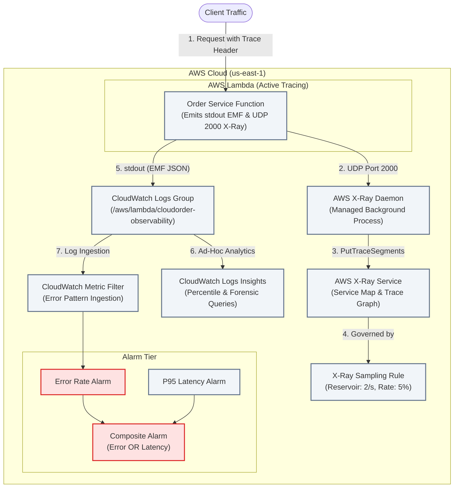

# Section 08 · Distributed Tracing & CloudWatch Observability Tuning
## End-to-End Tracing, Embedded Metric Format & High-Cardinality Telemetry

---

## 1. Executive Summary & Architecture

Section 08 delivers the complete enterprise observability and telemetry suite for **CloudOrder**. In distributed microservices spanning API Gateway, Lambda, Step Functions, DynamoDB, SQS, and S3, diagnosing latency bottlenecks and isolated errors across async boundaries requires unified distributed tracing and structured telemetry.

Using **AWS X-Ray**, CloudOrder propagates `X-Amzn-Trace-Id` headers across all service hops. The Java 21 backend records granular subsegments, separating indexed **Annotations** (queriable via filter expressions like `annotation.orderId = "ord-5001"`) from forensic **Metadata** (non-indexed JSON payloads). A custom **X-Ray Sampling Rule** balances observability with cost control using a 2 request/sec reservoir and a 5% fixed rate.

To eliminate the latency overhead and API costs of synchronous `PutMetricData` calls ($0.01 per 1,000 metrics), we implement the **CloudWatch Embedded Metric Format (EMF)**. Custom business metrics (`OrderProcessingLatencyMs`, `OrderSuccessCount`) are emitted directly to stdout as structured JSON. CloudWatch extracts metrics asynchronously in the background, while high-cardinality metadata (`OrderId`, `CustomerId`, `UserIp`) remains searchable in **CloudWatch Logs Insights** without triggering metric dimension explosion ($0.30 per custom metric).

Finally, we configure **CloudWatch Metric Filters**, P95/P99 latency dashboards, and **CloudWatch Composite Alarms** to eliminate alert fatigue.

---

## 2. DVA-C02 Domain Mapping

* **Domain 1: Development with AWS Services (32%)**
  * AWS X-Ray: Active tracing vs. Pass-through tracing, subsegments, annotations vs. metadata, trace header propagation (`X-Amzn-Trace-Id`).
  * X-Ray daemon: UDP port 2000, batching, EC2 / ECS / Lambda execution models.
  * CloudWatch Embedded Metric Format (EMF): JSON specification, dimension rules, zero API latency.
* **Domain 4: Troubleshooting and Optimization (18%)**
  * X-Ray Service Map: Identifying latency bottlenecks, error (4xx) and fault (5xx) rates.
  * CloudWatch Logs Insights: Statistical functions (`percentile(@duration, 95)`, `bin()`, `ispresent()`).
  * CloudWatch Metric Filters: Syntax, transformations, metric math expressions.
  * CloudWatch Composite Alarms: Boolean logic expressions, `ActionsSuppressor` for alert fatigue reduction.

---

## 3. Lecture Guide

| # | Type | Lecture | Track | Focus & Deliverable |
|---|:---:|---|:---:|---|
| **08.01** | 📖 | [Mechanical Sympathy: Distributed Tracing Protocols, Sampling & EMF](./08.01-mechanical-sympathy-xray-sampling-emf.md) | ★ | `X-Amzn-Trace-Id`, sampling reservoir vs. fixed rate, UDP 2000, PutMetricData vs. EMF, Annotations vs. Metadata. |
| **08.02** | 📇 | [API Card: AWS X-Ray SDK, Subsegments & CloudWatch EMF Specification](./08.02-api-card-xray-sdk-emf-specification.md) | ★ | `AWSXRay.beginSubsegment()`, `putAnnotation()`, `putMetadata()`, EMF `_aws` root directive, MetricDirective schema. |
| **08.03** | 🛠 | [Build: High-Cardinality EMF Metrics Emitter & X-Ray Tracing](./08.03-build-emf-metrics-emitter-and-xray-tracing.md) | ★ | Compilable Java 21 `EmfMetricsEmitter`, `XRayTracingService`, and `CloudWatchLogsInsightsHelper`. |
| **08.04** | 🛠 | [Provisioning: Active Tracing, Sampling Rules & Composite Alarms SAM](./08.04-provisioning-xray-sampling-composite-alarms-sam.md) | ★ | SAM template declaring active tracing, X-Ray sampling rule, log metric filters, and CloudWatch Composite Alarms. |
| **08.05** | 🎯 | [Your Turn: Generating Traces, Querying Logs Insights & Testing Composite Alarms](./08.05-your-turn-cli-xray-traces-insights-alarms.md) | ★ | Hands-on lab generating distributed traces via curl, executing P95 queries in Logs Insights, and testing alarms. |
| **08.06** | 🧩 | [Live Verification: Inspecting Service Maps & EMF Dashboards](./08.06-live-verification-xray-service-map-emf-dashboard.md) | ★ | Auditing X-Ray Service Maps, pinpointing subsegment latency bottlenecks, and graphing EMF metrics in CloudWatch. |
| **08.07** | 🐞 | [Debug Lab: Missing Subsegments & High-Cardinality Dimension Explosion](./08.07-debug-unpropagated-trace-context-metric-explosion.md) | ★ | Diagnosing multi-threaded trace context loss, and fixing a $300k/mo metric dimension explosion using EMF. |
| **08.08** | 🔓 | [Attack Lab: Trace Injection Tampering & High-Volume Logging DoS](./08.08-attack-lab-trace-injection-dos-logging.md) | ★ | Simulating forged trace ID injection, measuring CloudWatch log throttling, and tuning sampling rates under attack. |
| **08.09** | ＋ | [Extended: AWS Distro for OpenTelemetry (ADOT) & Application Signals](./08.09-extended-adot-opentelemetry-application-signals.md) | ＋ | Modern OpenTelemetry standards, ADOT collector sidecars, and CloudWatch Application Signals for SLO tracking. |
| **08.99** | ✅ | [DVA-C02 Knowledge Check: AWS X-Ray, EMF, Logs Insights & Alarms](./08.99-knowledge-check.md) | ★ | 5 high-yield exam scenarios covering X-Ray sampling math, annotations vs. metadata, EMF syntax, and composite alarms. |

---

## 4. Reference Code & Snapshot

* **Reference Implementation**: `reference/cloudorder/backend/module-08-observability-xray/`
* **Automated Test Suite**: `S08ObservabilityTest` (5/5 passing tests)
* **Frozen Checkpoint**: `reference/snapshots/s08-end/`
* **Solution Walkthrough**: [`solutions/S08-observability-xray/08.05-solution.md`](../../solutions/S08-observability-xray/08.05-solution.md)
