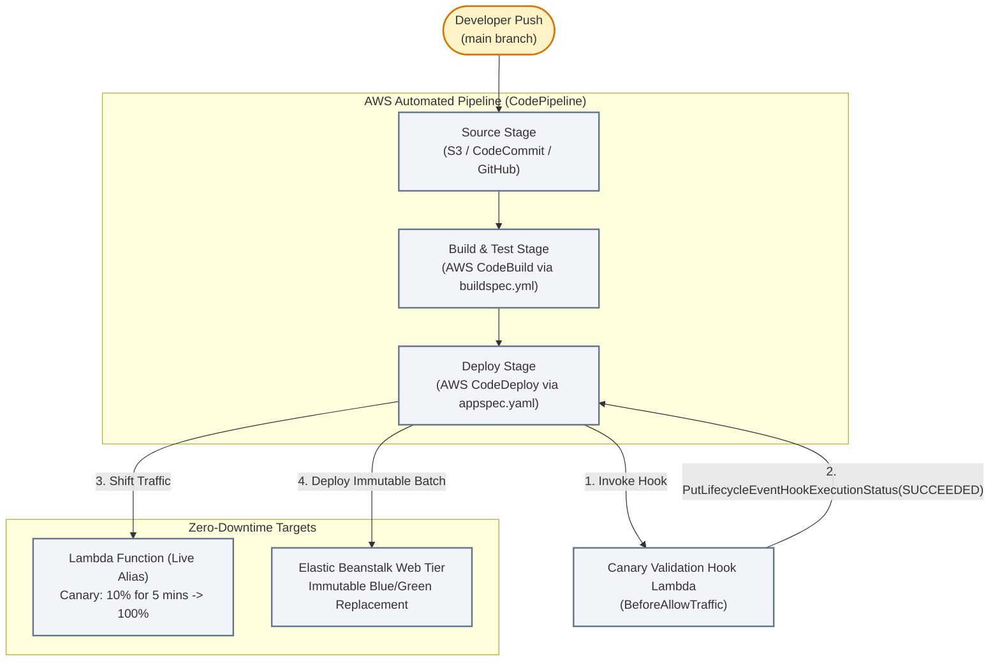

# Lecture 07.04 · 🛠 Provisioning: CodePipeline, CodeBuild, CodeDeploy Deployment Group & Elastic Beanstalk SAM

> **Section:** S07 · **Type:** 🛠 Provisioning · **Track:** ★ Core · **Time:** ~35 minutes  
> **Navigation:** ← [07.03 · 🛠 Build: Canary Hook & Buildspec](./07.03-build-codedeploy-canary-hook-and-buildspec.md) | [Section 07 Overview](./README.md) | [07.05 · 🎯 Your Turn: Triggering Pipeline CLI](./07.05-your-turn-cli-pipeline-canary-rollback.md) →  
> **Project feature:** Declarative AWS SAM infrastructure for CloudOrder's continuous delivery pipeline and deployment targets. Provisions an S3 artifact repository, a CodeBuild automated test and packaging project, a CodeDeploy Lambda application with automated `Canary10Percent5Minutes` traffic shifting, an automated rollback configuration on CloudWatch alarms, and an Elastic Beanstalk web environment with `Immutable` deployment policies.  
> **Verified:** `template.yaml` (Module 07 declarative SAM resources, CodeDeploy configurations, and Beanstalk option settings).

---

## Narrative Bridge: Infrastructure as Code for Delivery Pipelines

In [Lecture 07.03](./07.03-build-codedeploy-canary-hook-and-buildspec.md), we wrote the Java 21 validation hook and build specifications. Now, we define the AWS resources that orchestrate this automation.

---

## 1. Complete AWS SAM Template

✍️ `template.yaml`

{{file:backend/module-07-cicd-beanstalk/template.yaml:yaml}}

---

## 2. Critical DVA-C02 Architectural Analysis

### 1. CodeDeploy Traffic Shifting Configurations
AWS CodeDeploy provides predefined deployment configurations for AWS Lambda:

| Configuration | Traffic Behavior | DVA-C02 Exam Use Case |
|---|---|---|
| **`Canary10Percent5Minutes`** | Shifts 10% of traffic to the new version immediately. Waits **5 minutes**. If alarms do not fire and hooks succeed, shifts the remaining 90% in one step. | Production workloads requiring quick verification before full rollout. |
| **`Canary10Percent15Minutes`** | Shifts 10% of traffic, waits **15 minutes**, then shifts remaining 90%. | High-traffic services requiring longer statistical sample times. |
| **`Linear10PercentEvery1Minute`** | Shifts 10% every minute over 10 minutes until 100% is reached. | Smooth, gradual traffic increases. |
| **`AllAtOnce`** | Shifts 100% of traffic instantaneously. | Dev and staging environments where immediate updates are prioritized over zero-downtime safety. |

### 2. Elastic Beanstalk Deployment Policies
Choosing the correct Elastic Beanstalk deployment policy is one of the most heavily tested topics on the DVA-C02:

| Deployment Policy | Downtime? | Capacity Impact | Cost Impact | Rollback Speed |
|---|:---:|---|---|---|
| **All at Once** | ⚠️ **Yes** | 100% capacity lost during update | No extra cost | Slow (requires re-deploying old version) |
| **Rolling** | ❌ No | Drops below full capacity during updates (e.g. 50% capacity available) | No extra cost | Slow (re-deploys old version across instances) |
| **Rolling with Additional Batch** | ❌ No | **100% capacity maintained** (launches an extra batch before updating) | Temporary minimal cost | Slow |
| **Immutable (Used Here)** | ❌ No | **100% capacity maintained** (launches a fresh Auto Scaling Group) | Temporary 2x cost | **Fast** (terminates new ASG immediately) |
| **Traffic Splitting** | ❌ No | Splits canary traffic between old and new environments | Temporary 2x cost | **Instant** |

---

## What We Provisioned & What's Next

We have declared our entire CI/CD and deployment target infrastructure:
* S3 artifact bucket with encryption and public access blocks.
* CodeBuild project executing automated tests with `/root/.m2` caching.
* CodeDeploy application and deployment group with automated canary traffic shifting and rollback alarms.
* Elastic Beanstalk web environment running Corretto 21 with immutable deployment policies.

In [Lecture 07.05 · 🎯 Your Turn](./07.05-your-turn-cli-pipeline-canary-rollback.md), you will trigger pipeline executions via the AWS CLI, observe real-time canary traffic shifting, and simulate hook failures to trigger automatic rollbacks.
