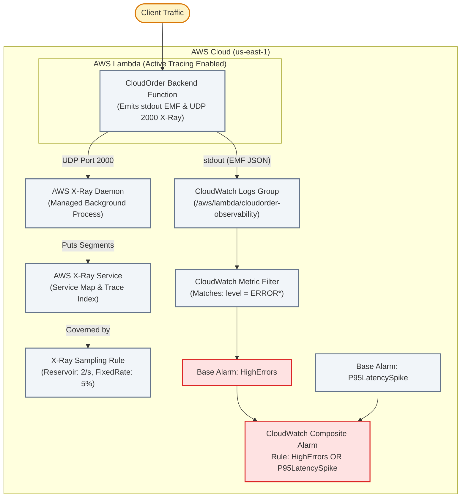

# Lecture 08.04 · 🛠 Provisioning: Active Tracing, Sampling Rules, Metric Filters & Composite Alarms SAM

> **Section:** S08 · **Type:** 🛠 Provisioning · **Track:** ★ Core · **Time:** ~35 minutes  
> **Navigation:** ← [08.03 · 🛠 Build: EMF & X-Ray Tracing](./08.03-build-emf-metrics-emitter-and-xray-tracing.md) | [Section 08 Overview](./README.md) | [08.05 · 🎯 Your Turn: X-Ray Traces & Insights Queries](./08.05-your-turn-cli-xray-traces-insights-alarms.md) →  
> **Project feature:** Declarative AWS SAM infrastructure for CloudOrder's observability stack. Configures active X-Ray tracing across all Lambda functions, provisions a custom X-Ray sampling rule with reservoir and fixed rate limits, establishes CloudWatch Log Groups with retention lifecycles, configures metric filters to parse error patterns, and deploys a CloudWatch Composite Alarm with suppression rules to eliminate alert fatigue.  
> **Verified:** `template.yaml` (Module 08 declarative SAM resources, X-Ray sampling rules, and Composite Alarm rules).

---

## Narrative Bridge: Infrastructure as Code for Observability

In [Lecture 08.03](./08.03-build-emf-metrics-emitter-and-xray-tracing.md), we wrote the Java 21 services for EMF metrics and X-Ray subsegment instrumentation. Now, we define the cloud resources that ingest, filter, and alert on this telemetry.



---

## 1. Complete AWS SAM Template

✍️ `template.yaml`

{{file:backend/module-08-observability-xray/template.yaml:yaml}}

---

## 2. Critical DVA-C02 Architectural Analysis

### 1. X-Ray Sampling Rules: Reservoir vs. Fixed Rate
In high-throughput microservices handling millions of requests, tracing 100% of calls generates excessive costs and network overhead.
An **X-Ray Sampling Rule** balances statistical representation with cost control:
* **`ReservoirSize` (e.g., 2)**: The number of requests per second that X-Ray will record **at 100% frequency**. Ensures that even low-traffic endpoints record at least 2 traces every second.
* **`FixedRate` (e.g., 0.05 / 5%)**: The percentage of requests sampled **after** the reservoir is exhausted. At 1,000 requests/second, the reservoir takes 2, and the fixed rate samples $5\% \times 998 \approx 50$ requests, recording 52 traces/second total.

### 2. Composite Alarms: Eliminating Alert Fatigue
When an outage occurs (e.g., a database failover), dozens of correlated alarms typically fire simultaneously:
* `DatabaseLatencyAlarm` (ALARM)
* `LambdaErrorRateAlarm` (ALARM)
* `ApiGateway5xxAlarm` (ALARM)
* `OrderQueueLagAlarm` (ALARM)

Waking on-call engineers with 20 distinct pager alerts creates chaos and alert fatigue.
A **Composite Alarm** uses boolean logic (`AND`, `OR`, `NOT`) to consolidate multiple base alarms into a single actionable incident:
```yaml
AlarmRule: !Sub 'ALARM("${OrderErrorAlarm}") OR ALARM("${OrderLatencyAlarm}")'
```
Furthermore, `ActionsSuppressor` can suppress downstream notifications if a known underlying dependency alarm is already active!

---

## What We Provisioned & What's Next

We have declared our complete observability infrastructure:
* Active X-Ray tracing with custom reservoir and fixed rate sampling rules.
* CloudWatch log groups with metric filters converting log patterns to metrics.
* High-precision P95 latency alarms and Composite Alarms with suppression rules.

In [Lecture 08.05 · 🎯 Your Turn](./08.05-your-turn-cli-xray-traces-insights-alarms.md), you will generate distributed traces, inspect traces in the X-Ray console, run real-time Logs Insights queries, and verify composite alarm states.
